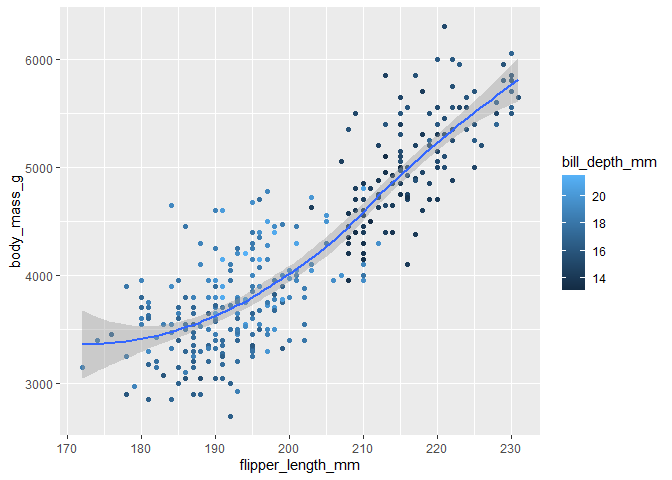
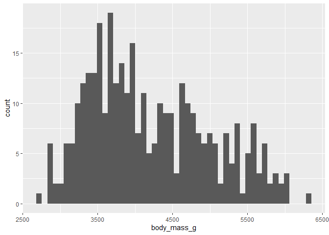
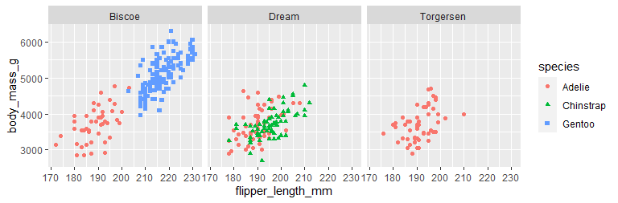
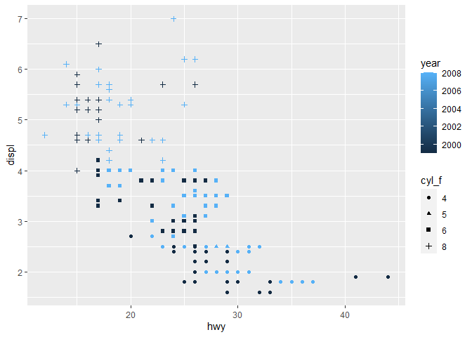

# 2 Data visualization {#sec-data-visualization}

## 2.1 Introduction

> "The simple graph has brought more information to the data analyst's mind than any other device." --- John Tukey

R has several systems for making graphs, but ggplot2 is one of the most elegant and most versatile.
ggplot2 implements the **grammar of graphics**, a coherent system for describing and building graphs.
With ggplot2, you can do more and faster by learning one system and applying it in many places.

This chapter will teach you how to visualize your data using **ggplot2**.
We will start by creating a simple scatterplot and use that to introduce aesthetic mappings and geometric objects -- the fundamental building blocks of ggplot2.
We will then walk you through visualizing distributions of single variables as well as visualizing relationships between two or more variables.
We'll finish off with saving your plots and troubleshooting tips.

### 2.1.1 Prerequisites

This chapter focuses on ggplot2, one of the core packages in the tidyverse.
To access the datasets, help pages, and functions used in this chapter, load the tidyverse by running:


```r
library(tidyverse)
```

```
## ── Attaching core tidyverse packages ──────────────────────── tidyverse 2.0.0 ──
## ✔ dplyr     1.1.0     ✔ readr     2.1.4
## ✔ forcats   1.0.0     ✔ stringr   1.5.0
## ✔ ggplot2   3.4.1     ✔ tibble    3.2.0
## ✔ lubridate 1.9.2     ✔ tidyr     1.3.0
## ✔ purrr     1.0.1     
## ── Conflicts ────────────────────────────────────────── tidyverse_conflicts() ──
## ✖ dplyr::filter() masks stats::filter()
## ✖ dplyr::lag()    masks stats::lag()
## ℹ Use the ]8;;http://conflicted.r-lib.org/conflicted package]8;; to force all conflicts to become errors
```

That one line of code loads the core tidyverse; the packages that you will use in almost every data analysis.
It also tells you which functions from the tidyverse conflict with functions in base R (or from other packages you might have loaded)[^data-visualize-1].

[^data-visualize-1]: You can eliminate that message and force conflict resolution to happen on demand by using the conflicted package, which becomes more important as you load more packages.
    You can learn more about conflicted at <https://conflicted.r-lib.org>.

If you run this code and get the error message `there is no package called 'tidyverse'`, you'll need to first install it, then run `library()` once again.


```r
# install.packages("tidyverse")
# library(tidyverse)
```

You only need to install a package once, but you need to load it every time you start a new session.

In addition to tidyverse, we will also use the **palmerpenguins** package, which includes the `penguins` dataset containing body measurements for penguins on three islands in the Palmer Archipelago, and the ggthemes package, which offers a colorblind safe color palette.


```r
library(palmerpenguins)
library(ggthemes)
```

## 2.2 First steps

Do penguins with longer flippers weigh more or less than penguins with shorter flippers?
You probably already have an answer, but try to make your answer precise.
What does the relationship between flipper length and body mass look like?
Is it positive?
Negative?
Linear?
Nonlinear?
Does the relationship vary by the species of the penguin?
And how about by the island where the penguin lives.
Let's create visualizations that we can use to answer these questions.

### 2.2.1 The `penguins` data frame

You can test your answer with the `penguins` **data frame** found in palmerpenguins (a.k.a. `palmerpenguins::penguins`).
A data frame is a rectangular collection of variables (in the columns) and observations (in the rows).
`penguins` contains 344 observations collected and made available by Dr. Kristen Gorman and the Palmer Station, Antarctica LTER[^data-visualize-2].

[^data-visualize-2]: Horst AM, Hill AP, Gorman KB (2020).
    palmerpenguins: Palmer Archipelago (Antarctica) penguin data.
    R package version 0.1.0.
    <https://allisonhorst.github.io/palmerpenguins/>.
    doi: 10.5281/zenodo.3960218.

To make the discussion easier, let's define some terms:

-   A **variable** is a quantity, quality, or property that you can measure.

-   A **value** is the state of a variable when you measure it.
    The value of a variable may change from measurement to measurement.

-   An **observation** is a set of measurements made under similar conditions (you usually make all of the measurements in an observation at the same time and on the same object).
    An observation will contain several values, each associated with a different variable.
    We'll sometimes refer to an observation as a data point.

-   **Tabular data** is a set of values, each associated with a variable and an observation.
    Tabular data is *tidy* if each value is placed in its own "cell", each variable in its own column, and each observation in its own row.

In this context, a variable refers to an attribute of all the penguins, and an observation refers to all the attributes of a single penguin.

Type the name of the data frame in the console and R will print a preview of its contents.
Note that it says `tibble` on top of this preview.
In the tidyverse, we use special data frames called **tibbles** that you will learn more about soon.


```r
penguins
```

```
## # A tibble: 344 × 8
##    species island    bill_length_mm bill_depth_mm flipper_…¹ body_…² sex    year
##    <fct>   <fct>              <dbl>         <dbl>      <int>   <int> <fct> <int>
##  1 Adelie  Torgersen           39.1          18.7        181    3750 male   2007
##  2 Adelie  Torgersen           39.5          17.4        186    3800 fema…  2007
##  3 Adelie  Torgersen           40.3          18          195    3250 fema…  2007
##  4 Adelie  Torgersen           NA            NA           NA      NA <NA>   2007
##  5 Adelie  Torgersen           36.7          19.3        193    3450 fema…  2007
##  6 Adelie  Torgersen           39.3          20.6        190    3650 male   2007
##  7 Adelie  Torgersen           38.9          17.8        181    3625 fema…  2007
##  8 Adelie  Torgersen           39.2          19.6        195    4675 male   2007
##  9 Adelie  Torgersen           34.1          18.1        193    3475 <NA>   2007
## 10 Adelie  Torgersen           42            20.2        190    4250 <NA>   2007
## # … with 334 more rows, and abbreviated variable names ¹​flipper_length_mm,
## #   ²​body_mass_g
```

This data frame contains 8 columns.
For an alternative view, where you can see all variables and the first few observations of each variable, use `glimpse()`.
Or, if you're in RStudio, click on the name of the data frame in the Environment pane or run `View(penguins)` to open an interactive data viewer.


```r
glimpse(penguins)
```

```
## Rows: 344
## Columns: 8
## $ species           <fct> Adelie, Adelie, Adelie, Adelie, Adelie, Adelie, Adel…
## $ island            <fct> Torgersen, Torgersen, Torgersen, Torgersen, Torgerse…
## $ bill_length_mm    <dbl> 39.1, 39.5, 40.3, NA, 36.7, 39.3, 38.9, 39.2, 34.1, …
## $ bill_depth_mm     <dbl> 18.7, 17.4, 18.0, NA, 19.3, 20.6, 17.8, 19.6, 18.1, …
## $ flipper_length_mm <int> 181, 186, 195, NA, 193, 190, 181, 195, 193, 190, 186…
## $ body_mass_g       <int> 3750, 3800, 3250, NA, 3450, 3650, 3625, 4675, 3475, …
## $ sex               <fct> male, female, female, NA, female, male, female, male…
## $ year              <int> 2007, 2007, 2007, 2007, 2007, 2007, 2007, 2007, 2007…
```

Among the variables in `penguins` are:

1.  `species`: a penguin's species (Adelie, Chinstrap, or Gentoo).

2.  `flipper_length_mm`: length of a penguin's flipper, in millimeters.

3.  `body_mass_g`: body mass of a penguin, in grams.

To learn more about `penguins`, open its help page by running `?penguins`.

### 2.2.2 Ultimate goal {#sec-ultimate-goal}

Our ultimate goal in this chapter is to recreate the following visualization displaying the relationship between flipper lengths and body masses of these penguins, taking into consideration the species of the penguin.


```
## `geom_smooth()` using formula = 'y ~ x'
```


### 2.2.3 Creating a ggplot

Let's recreate this plot step-by-step.

With ggplot2, you begin a plot with the function `ggplot()`, defining a plot object that you then add **layers** to.
The first argument of `ggplot()` is the dataset to use in the graph and so `ggplot(data = penguins)` creates an empty graph that is primed to display the `penguins` data, but since we haven't told it how to visualize it yet, for now it's empty.
This is not a very exciting plot, but you can think of it like an empty canvas you'll paint the remaining layers of your plot onto.


```r
ggplot(data = penguins)
```


Next, we need to tell `ggplot()` how the information from our data will be visually represented.
The `mapping` argument of the `ggplot()` function defines how variables in your dataset are mapped to visual properties (**aesthetics**) of your plot.
The `mapping` argument is always defined in the `aes()` function, and the `x` and `y` arguments of `aes()` specify which variables to map to the x and y axes.
For now, we will only map flipper length to the `x` aesthetic and body mass to the `y` aesthetic.
ggplot2 looks for the mapped variables in the `data` argument, in this case, `penguins`.

The following plot shows the result of adding these mappings.


```r
ggplot(
  data = penguins,
  mapping = aes(x = flipper_length_mm, y = body_mass_g)
)
```


Our empty canvas now has more structure -- it's clear where flipper lengths will be displayed (on the x-axis) and where body masses will be displayed (on the y-axis).
But the penguins themselves are not yet on the plot.
This is because we have not yet articulated, in our code, how to represent the observations from our data frame on our plot.

To do so, we need to define a **geom**: the geometrical object that a plot uses to represent data.
These geometric objects are made available in ggplot2 with functions that start with `geom_`.
People often describe plots by the type of geom that the plot uses.
For example, bar charts use bar geoms (`geom_bar()`), line charts use line geoms (`geom_line()`), boxplots use boxplot geoms (`geom_boxplot()`), scatterplots use point geoms (`geom_point()`), and so on.

The function `geom_point()` adds a layer of points to your plot, which creates a scatterplot.
ggplot2 comes with many geom functions that each adds a different type of layer to a plot.
You'll learn a whole bunch of geoms throughout the book, particularly in @sec-layers.


```r
ggplot(
  data = penguins,
  mapping = aes(x = flipper_length_mm, y = body_mass_g)
) +
  geom_point()
```

```
## Warning: Removed 2 rows containing missing values (`geom_point()`).
```


Now we have something that looks like what we might think of as a "scatter plot".
It doesn't yet match our "ultimate goal" plot, but using this plot we can start answering the question that motivated our exploration: "What does the relationship between flipper length and body mass look like?" The relationship appears to be positive (as flipper length increases, so does body mass), fairly linear (the points are clustered around a line instead of a curve), and moderately strong (there isn't too much scatter around such a line).
Penguins with longer flippers are generally larger in terms of their body mass.

Before we add more layers to this plot, let's pause for a moment and review the warning message we got:

> Removed 2 rows containing missing values (`geom_point()`).

We're seeing this message because there are two penguins in our dataset with missing body mass and/or flipper length values and ggplot2 has no way of representing them on the plot without both of these values.
Like R, ggplot2 subscribes to the philosophy that missing values should never silently go missing.
This type of warning is probably one of the most common types of warnings you will see when working with real data -- missing values are a very common issue and you'll learn more about them throughout the book, particularly in @sec-missing-values.
For the remaining plots in this chapter we will suppress this warning so it's not printed alongside every single plot we make.

### 2.2.4 Adding aesthetics and layers {#sec-adding-aesthetics-layers}

Scatterplots are useful for displaying the relationship between two numerical variables, but it's always a good idea to be skeptical of any apparent relationship between two variables and ask if there may be other variables that explain or change the nature of this apparent relationship.
For example, does the relationship between flipper length and body mass differ by species?
Let's incorporate species into our plot and see if this reveals any additional insights into the apparent relationship between these variables.
We will do this by representing species with different colored points.

To achieve this, will we need to modify the aesthetic or the geom?
If you guessed "in the aesthetic mapping, inside of `aes()`", you're already getting the hang of creating data visualizations with ggplot2!
And if not, don't worry.
Throughout the book you will make many more ggplots and have many more opportunities to check your intuition as you make them.


```r
ggplot(
  data = penguins,
  mapping = aes(x = flipper_length_mm, y = body_mass_g, color = species)
) +
  geom_point()
```


When a categorical variable is mapped to an aesthetic, ggplot2 will automatically assign a unique value of the aesthetic (here a unique color) to each unique level of the variable (each of the three species), a process known as **scaling**.
ggplot2 will also add a legend that explains which values correspond to which levels.

Now let's add one more layer: a smooth curve displaying the relationship between body mass and flipper length.
Before you proceed, refer back to the code above, and think about how we can add this to our existing plot.

Since this is a new geometric object representing our data, we will add a new geom as a layer on top of our point geom: `geom_smooth()`.
And we will specify that we want to to draw the line of best fit based on a `l`inear `m`odel with `method = "lm"`.


```r
ggplot(
  data = penguins,
  mapping = aes(x = flipper_length_mm, y = body_mass_g, color = species)
) +
  geom_point() +
  geom_smooth(method = "lm")
```

```
## `geom_smooth()` using formula = 'y ~ x'
```


We have successfully added lines, but this plot doesn't look like the plot from @sec-ultimate-goal, which only has one line for the entire dataset as opposed to separate lines for each of the penguin species.

When aesthetic mappings are defined in `ggplot()`, at the *global* level, they're passed down to each of the subsequent geom layers of the plot.
However, each geom function in ggplot2 can also take a `mapping` argument, which allows for aesthetic mappings at the *local* level that are added to those inherited from the global level.
Since we want points to be colored based on species but don't want the lines to be separated out for them, we should specify `color = species` for `geom_point()` only.


```r
ggplot(
  data = penguins,
  mapping = aes(x = flipper_length_mm, y = body_mass_g)
) +
  geom_point(mapping = aes(color = species)) +
  geom_smooth(method = "lm")
```

```
## `geom_smooth()` using formula = 'y ~ x'
```


Voila!
We have something that looks very much like our ultimate goal, though it's not yet perfect.
We still need to use different shapes for each species of penguins and improve labels.

It's generally not a good idea to represent information using only colors on a plot, as people perceive colors differently due to color blindness or other color vision differences.
Therefore, in addition to color, we can also map `species` to the `shape` aesthetic.


```r
ggplot(
  data = penguins,
  mapping = aes(x = flipper_length_mm, y = body_mass_g)
) +
  geom_point(mapping = aes(color = species, shape = species)) +
  geom_smooth(method = "lm")
```

```
## `geom_smooth()` using formula = 'y ~ x'
```


Note that the legend is automatically updated to reflect the different shapes of the points as well.

And finally, we can improve the labels of our plot using the `labs()` function in a new layer.
Some of the arguments to `labs()` might be self explanatory: `title` adds a title and `subtitle` adds a subtitle to the plot.
Other arguments match the aesthetic mappings, `x` is the x-axis label, `y` is the y-axis label, and `color` and `shape` define the label for the legend.
In addition, we can improve the color palette to be colorblind safe with the `scale_color_colorblind()` function from the ggthemes package.


```r
ggplot(
  data = penguins,
  mapping = aes(x = flipper_length_mm, y = body_mass_g)
) +
  geom_point(aes(color = species, shape = species)) +
  geom_smooth(method = "lm") +
  labs(
    title = "Body mass and flipper length",
    subtitle = "Dimensions for Adelie, Chinstrap, and Gentoo Penguins",
    x = "Flipper length (mm)", y = "Body mass (g)",
    color = "Species", shape = "Species"
  ) +
  scale_color_colorblind()
```

```
## `geom_smooth()` using formula = 'y ~ x'
```


We finally have a plot that perfectly matches our "ultimate goal"!

### 2.2.5 Exercises

1.  How many rows are in `penguins`?
    How many columns?
    

```r
str(penguins)
```

```
## tibble [344 × 8] (S3: tbl_df/tbl/data.frame)
##  $ species          : Factor w/ 3 levels "Adelie","Chinstrap",..: 1 1 1 1 1 1 1 1 1 1 ...
##  $ island           : Factor w/ 3 levels "Biscoe","Dream",..: 3 3 3 3 3 3 3 3 3 3 ...
##  $ bill_length_mm   : num [1:344] 39.1 39.5 40.3 NA 36.7 39.3 38.9 39.2 34.1 42 ...
##  $ bill_depth_mm    : num [1:344] 18.7 17.4 18 NA 19.3 20.6 17.8 19.6 18.1 20.2 ...
##  $ flipper_length_mm: int [1:344] 181 186 195 NA 193 190 181 195 193 190 ...
##  $ body_mass_g      : int [1:344] 3750 3800 3250 NA 3450 3650 3625 4675 3475 4250 ...
##  $ sex              : Factor w/ 2 levels "female","male": 2 1 1 NA 1 2 1 2 NA NA ...
##  $ year             : int [1:344] 2007 2007 2007 2007 2007 2007 2007 2007 2007 2007 ...
```

```r
dim(penguins)
```

```
## [1] 344   8
```

> 344 rows, 8 columns

2.  What does the `bill_depth_mm` variable in the `penguins` data frame describe?
    Read the help for `?penguins` to find out.
    

```r
# ?penguins
```

> bill_depth_mm: a number denoting bill depth (millimeters)

3.  Make a scatterplot of `bill_depth_mm` vs. `bill_length_mm`.
    That is, make a scatterplot with `bill_depth_mm` on the y-axis and `bill_length_mm` on the x-axis. Describe the relationship between these two variables.
    

```r
ggplot(
  data = penguins,
  mapping = aes(x = bill_length_mm, y = bill_depth_mm)
) +
  geom_point(aes(color = species, shape = species)) +
  geom_smooth(method = "lm") +
  labs(
    title = "Bill length and depth",
    subtitle = "Bill Dimensions for Adelie, Chinstrap, and Gentoo Penguins",
    x = "bill length (mm)", y = "bill depth (mm)",
    color = "Species", shape = "Species"
  ) +
  scale_color_colorblind()
```

```
## `geom_smooth()` using formula = 'y ~ x'
```

```
## Warning: Removed 2 rows containing non-finite values (`stat_smooth()`).
```

```
## Warning: Removed 2 rows containing missing values (`geom_point()`).
```

<!-- -->


4.  What happens if you make a scatterplot of `species` vs. `bill_depth_mm`?
    What might be a better choice of geom?
    

```r
ggplot(
  data = penguins,
  mapping = aes(x = species, y = bill_depth_mm)
) +
  geom_point(aes(color = species, shape = species)) +
  geom_smooth(method = "lm") +
  labs(
    title = "Species and bill depth",
    subtitle = "Bill Dimensions for Adelie, Chinstrap, and Gentoo Penguins",
    x = "species", y = "bill depth (mm)",
    color = "Species", shape = "Species"
  ) +
  scale_color_colorblind()
```

```
## `geom_smooth()` using formula = 'y ~ x'
```

```
## Warning: Removed 2 rows containing non-finite values (`stat_smooth()`).
```

```
## Warning: Removed 2 rows containing missing values (`geom_point()`).
```

<!-- -->

    

```r
ggplot(
  data = penguins,
  mapping = aes(x = species, y = bill_depth_mm)
) +
  geom_jitter(aes(color = species, shape = species)) +
  geom_smooth(method = "lm") +
  labs(
    title = "Species and bill depth",
    subtitle = "Bill Dimensions for Adelie, Chinstrap, and Gentoo Penguins",
    x = "species", y = "bill depth (mm)",
    color = "Species", shape = "Species"
  ) +
  scale_color_colorblind()
```

```
## `geom_smooth()` using formula = 'y ~ x'
```

```
## Warning: Removed 2 rows containing non-finite values (`stat_smooth()`).
```

```
## Warning: Removed 2 rows containing missing values (`geom_point()`).
```

<!-- -->


5.  Why does the following give an error and how would you fix it?


```r
ggplot(data = penguins) + 
  geom_point()
```


```r
ggplot(data = penguins, mapping = aes(x = bill_length_mm, y = bill_depth_mm)) + 
  geom_point()
```

```
## Warning: Removed 2 rows containing missing values (`geom_point()`).
```

<!-- -->


6.  What does the `na.rm` argument do in `geom_point()`?
    What is the default value of the argument?
    Create a scatterplot where you successfully use this argument set to `TRUE`.
    
> na.rm: If FALSE, the default, missing values are removed with a warning. If TRUE, missing values are silently removed.


```r
summary(penguins)
```

```
##       species          island    bill_length_mm  bill_depth_mm  
##  Adelie   :152   Biscoe   :168   Min.   :32.10   Min.   :13.10  
##  Chinstrap: 68   Dream    :124   1st Qu.:39.23   1st Qu.:15.60  
##  Gentoo   :124   Torgersen: 52   Median :44.45   Median :17.30  
##                                  Mean   :43.92   Mean   :17.15  
##                                  3rd Qu.:48.50   3rd Qu.:18.70  
##                                  Max.   :59.60   Max.   :21.50  
##                                  NA's   :2       NA's   :2      
##  flipper_length_mm  body_mass_g       sex           year     
##  Min.   :172.0     Min.   :2700   female:165   Min.   :2007  
##  1st Qu.:190.0     1st Qu.:3550   male  :168   1st Qu.:2007  
##  Median :197.0     Median :4050   NA's  : 11   Median :2008  
##  Mean   :200.9     Mean   :4202                Mean   :2008  
##  3rd Qu.:213.0     3rd Qu.:4750                3rd Qu.:2009  
##  Max.   :231.0     Max.   :6300                Max.   :2009  
##  NA's   :2         NA's   :2
```


```r
ggplot(
  data = penguins,
  mapping = aes(x = flipper_length_mm, y = body_mass_g)
) +
  geom_point(aes(color = species, shape = species), na.rm = TRUE) +
  geom_smooth(method = "lm", na.rm = TRUE) +
  labs(
    title = "Body mass and flipper length",
    subtitle = "Dimensions for Adelie, Chinstrap, and Gentoo Penguins",
    x = "Flipper length (mm)", y = "Body mass (g)",
    color = "Species", shape = "Species"
  ) +
  scale_color_colorblind()
```

```
## `geom_smooth()` using formula = 'y ~ x'
```

<!-- -->


7.  Add the following caption to the plot you made in the previous exercise: "Data come from the palmerpenguins package." Hint: Take a look at the documentation for `labs()`.

> caption: The text for the caption which will be displayed in the bottom-right of the plot by default.


```r
ggplot(
  data = penguins,
  mapping = aes(x = flipper_length_mm, y = body_mass_g)
) +
  geom_point(aes(color = species, shape = species), na.rm = TRUE) +
  geom_smooth(method = "lm", na.rm = TRUE) +
  labs(
    title = "Body mass and flipper length",
    subtitle = "Dimensions for Adelie, Chinstrap, and Gentoo Penguins",
    caption = "Data come from the palmerpenguins package.",
    x = "Flipper length (mm)", y = "Body mass (g)",
    color = "Species", shape = "Species"
  ) +
  scale_color_colorblind()
```

```
## `geom_smooth()` using formula = 'y ~ x'
```

<!-- -->


8.  Recreate the following visualization.
    What aesthetic should `bill_depth_mm` be mapped to?
    And should it be mapped at the global level or at the geom level?

> `bill_depth_mm` be mapped to color.

> at the geom level

    
    ```
    ## `geom_smooth()` using method = 'loess' and formula = 'y ~ x'
    ```
    
    


```r
    ggplot(
      data = penguins,
      mapping = aes(x = flipper_length_mm, y = body_mass_g, color = bill_depth_mm)
    ) +
      geom_point() +
      geom_smooth()
```

```
## `geom_smooth()` using method = 'loess' and formula = 'y ~ x'
```

```
## Warning: Removed 2 rows containing non-finite values (`stat_smooth()`).
```

```
## Warning: The following aesthetics were dropped during statistical transformation: colour
## ℹ This can happen when ggplot fails to infer the correct grouping structure in
##   the data.
## ℹ Did you forget to specify a `group` aesthetic or to convert a numerical
##   variable into a factor?
```

```
## Warning: Removed 2 rows containing missing values (`geom_point()`).
```

<!-- -->


```r
    ggplot(
      data = penguins,
      mapping = aes(x = flipper_length_mm, y = body_mass_g)
    ) +
      geom_point(aes(color = bill_depth_mm, size = bill_depth_mm)) +
      geom_smooth()
```

```
## `geom_smooth()` using method = 'loess' and formula = 'y ~ x'
```

```
## Warning: Removed 2 rows containing non-finite values (`stat_smooth()`).
```

```
## Warning: Removed 2 rows containing missing values (`geom_point()`).
```

<!-- -->


```r
ggplot(
  data = penguins,
  mapping = aes(x = flipper_length_mm, y = body_mass_g)
) +
  geom_point(aes(color = bill_depth_mm)) +
  scale_colour_binned(type = "viridis") + 
  geom_smooth()
```

```
## `geom_smooth()` using method = 'loess' and formula = 'y ~ x'
```

```
## Warning: Removed 2 rows containing non-finite values (`stat_smooth()`).
```

```
## Warning: Removed 2 rows containing missing values (`geom_point()`).
```

<!-- -->


9.  Run this code in your head and predict what the output will look like.
    Then, run the code in R and check your predictions.


```r
ggplot(
  data = penguins,
  mapping = aes(x = flipper_length_mm, y = body_mass_g, color = island)
) +
  geom_point() +
  geom_smooth(se = FALSE)
```


```r
    ggplot(
      data = penguins,
      mapping = aes(x = flipper_length_mm, y = body_mass_g)
    ) +
      geom_point(aes(color = island)) +
      geom_smooth()
```

```
## `geom_smooth()` using method = 'loess' and formula = 'y ~ x'
```

```
## Warning: Removed 2 rows containing non-finite values (`stat_smooth()`).
```

```
## Warning: Removed 2 rows containing missing values (`geom_point()`).
```

<!-- -->


10. Will these two graphs look different?
    Why/why not?
    
> no, they look the same.

    
    ```r
    ggplot(
      data = penguins,
      mapping = aes(x = flipper_length_mm, y = body_mass_g)
    ) +
      geom_point() +
      geom_smooth()
    
    ggplot() +
      geom_point(
        data = penguins,
        mapping = aes(x = flipper_length_mm, y = body_mass_g)
      ) +
      geom_smooth(
        data = penguins,
        mapping = aes(x = flipper_length_mm, y = body_mass_g)
      )
    ```

## 2.3 ggplot2 calls {#sec-ggplot2-calls}

As we move on from these introductory sections, we'll transition to a more concise expression of ggplot2 code.
So far we've been very explicit, which is helpful when you are learning:


```r
ggplot(
  data = penguins,
  mapping = aes(x = flipper_length_mm, y = body_mass_g)
) +
  geom_point()
```

Typically, the first one or two arguments to a function are so important that you should know them by heart.
The first two arguments to `ggplot()` are `data` and `mapping`, in the remainder of the book, we won't supply those names.
That saves typing, and, by reducing the amount of extra text, makes it easier to see what's different between plots.
That's a really important programming concern that we'll come back to in @sec-functions.

Rewriting the previous plot more concisely yields:


```r
ggplot(penguins, aes(x = flipper_length_mm, y = body_mass_g)) + 
  geom_point()
```

In the future, you'll also learn about the pipe, `|>`, which will allow you to create that plot with:

> %>% is the pipe that most R users know. Originally from the magrittr package, it’s now used in many other packages as well.

> The new pipe in R 4.1: 
Why does R need a new, built-in pipe when magrittr already supplies one? It cuts down on external dependencies, so developers don’t have to rely on an external package for such a key operation. Also, the built-in pipe may be faster. 


```r
penguins |> 
  ggplot(aes(x = flipper_length_mm, y = body_mass_g)) + 
  geom_point()
```

## 2.4 Visualizing distributions

How you visualize the distribution of a variable depends on the type of variable: categorical or numerical.

### 2.4.1 A categorical variable

A variable is **categorical** if it can only take one of a small set of values.
To examine the distribution of a categorical variable, you can use a bar chart.
The height of the bars displays how many observations occurred with each `x` value.


```r
ggplot(penguins, aes(x = species)) +
  geom_bar()
```


In bar plots of categorical variables with non-ordered levels, like the penguin `species` above, it's often preferable to reorder the bars based on their frequencies.
Doing so requires transforming the variable to a factor (how R handles categorical data) and then reordering the levels of that factor.


```r
ggplot(penguins, aes(x = fct_infreq(species))) +
  geom_bar()
```


You will learn more about factors and functions for dealing with factors (like `fct_infreq()` shown above) in @sec-factors.

> fct_inorder(): by the order in which they first appear.

> fct_infreq(): by number of observations with each level (largest first)


### 2.4.2 A numerical variable

A variable is **numerical** (or quantitative) if it can take on a wide range of numerical values, and it is sensible to add, subtract, or take averages with those values.
Numerical variables can be continuous or discrete.

One commonly used visualization for distributions of continuous variables is a histogram.


```r
ggplot(penguins, aes(x = body_mass_g)) +
  geom_histogram(binwidth = 200)
```


A histogram divides the x-axis into equally spaced bins and then uses the height of a bar to display the number of observations that fall in each bin.
In the graph above, the tallest bar shows that 39 observations have a `body_mass_g` value between 3,500 and 3,700 grams, which are the left and right edges of the bar.

You can set the width of the intervals in a histogram with the binwidth argument, which is measured in the units of the `x` variable.
You should always explore a variety of binwidths when working with histograms, as different binwidths can reveal different patterns.
In the plots below a binwidth of 20 is too narrow, resulting in too many bars, making it difficult to determine the shape of the distribution.
Similarly, a binwidth of 2,000 is too high, resulting in all data being binned into only three bars, and also making it difficult to determine the shape of the distribution.
A binwidth of 200 provides a sensible balance.


```r
ggplot(penguins, aes(x = body_mass_g)) +
  geom_histogram(binwidth = 20)
```


```r
ggplot(penguins, aes(x = body_mass_g)) +
  geom_histogram(binwidth = 2000)
```


An alternative visualization for distributions of numerical variables is a density plot.
A density plot is a smoothed-out version of a histogram and a practical alternative, particularly for continuous data that comes from an underlying smooth distribution.
We won't go into how `geom_density()` estimates the density (you can read more about that in the function documentation), but let's explain how the density curve is drawn with an analogy.
Imagine a histogram made out of wooden blocks.
Then, imagine that you drop a cooked spaghetti string over it.
The shape the spaghetti will take draped over blocks can be thought of as the shape of the density curve.
It shows fewer details than a histogram but can make it easier to quickly glean the shape of the distribution, particularly with respect to modes and skewness.


```r
ggplot(penguins, aes(x = body_mass_g)) +
  geom_density()
```

```
## Warning: Removed 2 rows containing non-finite values (`stat_density()`).
```


### 2.4.3 Exercises

1.  Make a bar plot of `species` of `penguins`, where you assign `species` to the `y` aesthetic.
    How is this plot different?
    

```r
ggplot(penguins, aes(y = fct_infreq(species))) +
  geom_bar()
```

<!-- -->


2.  How are the following two plots different?
    Which aesthetic, `color` or `fill`, is more useful for changing the color of bars?

> `fill` is more useful for changing the color of bars

    
    ```r
    ggplot(penguins, aes(x = species)) +
      geom_bar(color = "red")
    
    ggplot(penguins, aes(x = species)) +
      geom_bar(fill = "red")
    ```

3.  What does the `bins` argument in `geom_histogram()` do?

> bins: Number of bins. Overridden by binwidth. Defaults to 30.


```r
ggplot(penguins, aes(x = body_mass_g)) +
  geom_histogram(bins = 50)
```

```
## Warning: Removed 2 rows containing non-finite values (`stat_bin()`).
```

<!-- -->


4.  Make a histogram of the `carat` variable in the `diamonds` dataset that is available when you load the tidyverse package.
    Experiment with different binwidths.
    What binwidth reveals the most interesting patterns?
    

```r
str(diamonds)
```

```
## tibble [53,940 × 10] (S3: tbl_df/tbl/data.frame)
##  $ carat  : num [1:53940] 0.23 0.21 0.23 0.29 0.31 0.24 0.24 0.26 0.22 0.23 ...
##  $ cut    : Ord.factor w/ 5 levels "Fair"<"Good"<..: 5 4 2 4 2 3 3 3 1 3 ...
##  $ color  : Ord.factor w/ 7 levels "D"<"E"<"F"<"G"<..: 2 2 2 6 7 7 6 5 2 5 ...
##  $ clarity: Ord.factor w/ 8 levels "I1"<"SI2"<"SI1"<..: 2 3 5 4 2 6 7 3 4 5 ...
##  $ depth  : num [1:53940] 61.5 59.8 56.9 62.4 63.3 62.8 62.3 61.9 65.1 59.4 ...
##  $ table  : num [1:53940] 55 61 65 58 58 57 57 55 61 61 ...
##  $ price  : int [1:53940] 326 326 327 334 335 336 336 337 337 338 ...
##  $ x      : num [1:53940] 3.95 3.89 4.05 4.2 4.34 3.94 3.95 4.07 3.87 4 ...
##  $ y      : num [1:53940] 3.98 3.84 4.07 4.23 4.35 3.96 3.98 4.11 3.78 4.05 ...
##  $ z      : num [1:53940] 2.43 2.31 2.31 2.63 2.75 2.48 2.47 2.53 2.49 2.39 ...
```


```r
summary(diamonds)
```

```
##      carat               cut        color        clarity          depth      
##  Min.   :0.2000   Fair     : 1610   D: 6775   SI1    :13065   Min.   :43.00  
##  1st Qu.:0.4000   Good     : 4906   E: 9797   VS2    :12258   1st Qu.:61.00  
##  Median :0.7000   Very Good:12082   F: 9542   SI2    : 9194   Median :61.80  
##  Mean   :0.7979   Premium  :13791   G:11292   VS1    : 8171   Mean   :61.75  
##  3rd Qu.:1.0400   Ideal    :21551   H: 8304   VVS2   : 5066   3rd Qu.:62.50  
##  Max.   :5.0100                     I: 5422   VVS1   : 3655   Max.   :79.00  
##                                     J: 2808   (Other): 2531                  
##      table           price             x                y         
##  Min.   :43.00   Min.   :  326   Min.   : 0.000   Min.   : 0.000  
##  1st Qu.:56.00   1st Qu.:  950   1st Qu.: 4.710   1st Qu.: 4.720  
##  Median :57.00   Median : 2401   Median : 5.700   Median : 5.710  
##  Mean   :57.46   Mean   : 3933   Mean   : 5.731   Mean   : 5.735  
##  3rd Qu.:59.00   3rd Qu.: 5324   3rd Qu.: 6.540   3rd Qu.: 6.540  
##  Max.   :95.00   Max.   :18823   Max.   :10.740   Max.   :58.900  
##                                                                   
##        z         
##  Min.   : 0.000  
##  1st Qu.: 2.910  
##  Median : 3.530  
##  Mean   : 3.539  
##  3rd Qu.: 4.040  
##  Max.   :31.800  
## 
```


```r
ggplot(diamonds, aes(x = carat)) +
  geom_histogram()
```

```
## `stat_bin()` using `bins = 30`. Pick better value with `binwidth`.
```

<!-- -->


```r
ggplot(diamonds, aes(x = carat)) +
  geom_histogram(binwidth = 0.2)
```

<!-- -->

```r
ggplot(diamonds, aes(x = carat)) +
  geom_histogram(binwidth = 0.1)
```

<!-- -->


```r
ggplot(diamonds, aes(x = carat)) +
  geom_density()
```

<!-- -->


```r
ggplot(diamonds, aes(x = carat, color = cut, fill = cut)) +
  geom_density(alpha = 0.5)
```

<!-- -->


```r
ggplot(diamonds, aes(x = carat, y = price)) +
  geom_point(alpha = 0.5) +
  geom_density_2d_filled(alpha = 0.7)
```

<!-- -->


## 2.5 Visualizing relationships

To visualize a relationship we need to have at least two variables mapped to aesthetics of a plot.
In the following sections you will learn about commonly used plots for visualizing relationships between two or more variables and the geoms used for creating them.

### 2.5.1 A numerical and a categorical variable

To visualize the relationship between a numerical and a categorical variable we can use side-by-side box plots.
A **boxplot** is a type of visual shorthand for measures of position (percentiles) that describe a distribution.
It is also useful for identifying potential outliers.
As shown in @fig-eda-boxplot, each boxplot consists of:

-   A box that indicates the range of the middle half of the data, a distance known as the interquartile range (IQR), stretching from the 25th percentile of the distribution to the 75th percentile.
    In the middle of the box is a line that displays the median, i.e. 50th percentile, of the distribution.
    These three lines give you a sense of the spread of the distribution and whether or not the distribution is symmetric about the median or skewed to one side.

-   Visual points that display observations that fall more than 1.5 times the IQR from either edge of the box.
    These outlying points are unusual so are plotted individually.

-   A line (or whisker) that extends from each end of the box and goes to the farthest non-outlier point in the distribution.

<div class="figure">

<p class="caption">Diagram depicting how a boxplot is created.
</p>
</div>

Let's take a look at the distribution of body mass by species using `geom_boxplot()`:


```r
ggplot(penguins, aes(x = species, y = body_mass_g)) +
  geom_boxplot()
```


Alternatively, we can make density plots with `geom_density()`.


```r
ggplot(penguins, aes(x = body_mass_g, color = species)) +
  geom_density(linewidth = 0.75)
```


We've also customized the thickness of the lines using the `linewidth` argument in order to make them stand out a bit more against the background.

Additionally, we can map `species` to both `color` and `fill` aesthetics and use the `alpha` aesthetic to add transparency to the filled density curves.
This aesthetic takes values between 0 (completely transparent) and 1 (completely opaque).
In the following plot it's *set* to 0.5.


```r
ggplot(penguins, aes(x = body_mass_g, color = species, fill = species)) +
  geom_density(alpha = 0.5)
```


Note the terminology we have used here:

-   We *map* variables to aesthetics if we want the visual attribute represented by that aesthetic to vary based on the values of that variable.
-   Otherwise, we *set* the value of an aesthetic.

### 2.5.2 Two categorical variables

We can use stacked bar plots to visualize the relationship between two categorical variables.
For example, the following two stacked bar plots both display the relationship between `island` and `species`, or specifically, visualizing the distribution of `species` within each island.

The first plot shows the frequencies of each species of penguins on each island and the plot on the right shows the relative frequencies (proportions) of each species within each island (despite the incorrectly labeled y-axis that says "count").
The plot of frequencies show that there are equal numbers of Adelies on each island.
But we don't have a good sense of the percentage balance within each island.
In the proportions plot, we've lost our notion of total penguins, but we've gained the advantage of "breakdown by island".


```r
ggplot(penguins, aes(x = island, fill = species)) +
  geom_bar()
```


The second plot is a relative frequency plot, created by setting `position = "fill"` in the geom is more useful for comparing species distributions across islands since it's not affected by the unequal numbers of penguins across the islands.
Using this plot we can see that Gentoo penguins all live on Biscoe island and make up roughly 75% of the penguins on that island, Chinstrap all live on Dream island and make up roughly 50% of the penguins on that island, and Adelie live on all three islands and make up all of the penguins on Torgersen.


```r
summary(penguins)
```

```
##       species          island    bill_length_mm  bill_depth_mm  
##  Adelie   :152   Biscoe   :168   Min.   :32.10   Min.   :13.10  
##  Chinstrap: 68   Dream    :124   1st Qu.:39.23   1st Qu.:15.60  
##  Gentoo   :124   Torgersen: 52   Median :44.45   Median :17.30  
##                                  Mean   :43.92   Mean   :17.15  
##                                  3rd Qu.:48.50   3rd Qu.:18.70  
##                                  Max.   :59.60   Max.   :21.50  
##                                  NA's   :2       NA's   :2      
##  flipper_length_mm  body_mass_g       sex           year     
##  Min.   :172.0     Min.   :2700   female:165   Min.   :2007  
##  1st Qu.:190.0     1st Qu.:3550   male  :168   1st Qu.:2007  
##  Median :197.0     Median :4050   NA's  : 11   Median :2008  
##  Mean   :200.9     Mean   :4202                Mean   :2008  
##  3rd Qu.:213.0     3rd Qu.:4750                3rd Qu.:2009  
##  Max.   :231.0     Max.   :6300                Max.   :2009  
##  NA's   :2         NA's   :2
```


```r
str(penguins)
```

```
## tibble [344 × 8] (S3: tbl_df/tbl/data.frame)
##  $ species          : Factor w/ 3 levels "Adelie","Chinstrap",..: 1 1 1 1 1 1 1 1 1 1 ...
##  $ island           : Factor w/ 3 levels "Biscoe","Dream",..: 3 3 3 3 3 3 3 3 3 3 ...
##  $ bill_length_mm   : num [1:344] 39.1 39.5 40.3 NA 36.7 39.3 38.9 39.2 34.1 42 ...
##  $ bill_depth_mm    : num [1:344] 18.7 17.4 18 NA 19.3 20.6 17.8 19.6 18.1 20.2 ...
##  $ flipper_length_mm: int [1:344] 181 186 195 NA 193 190 181 195 193 190 ...
##  $ body_mass_g      : int [1:344] 3750 3800 3250 NA 3450 3650 3625 4675 3475 4250 ...
##  $ sex              : Factor w/ 2 levels "female","male": 2 1 1 NA 1 2 1 2 NA NA ...
##  $ year             : int [1:344] 2007 2007 2007 2007 2007 2007 2007 2007 2007 2007 ...
```


```r
ggplot(penguins, aes(x = island, fill = species)) +
  geom_bar(position = "fill")
```


In creating these bar charts, we map the variable that will be separated into bars to the `x` aesthetic, and the variable that will change the colors inside the bars to the `fill` aesthetic.

### 2.5.3 Two numerical variables

So far you've learned about scatterplots (created with `geom_point()`) and smooth curves (created with `geom_smooth()`) for visualizing the relationship between two numerical variables.
A scatterplot is probably the most commonly used plot for visualizing the relationship between two numerical variables.


```r
ggplot(penguins, aes(x = flipper_length_mm, y = body_mass_g)) +
  geom_point()
```


### Three or more variables

As we saw in @sec-adding-aesthetics-layers, we can incorporate more variables into a plot by mapping them to additional aesthetics.
For example, in the following scatterplot the colors of points represent species and the shapes of points represent islands.


```r
ggplot(penguins, aes(x = flipper_length_mm, y = body_mass_g)) +
  geom_point(aes(color = species, shape = island))
```


However adding too many aesthetic mappings to a plot makes it cluttered and difficult to make sense of.
Another way, which is particularly useful for categorical variables, is to split your plot into **facets**, subplots that each display one subset of the data.

To facet your plot by a single variable, use `facet_wrap()`.
The first argument of `facet_wrap()` is a formula[^data-visualize-3], which you create with `~` followed by a variable name.
The variable that you pass to `facet_wrap()` should be categorical.

[^data-visualize-3]: Here "formula" is the name of the thing created by `~`, not a synonym for "equation".


```r
ggplot(penguins, aes(x = flipper_length_mm, y = body_mass_g)) +
  geom_point(aes(color = species, shape = species)) +
  facet_wrap(~island)
```



You will learn about many other geoms for visualizing distributions of variables and relationships between them in @sec-layers.

### 2.5.5 Exercises

1.  The `mpg` data frame that is bundled with the ggplot2 package contains 234 observations collected by the US Environmental Protection Agency on 38 car models.
    Which variables in `mpg` are categorical?
    Which variables are numerical?
    (Hint: Type `?mpg` to read the documentation for the dataset.) How can you see this information when you run `mpg`?
    

```r
str(mpg)
```

```
## tibble [234 × 11] (S3: tbl_df/tbl/data.frame)
##  $ manufacturer: chr [1:234] "audi" "audi" "audi" "audi" ...
##  $ model       : chr [1:234] "a4" "a4" "a4" "a4" ...
##  $ displ       : num [1:234] 1.8 1.8 2 2 2.8 2.8 3.1 1.8 1.8 2 ...
##  $ year        : int [1:234] 1999 1999 2008 2008 1999 1999 2008 1999 1999 2008 ...
##  $ cyl         : int [1:234] 4 4 4 4 6 6 6 4 4 4 ...
##  $ trans       : chr [1:234] "auto(l5)" "manual(m5)" "manual(m6)" "auto(av)" ...
##  $ drv         : chr [1:234] "f" "f" "f" "f" ...
##  $ cty         : int [1:234] 18 21 20 21 16 18 18 18 16 20 ...
##  $ hwy         : int [1:234] 29 29 31 30 26 26 27 26 25 28 ...
##  $ fl          : chr [1:234] "p" "p" "p" "p" ...
##  $ class       : chr [1:234] "compact" "compact" "compact" "compact" ...
```

```r
summary(mpg)
```

```
##  manufacturer          model               displ            year     
##  Length:234         Length:234         Min.   :1.600   Min.   :1999  
##  Class :character   Class :character   1st Qu.:2.400   1st Qu.:1999  
##  Mode  :character   Mode  :character   Median :3.300   Median :2004  
##                                        Mean   :3.472   Mean   :2004  
##                                        3rd Qu.:4.600   3rd Qu.:2008  
##                                        Max.   :7.000   Max.   :2008  
##       cyl           trans               drv                 cty       
##  Min.   :4.000   Length:234         Length:234         Min.   : 9.00  
##  1st Qu.:4.000   Class :character   Class :character   1st Qu.:14.00  
##  Median :6.000   Mode  :character   Mode  :character   Median :17.00  
##  Mean   :5.889                                         Mean   :16.86  
##  3rd Qu.:8.000                                         3rd Qu.:19.00  
##  Max.   :8.000                                         Max.   :35.00  
##       hwy             fl               class          
##  Min.   :12.00   Length:234         Length:234        
##  1st Qu.:18.00   Class :character   Class :character  
##  Median :24.00   Mode  :character   Mode  :character  
##  Mean   :23.44                                        
##  3rd Qu.:27.00                                        
##  Max.   :44.00
```
> manufacturer (manufacturer name), model (model name), trans (type of transmission), drv (the type of drive train, where f = front-wheel drive, r = rear wheel drive, 4 = 4wd), fl(fuel type), class("type" of car) in `mpg` are categorical.

> displ (engine displacement, in litres), year (year of manufacture), cyl (number of cylinders), cty (city miles per gallon), hwy (highway miles per gallon) are numerical.

> year (year of manufacture), cyl (number of cylinders) can be converted into categorical.

2.  Make a scatterplot of `hwy` vs. `displ` using the `mpg` data frame.
    Next, map a third, numerical variable to `color`, then `size`, then both `color` and `size`, then `shape`.
    How do these aesthetics behave differently for categorical vs. numerical variables?


```r
ggplot(mpg, aes(x = hwy, y = displ)) +
  geom_point(aes(color = cyl))
```

<!-- -->

```r
ggplot(mpg, aes(x = hwy, y = displ)) +
  geom_point(aes(size = cyl))
```

<!-- -->

```r
ggplot(mpg, aes(x = hwy, y = displ)) +
  geom_point(aes(color = year, size = cyl))
```

<!-- -->


```r
new_mpg <- mpg
new_mpg$cyl_f <- as.factor(mpg$cyl)

str(new_mpg)
```

```
## tibble [234 × 12] (S3: tbl_df/tbl/data.frame)
##  $ manufacturer: chr [1:234] "audi" "audi" "audi" "audi" ...
##  $ model       : chr [1:234] "a4" "a4" "a4" "a4" ...
##  $ displ       : num [1:234] 1.8 1.8 2 2 2.8 2.8 3.1 1.8 1.8 2 ...
##  $ year        : int [1:234] 1999 1999 2008 2008 1999 1999 2008 1999 1999 2008 ...
##  $ cyl         : int [1:234] 4 4 4 4 6 6 6 4 4 4 ...
##  $ trans       : chr [1:234] "auto(l5)" "manual(m5)" "manual(m6)" "auto(av)" ...
##  $ drv         : chr [1:234] "f" "f" "f" "f" ...
##  $ cty         : int [1:234] 18 21 20 21 16 18 18 18 16 20 ...
##  $ hwy         : int [1:234] 29 29 31 30 26 26 27 26 25 28 ...
##  $ fl          : chr [1:234] "p" "p" "p" "p" ...
##  $ class       : chr [1:234] "compact" "compact" "compact" "compact" ...
##  $ cyl_f       : Factor w/ 4 levels "4","5","6","8": 1 1 1 1 3 3 3 1 1 1 ...
```

```r
ggplot(new_mpg, aes(x = hwy, y = displ)) +
  geom_point(aes(color = year, shape = cyl_f))
```

<!-- -->


3.  In the scatterplot of `hwy` vs. `displ`, what happens if you map a third variable to `linewidth`?


```r
ggplot(mpg, aes(x = hwy, y = displ)) +
  geom_point(aes(linewidth = drv))
```

```
## Warning in geom_point(aes(linewidth = drv)): Ignoring unknown aesthetics:
## linewidth
```

```
## Warning: Using linewidth for a discrete variable is not advised.
```

<!-- -->


```r
ggplot(mpg, aes(x = hwy, y = displ)) +
  geom_point() +
  geom_smooth(aes(linewidth = drv))
```

```
## Warning: Using linewidth for a discrete variable is not advised.
```

```
## `geom_smooth()` using method = 'loess' and formula = 'y ~ x'
```

<!-- -->


4.  What happens if you map the same variable to multiple aesthetics?


```r
ggplot(mpg, aes(x = hwy, y = displ)) +
  geom_point(aes(color = cyl, size = cyl))
```

<!-- -->


5.  Make a scatterplot of `bill_depth_mm` vs. `bill_length_mm` and color the points by `species`.
    What does adding coloring by species reveal about the relationship between these two variables?
    What about faceting by species?
    

```r
ggplot(
  data = penguins,
  mapping = aes(x = bill_depth_mm, y = bill_length_mm)
) +
  geom_point(aes(color = species), na.rm = TRUE) +
  geom_smooth(method = "lm", na.rm = TRUE) +
  labs(
    title = "Bill depth and bill length",
    subtitle = "Dimensions for Adelie, Chinstrap, and Gentoo Penguins",
    caption = "Data come from the palmerpenguins package.",
    x = "bill depth (mm)", y = "bill length (mm)",
    color = "Species"
  ) +
  scale_color_colorblind()
```

```
## `geom_smooth()` using formula = 'y ~ x'
```

<!-- -->


```r
ggplot(
  data = penguins,
  mapping = aes(x = bill_depth_mm, y = bill_length_mm)
) +
  geom_point(aes(color = species), na.rm = TRUE) +
  geom_smooth(method = "lm", na.rm = TRUE) +
  labs(
    title = "Bill depth and bill length",
    subtitle = "Dimensions for Adelie, Chinstrap, and Gentoo Penguins",
    caption = "Data come from the palmerpenguins package.",
    x = "bill depth (mm)", y = "bill length (mm)",
    color = "Species"
  ) +
  scale_color_colorblind() +
  facet_wrap(~species)
```

```
## `geom_smooth()` using formula = 'y ~ x'
```

<!-- -->


6.  Why does the following yield two separate legends?
    How would you fix it to combine the two legends?

    
    ```r
    ggplot(
      data = penguins,
      mapping = aes(
        x = bill_length_mm, y = bill_depth_mm, 
        color = species, shape = species
      )
    ) +
      geom_point() +
      labs(color = "Species")
    ```


```r
    ggplot(
      data = penguins,
      mapping = aes(
        x = bill_length_mm, y = bill_depth_mm, 
        color = species, shape = species
      )
    ) +
      geom_point() +
      labs(color = "species")
```

```
## Warning: Removed 2 rows containing missing values (`geom_point()`).
```

<!-- -->


7.  Create the two following stacked bar plots.
    Which question can you answer with the first one?

> What is the composition of species for each island?   

    Which question can you answer with the second one?

> What is the distributions across islands for each species?


    
    ```r
    ggplot(penguins, aes(x = island, fill = species)) +
      geom_bar(position = "fill")
    ```
    
    ```r
    ggplot(penguins, aes(x = species, fill = island)) +
      geom_bar(position = "fill")
    ```

## 2.6 Saving your plots {#sec-ggsave}

Once you've made a plot, you might want to get it out of R by saving it as an image that you can use elsewhere.
That's the job of `ggsave()`, which will save the plot most recently created to disk:


```r
ggplot(penguins, aes(x = flipper_length_mm, y = body_mass_g)) +
  geom_point()
```

```r
ggsave(filename = "penguin-plot.png")
```

```
## Saving 7 x 5 in image
```


This will save your plot to your working directory, a concept you'll learn more about in @sec-workflow-scripts-projects.

If you don't specify the `width` and `height` they will be taken from the dimensions of the current plotting device.
For reproducible code, you'll want to specify them.
You can learn more about `ggsave()` in the documentation.

Generally, however, we recommend that you assemble your final reports using Quarto, a reproducible authoring system that allows you to interleave your code and your prose and automatically include your plots in your write-ups.
You will learn more about Quarto in @sec-quarto.

### 2.6.1 Exercises

1.  Run the following lines of code.
    Which of the two plots is saved as `mpg-plot.png`?
    Why?
    
> The second plot is saved as `mpg-plot.png` because `ggsave()` will save the plot most recently created to disk.

    
    ```r
    ggplot(mpg, aes(x = class)) +
      geom_bar()
    ggplot(mpg, aes(x = cty, y = hwy)) +
      geom_point()
    ggsave("mpg-plot.png")
    ```

2.  What do you need to change in the code above to save the plot as a PDF instead of a PNG?
    How could you find out what types of image files would work in `ggsave()`?
    

```r
ggplot(mpg, aes(x = cty, y = hwy)) +
  geom_point()
```

<!-- -->

```r
ggsave("mpg-plot.pdf")
```

```
## Saving 7 x 5 in image
```


```r
# ?ggsave
```

> device: Device to use. Can either be a device function (e.g. png), or one of "eps", "ps", "tex" (pictex), "pdf", "jpeg", "tiff", "png", "bmp", "svg" or "wmf" (windows only).

## 2.7 Common problems

As you start to run R code, you're likely to run into problems.
Don't worry --- it happens to everyone.
We have all been writing R code for years, but every day we still write code that doesn't work on the first try!

Start by carefully comparing the code that you're running to the code in the book.
R is extremely picky, and a misplaced character can make all the difference.
Make sure that every `(` is matched with a `)` and every `"` is paired with another `"`.
Sometimes you'll run the code and nothing happens.
Check the left-hand of your console: if it's a `+`, it means that R doesn't think you've typed a complete expression and it's waiting for you to finish it.
In this case, it's usually easy to start from scratch again by pressing ESCAPE to abort processing the current command.

One common problem when creating ggplot2 graphics is to put the `+` in the wrong place: it has to come at the end of the line, not the start.
In other words, make sure you haven't accidentally written code like this:


```r
ggplot(data = mpg) 
+ geom_point(mapping = aes(x = displ, y = hwy))
```

If you're still stuck, try the help.
You can get help about any R function by running `?function_name` in the console, or highlighting the function name and pressing F1 in RStudio.
Don't worry if the help doesn't seem that helpful - instead skip down to the examples and look for code that matches what you're trying to do.

If that doesn't help, carefully read the error message.
Sometimes the answer will be buried there!
But when you're new to R, even if the answer is in the error message, you might not yet know how to understand it.
Another great tool is Google: try googling the error message, as it's likely someone else has had the same problem, and has gotten help online.

## 2.8 Summary

In this chapter, you've learned the basics of data visualization with ggplot2.
We started with the basic idea that underpins ggplot2: a visualization is a mapping from variables in your data to aesthetic properties like position, color, size and shape.
You then learned about increasing the complexity and improving the presentation of your plots layer-by-layer.
You also learned about commonly used plots for visualizing the distribution of a single variable as well as for visualizing relationships between two or more variables, by levering additional aesthetic mappings and/or splitting your plot into small multiples using faceting.

We'll use visualizations again and again through out this book, introducing new techniques as we need them as well as do a deeper dive into creating visualizations with ggplot2 in @sec-layers through @sec-exploratory-data-analysis.

With the basics of visualization under your belt, in the next chapter we're going to switch gears a little and give you some practical workflow advice.
We intersperse workflow advice with data science tools throughout this part of the book because it'll help you stay organized as you write increasing amounts of R code.
