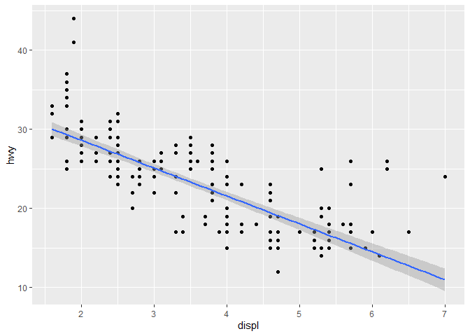

# 3 Workflow: basics {#sec-workflow-basics}

You now have some experience running R code.
We didn't give you many details, but you've obviously figured out the basics, or you would've thrown this book away in frustration!
Frustration is natural when you start programming in R because it is such a stickler for punctuation, and even one character out of place can cause it to complain.
But while you should expect to be a little frustrated, take comfort in that this experience is typical and temporary: it happens to everyone, and the only way to get over it is to keep trying.

Before we go any further, let's ensure you've got a solid foundation in running R code and that you know some of the most helpful RStudio features.

## 3.1 Coding basics

Let's review some basics we've omitted so far in the interest of getting you plotting as quickly as possible.
You can use R to do basic math calculations:


```r
1 / 200 * 30
```

```
## [1] 0.15
```

```r
(59 + 73 + 2) / 3
```

```
## [1] 44.66667
```

```r
sin(pi / 2)
```

```
## [1] 1
```

You can create new objects with the assignment operator `<-`:


```r
x <- 3 * 4
x
```

```
## [1] 12
```

Note that the value of `x` is not printed, it's just stored.
If you want to view the value, type `x` in the console.

You can **c**ombine multiple elements into a vector with `c()`:


```r
primes <- c(2, 3, 5, 7, 11, 13)
```

And basic arithmetic on vectors is applied to every element of of the vector:


```r
primes * 2
```

```
## [1]  4  6 10 14 22 26
```

```r
primes - 1
```

```
## [1]  1  2  4  6 10 12
```

All R statements where you create objects, **assignment** statements, have the same form:


```r
object_name <- value
```

When reading that code, say "object name gets value" in your head.

You will make lots of assignments, and `<-` is a pain to type.

> You can save time with RStudio's keyboard shortcut: Alt + - (the minus sign).
Notice that RStudio automatically surrounds `<-` with spaces, which is a good code formatting practice.

Code can be miserable to read on a good day, so giveyoureyesabreak and use spaces.

## Comments

R will ignore any text after `#` for that line.
This allows you to write **comments**, text that is ignored by R but read by other humans.
We'll sometimes include comments in examples explaining what's happening with the code.

Comments can be helpful for briefly describing what the following code does.


```r
# create vector of primes
primes <- c(2, 3, 5, 7, 11, 13)

# multiply primes by 2
primes * 2
```

```
## [1]  4  6 10 14 22 26
```

With short pieces of code like this, leaving a comment for every single line of code might not be necessary.
But as the code you're writing gets more complex, comments can save you (and your collaborators) a lot of time figuring out what was done in the code.

> Use comments to explain the *why* of your code, not the *how* or the *what*.

The *what* and *how* of your code are always possible to figure out, even if it might be tedious, by carefully reading it.
If you describe every step in the comments, and then change the code, you will have to remember to update the comments as well or it will be confusing when you return to your code in the future.

Figuring out *why* something was done is much more difficult, if not impossible.
For example, `geom_smooth()` has an argument called `span`, which controls the smoothness of the curve, with larger values yielding a smoother curve.
Suppose you decide to change the value of `span` from its default of 0.75 to 0.9: it's easy for a future reader to understand *what* is happening, but unless you note your thinking in a comment, no one will understand *why* you changed the default.

For data analysis code, use comments to explain your overall plan of attack and record important insights as you encounter them.
There's no way to re-capture this knowledge from the code itself.

## What's in a name? {#sec-whats-in-a-name}

Object names must start with a letter and can only contain letters, numbers, `_`, and `.`.
You want your object names to be descriptive, so you'll need to adopt a convention for multiple words.
We recommend **snake_case**, where you separate lowercase words with `_`.


```r
i_use_snake_case
otherPeopleUseCamelCase
some.people.use.periods
And_aFew.People_RENOUNCEconvention
```

We'll return to names again when we discuss code style in @sec-workflow-style.

You can inspect an object by typing its name:


```r
x
```

```
## [1] 12
```

Make another assignment:


```r
this_is_a_really_long_name <- 2.5
```

To inspect this object, try out RStudio's completion facility: type "this", press TAB, add characters until you have a unique prefix, then press return.

Let's assume you made a mistake, and that the value of `this_is_a_really_long_name` should be 3.5, not 2.5.
You can use another keyboard shortcut to help you fix it.
For example, you can press ↑ to bring the last command you typed and edit it.
Or, type "this" then press Cmd/Ctrl + ↑ to list all the commands you've typed that start with those letters.
Use the arrow keys to navigate, then press enter to retype the command.
Change 2.5 to 3.5 and rerun.

Make yet another assignment:


```r
r_rocks <- 2^3
```

Let's try to inspect it:


```r
r_rock
#> Error: object 'r_rock' not found
R_rocks
#> Error: object 'R_rocks' not found
```

This illustrates the implied contract between you and R: R will do the tedious computations for you, but in exchange, you must be completely precise in your instructions.
If not, you're likely to get an error that says the object you're looking for was not found.
Typos matter; R can't read your mind and say, "oh, they probably meant `r_rocks` when they typed `r_rock`".
Case matters; similarly, R can't read your mind and say, "oh, they probably meant `r_rocks` when they typed `R_rocks`".

## Calling functions

R has a large collection of built-in functions that are called like this:


```r
function_name(argument1 = value1, argument2 = value2, ...)
```

Let's try using `seq()`, which makes regular **seq**uences of numbers, and while we're at it, learn more helpful features of RStudio.
Type `se` and hit TAB.
A popup shows you possible completions.
Specify `seq()` by typing more (a `q`) to disambiguate or by using ↑/↓ arrows to select.
Notice the floating tooltip that pops up, reminding you of the function's arguments and purpose.
If you want more help, press F1 to get all the details in the help tab in the lower right pane.


When you've selected the function you want, press TAB again.
RStudio will add matching opening (`(`) and closing (`)`) parentheses for you.
Type the name of the first argument, `from`, and set it equal to `1`.
Then, type the name of the second argument, `to`, and set it equal to `10`.
Finally, hit return.


```r
seq(from = 1, to = 10)
```

```
##  [1]  1  2  3  4  5  6  7  8  9 10
```

We often omit the names of the first arguments in function calls, so we can rewrite this as follows:


```r
seq(1, 10)
```

```
##  [1]  1  2  3  4  5  6  7  8  9 10
```

Type the following code and notice that RStudio provides similar assistance with the paired quotation marks:


```r
x <- "hello world"
```

Quotation marks and parentheses must always come in a pair.
RStudio does its best to help you, but it's still possible to mess up and end up with a mismatch.
If this happens, R will show you the continuation character "+":

    > x <- "hello
    +

The `+` tells you that R is waiting for more input; it doesn't think you're done yet.
Usually, this means you've forgotten either a `"` or a `)`. Either add the missing pair, or press ESCAPE to abort the expression and try again.

Note that the environment tab in the upper right pane displays all of the objects that you've created:


## Exercises

1.  Why does this code not work?

    
    ```r
    my_variable <- 10
    my_variable
    ```
    
    ```
    ## [1] 10
    ```
    
    ```r
    my_varıable
    ```
    
    ```
    ## Error in eval(expr, envir, enclos): object 'my_varıable' not found
    ```

    Look carefully!
    (This may seem like an exercise in pointlessness, but training your brain to notice even the tiniest difference will pay off when programming.)

2.  Tweak each of the following R commands so that they run correctly:

    
    ```r
    libary(todyverse)
    
    ggplot(dTA = mpg) + 
      geom_point(maping = aes(x = displ y = hwy)) +
      geom_smooth(method = "lm)
    ```


```r
library(tidyverse)
```

```
## ── Attaching core tidyverse packages ──────────────────────── tidyverse 2.0.0 ──
## ✔ dplyr     1.1.0     ✔ readr     2.1.4
## ✔ forcats   1.0.0     ✔ stringr   1.5.0
## ✔ ggplot2   3.4.1     ✔ tibble    3.2.0
## ✔ lubridate 1.9.2     ✔ tidyr     1.3.0
## ✔ purrr     1.0.1     
## ── Conflicts ────────────────────────────────────────── tidyverse_conflicts() ──
## ✖ dplyr::filter() masks stats::filter()
## ✖ dplyr::lag()    masks stats::lag()
## ℹ Use the ]8;;http://conflicted.r-lib.org/conflicted package]8;; to force all conflicts to become errors
```

```r
str(mpg)
```

```
## tibble [234 × 11] (S3: tbl_df/tbl/data.frame)
##  $ manufacturer: chr [1:234] "audi" "audi" "audi" "audi" ...
##  $ model       : chr [1:234] "a4" "a4" "a4" "a4" ...
##  $ displ       : num [1:234] 1.8 1.8 2 2 2.8 2.8 3.1 1.8 1.8 2 ...
##  $ year        : int [1:234] 1999 1999 2008 2008 1999 1999 2008 1999 1999 2008 ...
##  $ cyl         : int [1:234] 4 4 4 4 6 6 6 4 4 4 ...
##  $ trans       : chr [1:234] "auto(l5)" "manual(m5)" "manual(m6)" "auto(av)" ...
##  $ drv         : chr [1:234] "f" "f" "f" "f" ...
##  $ cty         : int [1:234] 18 21 20 21 16 18 18 18 16 20 ...
##  $ hwy         : int [1:234] 29 29 31 30 26 26 27 26 25 28 ...
##  $ fl          : chr [1:234] "p" "p" "p" "p" ...
##  $ class       : chr [1:234] "compact" "compact" "compact" "compact" ...
```

```r
ggplot(data = mpg, mapping = aes(x = displ, y = hwy)) + 
  geom_point() +
  geom_smooth(method = "lm")
```

```
## `geom_smooth()` using formula = 'y ~ x'
```

<!-- -->


3.  Press Option + Shift + K / Alt + Shift + K.
    What happens?
    How can you get to the same place using the menus?
    
> it knits the file.
    
> yes, use "Knit".


4.  Let's revisit an exercise from the @sec-ggsave.
    Run the following lines of code.
    Which of the two plots is saved as `mpg-plot.png`?
    Why?
    
> my_bar_plot. Because you added "plot = my_bar_plot".

    
    ```r
    my_bar_plot <- ggplot(mpg, aes(x = class)) +
      geom_bar()
    
    my_bar_plot
    
    my_scatter_plot <- ggplot(mpg, aes(x = cty, y = hwy)) +
      geom_point()
    
    my_scatter_plot
    
    ggsave(filename = "mpg-plot.png", plot = my_bar_plot)
    ```

## Summary

Now that you've learned a little more about how R code works, and some tips to help you understand your code when you come back to it in the future.
In the next chapter, we'll continue your data science journey by teaching you about dplyr, the tidyverse package that helps you transform data, whether it's selecting important variables, filtering down to rows of interest, or computing summary statistics.
