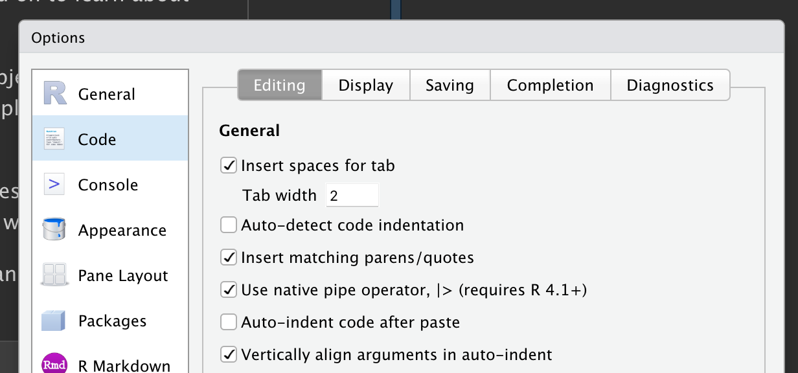

# 4 Data transformation {#sec-data-transform}

## 4.1 Introduction

Visualization is an important tool for generating insight, but it's rare that you get the data in exactly the right form you need to make the graph you want.
Often you'll need to create some new variables or summaries to answer your questions with your data, or maybe you just want to rename the variables or reorder the observations to make the data a little easier to work with.
You'll learn how to do all that (and more!) in this chapter, which will introduce you to data transformation using the **dplyr** package and a new dataset on flights that departed New York City in 2013.

The goal of this chapter is to give you an overview of all the key tools for transforming a data frame.
We'll start with functions that operate on rows and then columns of a data frame, then circle back to talk more about the pipe, an important tool that you use to combine verbs.
We will then introduce the ability to work with groups.
We will end the chapter with a case study that showcases these functions in action and we'll come back to the functions in more detail in later chapters, as we start to dig into specific types of data (e.g. numbers, strings, dates).

### 4.1.1 Prerequisites

In this chapter we'll focus on the dplyr package, another core member of the tidyverse.
We'll illustrate the key ideas using data from the nycflights13 package, and use ggplot2 to help us understand the data.


```r
library(nycflights13)
library(tidyverse)
```

```
## ── Attaching core tidyverse packages ──────────────────────── tidyverse 2.0.0 ──
## ✔ dplyr     1.1.0     ✔ readr     2.1.4
## ✔ forcats   1.0.0     ✔ stringr   1.5.0
## ✔ ggplot2   3.4.1     ✔ tibble    3.2.1
## ✔ lubridate 1.9.2     ✔ tidyr     1.3.0
## ✔ purrr     1.0.1     
## ── Conflicts ────────────────────────────────────────── tidyverse_conflicts() ──
## ✖ dplyr::filter() masks stats::filter()
## ✖ dplyr::lag()    masks stats::lag()
## ℹ Use the ]8;;http://conflicted.r-lib.org/conflicted package]8;; to force all conflicts to become errors
```

Take careful note of the conflicts message that's printed when you load the tidyverse.
It tells you that dplyr overwrites some functions in base R.
If you want to use the base version of these functions after loading dplyr, you'll need to use their full names: `stats::filter()` and `stats::lag()`.
So far we've mostly ignored which package a function comes from because most of the time it doesn't matter.
However, knowing the package can help you find help and find related functions, so when we need to be precise about which function a package comes from, we'll use the same syntax as R: `packagename::functionname()`.

### 4.1.2 nycflights13

To explore the basic dplyr verbs, we're going to use `nycflights13::flights`.
This dataset contains all 336,776 flights that departed from New York City in 2013.
The data comes from the US [Bureau of Transportation Statistics](http://www.transtats.bts.gov/DatabaseInfo.asp?DB_ID=120&Link=0), and is documented in `?flights`.


```r
flights
```

```
## # A tibble: 336,776 × 19
##     year month   day dep_time sched_de…¹ dep_d…² arr_t…³ sched…⁴ arr_d…⁵ carrier
##    <int> <int> <int>    <int>      <int>   <dbl>   <int>   <int>   <dbl> <chr>  
##  1  2013     1     1      517        515       2     830     819      11 UA     
##  2  2013     1     1      533        529       4     850     830      20 UA     
##  3  2013     1     1      542        540       2     923     850      33 AA     
##  4  2013     1     1      544        545      -1    1004    1022     -18 B6     
##  5  2013     1     1      554        600      -6     812     837     -25 DL     
##  6  2013     1     1      554        558      -4     740     728      12 UA     
##  7  2013     1     1      555        600      -5     913     854      19 B6     
##  8  2013     1     1      557        600      -3     709     723     -14 EV     
##  9  2013     1     1      557        600      -3     838     846      -8 B6     
## 10  2013     1     1      558        600      -2     753     745       8 AA     
## # … with 336,766 more rows, 9 more variables: flight <int>, tailnum <chr>,
## #   origin <chr>, dest <chr>, air_time <dbl>, distance <dbl>, hour <dbl>,
## #   minute <dbl>, time_hour <dttm>, and abbreviated variable names
## #   ¹​sched_dep_time, ²​dep_delay, ³​arr_time, ⁴​sched_arr_time, ⁵​arr_delay
```

`flights` is a tibble, a special type of data frame used by the tidyverse to avoid some common gotchas.
The most important difference between tibbles and data frames is the way tibbles print; they are designed for large datasets, so they only show the first few rows and only the columns that fit on one screen.
There are a few options to see everything.
If you're using RStudio, the most convenient is probably `View(flights)`, which will open an interactive scrollable and filterable view.
Otherwise you can use `print(flights, width = Inf)` to show all columns, or use `glimpse()`:


```r
glimpse(flights)
```

```
## Rows: 336,776
## Columns: 19
## $ year           <int> 2013, 2013, 2013, 2013, 2013, 2013, 2013, 2013, 2013, 2…
## $ month          <int> 1, 1, 1, 1, 1, 1, 1, 1, 1, 1, 1, 1, 1, 1, 1, 1, 1, 1, 1…
## $ day            <int> 1, 1, 1, 1, 1, 1, 1, 1, 1, 1, 1, 1, 1, 1, 1, 1, 1, 1, 1…
## $ dep_time       <int> 517, 533, 542, 544, 554, 554, 555, 557, 557, 558, 558, …
## $ sched_dep_time <int> 515, 529, 540, 545, 600, 558, 600, 600, 600, 600, 600, …
## $ dep_delay      <dbl> 2, 4, 2, -1, -6, -4, -5, -3, -3, -2, -2, -2, -2, -2, -1…
## $ arr_time       <int> 830, 850, 923, 1004, 812, 740, 913, 709, 838, 753, 849,…
## $ sched_arr_time <int> 819, 830, 850, 1022, 837, 728, 854, 723, 846, 745, 851,…
## $ arr_delay      <dbl> 11, 20, 33, -18, -25, 12, 19, -14, -8, 8, -2, -3, 7, -1…
## $ carrier        <chr> "UA", "UA", "AA", "B6", "DL", "UA", "B6", "EV", "B6", "…
## $ flight         <int> 1545, 1714, 1141, 725, 461, 1696, 507, 5708, 79, 301, 4…
## $ tailnum        <chr> "N14228", "N24211", "N619AA", "N804JB", "N668DN", "N394…
## $ origin         <chr> "EWR", "LGA", "JFK", "JFK", "LGA", "EWR", "EWR", "LGA",…
## $ dest           <chr> "IAH", "IAH", "MIA", "BQN", "ATL", "ORD", "FLL", "IAD",…
## $ air_time       <dbl> 227, 227, 160, 183, 116, 150, 158, 53, 140, 138, 149, 1…
## $ distance       <dbl> 1400, 1416, 1089, 1576, 762, 719, 1065, 229, 944, 733, …
## $ hour           <dbl> 5, 5, 5, 5, 6, 5, 6, 6, 6, 6, 6, 6, 6, 6, 6, 5, 6, 6, 6…
## $ minute         <dbl> 15, 29, 40, 45, 0, 58, 0, 0, 0, 0, 0, 0, 0, 0, 0, 59, 0…
## $ time_hour      <dttm> 2013-01-01 05:00:00, 2013-01-01 05:00:00, 2013-01-01 0…
```

In both views, the variables names are followed by abbreviations that tell you the type of each variable: `<int>` is short for integer, `<dbl>` is short for double (aka real numbers), `<chr>` for character (aka strings), and `<dttm>` for date-time.
These are important because the operations you can perform on a column depend so much on its "type", and these types are used to organize the chapters in the next section of the book.

### 4.1.3 dplyr basics

You're about to learn the primary dplyr verbs (functions) which will allow you to solve the vast majority of your data manipulation challenges.
But before we discuss their individual differences, it's worth stating what they have in common:

1.  The first argument is always a data frame.

2.  The subsequent arguments typically describe which columns to operate on, using the variable names (without quotes).

3.  The output is always a new data frame.

Because each verb does one thing well, solving complex problems will usually require combining multiple verbs, and we'll do so with the pipe, `|>`.
We'll discuss the pipe more in @sec-the-pipe, but in brief, the pipe takes the thing on its left and passes it along to the function on its right so that `x |> f(y)` is equivalent to `f(x, y)`, and `x |> f(y) |> g(z)` is equivalent to into `g(f(x, y), z)`.
The easiest way to pronounce the pipe is "then".
That makes it possible to get a sense of the following code even though you haven't yet learned the details:


```r
flights |>
  filter(dest == "IAH") |> 
  group_by(year, month, day) |> 
  summarize(
    arr_delay = mean(arr_delay, na.rm = TRUE) 
  )
```

dplyr's verbs are organized into four groups based on what they operate on: **rows**, **columns**, **groups**, or **tables**.
In the following sections you'll learn the most important verbs for rows, columns, and groups, then we'll come back to the join verbs that work on tables in @sec-joins.
Let's dive in!

## 4.2 Rows

The most important verbs that operate on rows of a dataset are `filter()`, which changes which rows are present without changing their order, and `arrange()`, which changes the order of the rows without changing which are present.
Both functions only affect the rows, and the columns are left unchanged.
We'll also discuss `distinct()` which finds rows with unique values but unlike `arrange()` and `filter()` it can also optionally modify the columns.

### 4.2.1 `filter()`

`filter()` allows you to keep rows based on the values of the columns[^data-transform-1].
The first argument is the data frame.
The second and subsequent arguments are the conditions that must be true to keep the row.
For example, we could find all flights that arrived more than 120 minutes (two hours) late:

[^data-transform-1]: Later, you'll learn about the `slice_*()` family which allows you to choose rows based on their positions.


```r
flights |> 
  filter(dep_delay > 120)
```

```
## # A tibble: 9,723 × 19
##     year month   day dep_time sched_de…¹ dep_d…² arr_t…³ sched…⁴ arr_d…⁵ carrier
##    <int> <int> <int>    <int>      <int>   <dbl>   <int>   <int>   <dbl> <chr>  
##  1  2013     1     1      848       1835     853    1001    1950     851 MQ     
##  2  2013     1     1      957        733     144    1056     853     123 UA     
##  3  2013     1     1     1114        900     134    1447    1222     145 UA     
##  4  2013     1     1     1540       1338     122    2020    1825     115 B6     
##  5  2013     1     1     1815       1325     290    2120    1542     338 EV     
##  6  2013     1     1     1842       1422     260    1958    1535     263 EV     
##  7  2013     1     1     1856       1645     131    2212    2005     127 AA     
##  8  2013     1     1     1934       1725     129    2126    1855     151 MQ     
##  9  2013     1     1     1938       1703     155    2109    1823     166 EV     
## 10  2013     1     1     1942       1705     157    2124    1830     174 MQ     
## # … with 9,713 more rows, 9 more variables: flight <int>, tailnum <chr>,
## #   origin <chr>, dest <chr>, air_time <dbl>, distance <dbl>, hour <dbl>,
## #   minute <dbl>, time_hour <dttm>, and abbreviated variable names
## #   ¹​sched_dep_time, ²​dep_delay, ³​arr_time, ⁴​sched_arr_time, ⁵​arr_delay
```

As well as `>` (greater than), you can use `>=` (greater than or equal to), `<` (less than), `<=` (less than or equal to), `==` (equal to), and `!=` (not equal to).
You can also combine conditions with `&` or `,` to indicate "and" (check for both conditions) or with `|` to indicate "or" (check for either condition):


```r
# Flights that departed on January 1
flights |> 
  filter(month == 1 & day == 1)
```

```
## # A tibble: 842 × 19
##     year month   day dep_time sched_de…¹ dep_d…² arr_t…³ sched…⁴ arr_d…⁵ carrier
##    <int> <int> <int>    <int>      <int>   <dbl>   <int>   <int>   <dbl> <chr>  
##  1  2013     1     1      517        515       2     830     819      11 UA     
##  2  2013     1     1      533        529       4     850     830      20 UA     
##  3  2013     1     1      542        540       2     923     850      33 AA     
##  4  2013     1     1      544        545      -1    1004    1022     -18 B6     
##  5  2013     1     1      554        600      -6     812     837     -25 DL     
##  6  2013     1     1      554        558      -4     740     728      12 UA     
##  7  2013     1     1      555        600      -5     913     854      19 B6     
##  8  2013     1     1      557        600      -3     709     723     -14 EV     
##  9  2013     1     1      557        600      -3     838     846      -8 B6     
## 10  2013     1     1      558        600      -2     753     745       8 AA     
## # … with 832 more rows, 9 more variables: flight <int>, tailnum <chr>,
## #   origin <chr>, dest <chr>, air_time <dbl>, distance <dbl>, hour <dbl>,
## #   minute <dbl>, time_hour <dttm>, and abbreviated variable names
## #   ¹​sched_dep_time, ²​dep_delay, ³​arr_time, ⁴​sched_arr_time, ⁵​arr_delay
```

```r
# Flights that departed in January or February
flights |> 
  filter(month == 1 | month == 2)
```

```
## # A tibble: 51,955 × 19
##     year month   day dep_time sched_de…¹ dep_d…² arr_t…³ sched…⁴ arr_d…⁵ carrier
##    <int> <int> <int>    <int>      <int>   <dbl>   <int>   <int>   <dbl> <chr>  
##  1  2013     1     1      517        515       2     830     819      11 UA     
##  2  2013     1     1      533        529       4     850     830      20 UA     
##  3  2013     1     1      542        540       2     923     850      33 AA     
##  4  2013     1     1      544        545      -1    1004    1022     -18 B6     
##  5  2013     1     1      554        600      -6     812     837     -25 DL     
##  6  2013     1     1      554        558      -4     740     728      12 UA     
##  7  2013     1     1      555        600      -5     913     854      19 B6     
##  8  2013     1     1      557        600      -3     709     723     -14 EV     
##  9  2013     1     1      557        600      -3     838     846      -8 B6     
## 10  2013     1     1      558        600      -2     753     745       8 AA     
## # … with 51,945 more rows, 9 more variables: flight <int>, tailnum <chr>,
## #   origin <chr>, dest <chr>, air_time <dbl>, distance <dbl>, hour <dbl>,
## #   minute <dbl>, time_hour <dttm>, and abbreviated variable names
## #   ¹​sched_dep_time, ²​dep_delay, ³​arr_time, ⁴​sched_arr_time, ⁵​arr_delay
```

There's a useful shortcut when you're combining `|` and `==`: `%in%`.
It keeps rows where the variable equals one of the values on the right:


```r
# A shorter way to select flights that departed in January or February
flights |> 
  filter(month %in% c(1, 2))
```

```
## # A tibble: 51,955 × 19
##     year month   day dep_time sched_de…¹ dep_d…² arr_t…³ sched…⁴ arr_d…⁵ carrier
##    <int> <int> <int>    <int>      <int>   <dbl>   <int>   <int>   <dbl> <chr>  
##  1  2013     1     1      517        515       2     830     819      11 UA     
##  2  2013     1     1      533        529       4     850     830      20 UA     
##  3  2013     1     1      542        540       2     923     850      33 AA     
##  4  2013     1     1      544        545      -1    1004    1022     -18 B6     
##  5  2013     1     1      554        600      -6     812     837     -25 DL     
##  6  2013     1     1      554        558      -4     740     728      12 UA     
##  7  2013     1     1      555        600      -5     913     854      19 B6     
##  8  2013     1     1      557        600      -3     709     723     -14 EV     
##  9  2013     1     1      557        600      -3     838     846      -8 B6     
## 10  2013     1     1      558        600      -2     753     745       8 AA     
## # … with 51,945 more rows, 9 more variables: flight <int>, tailnum <chr>,
## #   origin <chr>, dest <chr>, air_time <dbl>, distance <dbl>, hour <dbl>,
## #   minute <dbl>, time_hour <dttm>, and abbreviated variable names
## #   ¹​sched_dep_time, ²​dep_delay, ³​arr_time, ⁴​sched_arr_time, ⁵​arr_delay
```

We'll come back to these comparisons and logical operators in more detail in @sec-logicals.

When you run `filter()` dplyr executes the filtering operation, creating a new data frame, and then prints it.
It doesn't modify the existing `flights` dataset because dplyr functions never modify their inputs.
To save the result, you need to use the assignment operator, `<-`:


```r
jan1 <- flights |> 
  filter(month == 1 & day == 1)
```

### 4.2.2 Common mistakes

When you're starting out with R, the easiest mistake to make is to use `=` instead of `==` when testing for equality.
`filter()` will let you know when this happens:


```r
flights |> 
  filter(month = 1)
```

```
## Error in `filter()`:
## ! We detected a named input.
## ℹ This usually means that you've used `=` instead of `==`.
## ℹ Did you mean `month == 1`?
```

Another mistakes is you write "or" statements like you would in English:


```r
flights |> 
  filter(month == 1 | 2)
```

This "works", in the sense that it doesn't throw an error, but it doesn't do what you want because `|` first checks the condition `month == 1` and then checks the condition `2`, which is not a sensible condition to check.
We'll learn more about what's happening here and why in @sec-boolean-operations.

### 4.2.3 `arrange()`

`arrange()` changes the order of the rows based on the value of the columns.
It takes a data frame and a set of column names (or more complicated expressions) to order by.
If you provide more than one column name, each additional column will be used to break ties in the values of preceding columns.
For example, the following code sorts by the departure time, which is spread over four columns.
We get the earliest years first, then within a year the earliest months, etc.


```r
flights |> 
  arrange(year, month, day, dep_time)
```

```
## # A tibble: 336,776 × 19
##     year month   day dep_time sched_de…¹ dep_d…² arr_t…³ sched…⁴ arr_d…⁵ carrier
##    <int> <int> <int>    <int>      <int>   <dbl>   <int>   <int>   <dbl> <chr>  
##  1  2013     1     1      517        515       2     830     819      11 UA     
##  2  2013     1     1      533        529       4     850     830      20 UA     
##  3  2013     1     1      542        540       2     923     850      33 AA     
##  4  2013     1     1      544        545      -1    1004    1022     -18 B6     
##  5  2013     1     1      554        600      -6     812     837     -25 DL     
##  6  2013     1     1      554        558      -4     740     728      12 UA     
##  7  2013     1     1      555        600      -5     913     854      19 B6     
##  8  2013     1     1      557        600      -3     709     723     -14 EV     
##  9  2013     1     1      557        600      -3     838     846      -8 B6     
## 10  2013     1     1      558        600      -2     753     745       8 AA     
## # … with 336,766 more rows, 9 more variables: flight <int>, tailnum <chr>,
## #   origin <chr>, dest <chr>, air_time <dbl>, distance <dbl>, hour <dbl>,
## #   minute <dbl>, time_hour <dttm>, and abbreviated variable names
## #   ¹​sched_dep_time, ²​dep_delay, ³​arr_time, ⁴​sched_arr_time, ⁵​arr_delay
```

You can use `desc()` on a column inside of `arrange()` to re-order the data frame based on that column in descending (big-to-small) order.
For example, this code orders flights from most to least delayed:


```r
flights |> 
  arrange(desc(dep_delay))
```

```
## # A tibble: 336,776 × 19
##     year month   day dep_time sched_de…¹ dep_d…² arr_t…³ sched…⁴ arr_d…⁵ carrier
##    <int> <int> <int>    <int>      <int>   <dbl>   <int>   <int>   <dbl> <chr>  
##  1  2013     1     9      641        900    1301    1242    1530    1272 HA     
##  2  2013     6    15     1432       1935    1137    1607    2120    1127 MQ     
##  3  2013     1    10     1121       1635    1126    1239    1810    1109 MQ     
##  4  2013     9    20     1139       1845    1014    1457    2210    1007 AA     
##  5  2013     7    22      845       1600    1005    1044    1815     989 MQ     
##  6  2013     4    10     1100       1900     960    1342    2211     931 DL     
##  7  2013     3    17     2321        810     911     135    1020     915 DL     
##  8  2013     6    27      959       1900     899    1236    2226     850 DL     
##  9  2013     7    22     2257        759     898     121    1026     895 DL     
## 10  2013    12     5      756       1700     896    1058    2020     878 AA     
## # … with 336,766 more rows, 9 more variables: flight <int>, tailnum <chr>,
## #   origin <chr>, dest <chr>, air_time <dbl>, distance <dbl>, hour <dbl>,
## #   minute <dbl>, time_hour <dttm>, and abbreviated variable names
## #   ¹​sched_dep_time, ²​dep_delay, ³​arr_time, ⁴​sched_arr_time, ⁵​arr_delay
```

Note that the number of rows has not changed -- we're only arranging the data, we're not filtering it.

### 4.2.4 `distinct()`

`distinct()` finds all the unique rows in a dataset, so in a technical sense, it primarily operates on the rows.
Most of the time, however, you'll want the distinct combination of some variables, so you can also optionally supply column names:


```r
# Remove duplicate rows, if any
flights |> 
  distinct()
```

```
## # A tibble: 336,776 × 19
##     year month   day dep_time sched_de…¹ dep_d…² arr_t…³ sched…⁴ arr_d…⁵ carrier
##    <int> <int> <int>    <int>      <int>   <dbl>   <int>   <int>   <dbl> <chr>  
##  1  2013     1     1      517        515       2     830     819      11 UA     
##  2  2013     1     1      533        529       4     850     830      20 UA     
##  3  2013     1     1      542        540       2     923     850      33 AA     
##  4  2013     1     1      544        545      -1    1004    1022     -18 B6     
##  5  2013     1     1      554        600      -6     812     837     -25 DL     
##  6  2013     1     1      554        558      -4     740     728      12 UA     
##  7  2013     1     1      555        600      -5     913     854      19 B6     
##  8  2013     1     1      557        600      -3     709     723     -14 EV     
##  9  2013     1     1      557        600      -3     838     846      -8 B6     
## 10  2013     1     1      558        600      -2     753     745       8 AA     
## # … with 336,766 more rows, 9 more variables: flight <int>, tailnum <chr>,
## #   origin <chr>, dest <chr>, air_time <dbl>, distance <dbl>, hour <dbl>,
## #   minute <dbl>, time_hour <dttm>, and abbreviated variable names
## #   ¹​sched_dep_time, ²​dep_delay, ³​arr_time, ⁴​sched_arr_time, ⁵​arr_delay
```

```r
# Find all unique origin and destination pairs
flights |> 
  distinct(origin, dest)
```

```
## # A tibble: 224 × 2
##    origin dest 
##    <chr>  <chr>
##  1 EWR    IAH  
##  2 LGA    IAH  
##  3 JFK    MIA  
##  4 JFK    BQN  
##  5 LGA    ATL  
##  6 EWR    ORD  
##  7 EWR    FLL  
##  8 LGA    IAD  
##  9 JFK    MCO  
## 10 LGA    ORD  
## # … with 214 more rows
```

Alternatively, if you want to the keep other columns when filtering for unique rows, you can use the `.keep_all = TRUE` option.


```r
flights |> 
  distinct(origin, dest, .keep_all = TRUE)
```

```
## # A tibble: 224 × 19
##     year month   day dep_time sched_de…¹ dep_d…² arr_t…³ sched…⁴ arr_d…⁵ carrier
##    <int> <int> <int>    <int>      <int>   <dbl>   <int>   <int>   <dbl> <chr>  
##  1  2013     1     1      517        515       2     830     819      11 UA     
##  2  2013     1     1      533        529       4     850     830      20 UA     
##  3  2013     1     1      542        540       2     923     850      33 AA     
##  4  2013     1     1      544        545      -1    1004    1022     -18 B6     
##  5  2013     1     1      554        600      -6     812     837     -25 DL     
##  6  2013     1     1      554        558      -4     740     728      12 UA     
##  7  2013     1     1      555        600      -5     913     854      19 B6     
##  8  2013     1     1      557        600      -3     709     723     -14 EV     
##  9  2013     1     1      557        600      -3     838     846      -8 B6     
## 10  2013     1     1      558        600      -2     753     745       8 AA     
## # … with 214 more rows, 9 more variables: flight <int>, tailnum <chr>,
## #   origin <chr>, dest <chr>, air_time <dbl>, distance <dbl>, hour <dbl>,
## #   minute <dbl>, time_hour <dttm>, and abbreviated variable names
## #   ¹​sched_dep_time, ²​dep_delay, ³​arr_time, ⁴​sched_arr_time, ⁵​arr_delay
```

It's not a coincidence that all of these distinct flights are on January 1: `distinct()` will find the first occurrence of a unique row in the dataset and discard the rest.

If you want to find the number of occurrences instead, you're better off swapping `distinct()` for `count()`, and with the `sort = TRUE` argument you can arrange them in descending order of number of occurrences.
You'll learn more about count in @sec-counts.


```r
flights |>
  count(origin, dest, sort = TRUE)
```

```
## # A tibble: 224 × 3
##    origin dest      n
##    <chr>  <chr> <int>
##  1 JFK    LAX   11262
##  2 LGA    ATL   10263
##  3 LGA    ORD    8857
##  4 JFK    SFO    8204
##  5 LGA    CLT    6168
##  6 EWR    ORD    6100
##  7 JFK    BOS    5898
##  8 LGA    MIA    5781
##  9 JFK    MCO    5464
## 10 EWR    BOS    5327
## # … with 214 more rows
```

### 4.2.5 Exercises

1.  In a singe pipeline, find all flights that meet all of the following conditions:

    -   Had an arrival delay of two or more hours

```r
flights |> 
  filter(arr_delay >= 120)
```

```
## # A tibble: 10,200 × 19
##     year month   day dep_time sched_de…¹ dep_d…² arr_t…³ sched…⁴ arr_d…⁵ carrier
##    <int> <int> <int>    <int>      <int>   <dbl>   <int>   <int>   <dbl> <chr>  
##  1  2013     1     1      811        630     101    1047     830     137 MQ     
##  2  2013     1     1      848       1835     853    1001    1950     851 MQ     
##  3  2013     1     1      957        733     144    1056     853     123 UA     
##  4  2013     1     1     1114        900     134    1447    1222     145 UA     
##  5  2013     1     1     1505       1310     115    1638    1431     127 EV     
##  6  2013     1     1     1525       1340     105    1831    1626     125 B6     
##  7  2013     1     1     1549       1445      64    1912    1656     136 EV     
##  8  2013     1     1     1558       1359     119    1718    1515     123 EV     
##  9  2013     1     1     1732       1630      62    2028    1825     123 EV     
## 10  2013     1     1     1803       1620     103    2008    1750     138 MQ     
## # … with 10,190 more rows, 9 more variables: flight <int>, tailnum <chr>,
## #   origin <chr>, dest <chr>, air_time <dbl>, distance <dbl>, hour <dbl>,
## #   minute <dbl>, time_hour <dttm>, and abbreviated variable names
## #   ¹​sched_dep_time, ²​dep_delay, ³​arr_time, ⁴​sched_arr_time, ⁵​arr_delay
```

    -   Flew to Houston (`IAH` or `HOU`)

```r
flights |> 
  filter(arr_delay >= 120) |> 
  filter(dest %in% c("IAH","HOU"))
```

```
## # A tibble: 220 × 19
##     year month   day dep_time sched_de…¹ dep_d…² arr_t…³ sched…⁴ arr_d…⁵ carrier
##    <int> <int> <int>    <int>      <int>   <dbl>   <int>   <int>   <dbl> <chr>  
##  1  2013     1     1     1114        900     134    1447    1222     145 UA     
##  2  2013     1    10     2137       1630     307      17    1925     292 UA     
##  3  2013     1    15     1603       1446      77    1957    1757     120 UA     
##  4  2013     1    16     1239       1043     116    1558    1340     138 UA     
##  5  2013     1    20     2136       1700     276      27    2011     256 UA     
##  6  2013     1    21     1708       1446     142    2032    1757     155 UA     
##  7  2013     1    25     1409       1155     134    1710    1459     131 B6     
##  8  2013     1    30     2312       2040     152     227    2345     162 B6     
##  9  2013     1    31     1837       1635     122    2241    1945     176 WN     
## 10  2013     1    31     2123       1856     147      49    2204     165 UA     
## # … with 210 more rows, 9 more variables: flight <int>, tailnum <chr>,
## #   origin <chr>, dest <chr>, air_time <dbl>, distance <dbl>, hour <dbl>,
## #   minute <dbl>, time_hour <dttm>, and abbreviated variable names
## #   ¹​sched_dep_time, ²​dep_delay, ³​arr_time, ⁴​sched_arr_time, ⁵​arr_delay
```

    -   Were operated by United, American, or Delta

```r
flights |> 
  filter(arr_delay >= 120) |> 
  filter(dest %in% c("IAH","HOU")) |> 
  filter(carrier %in% c("UA","AA","DL"))
```

```
## # A tibble: 162 × 19
##     year month   day dep_time sched_de…¹ dep_d…² arr_t…³ sched…⁴ arr_d…⁵ carrier
##    <int> <int> <int>    <int>      <int>   <dbl>   <int>   <int>   <dbl> <chr>  
##  1  2013     1     1     1114        900     134    1447    1222     145 UA     
##  2  2013     1    10     2137       1630     307      17    1925     292 UA     
##  3  2013     1    15     1603       1446      77    1957    1757     120 UA     
##  4  2013     1    16     1239       1043     116    1558    1340     138 UA     
##  5  2013     1    20     2136       1700     276      27    2011     256 UA     
##  6  2013     1    21     1708       1446     142    2032    1757     155 UA     
##  7  2013     1    31     2123       1856     147      49    2204     165 UA     
##  8  2013    10     3     1122        630     292    1357     919     278 UA     
##  9  2013    10    10     2018       1720     178    2241    2010     151 UA     
## 10  2013    10    11     2009       1720     169    2233    2010     143 UA     
## # … with 152 more rows, 9 more variables: flight <int>, tailnum <chr>,
## #   origin <chr>, dest <chr>, air_time <dbl>, distance <dbl>, hour <dbl>,
## #   minute <dbl>, time_hour <dttm>, and abbreviated variable names
## #   ¹​sched_dep_time, ²​dep_delay, ³​arr_time, ⁴​sched_arr_time, ⁵​arr_delay
```

    -   Departed in summer (July, August, and September)

```r
flights |> 
  filter(arr_delay >= 120) |> 
  filter(dest %in% c("IAH","HOU")) |> 
  filter(carrier %in% c("UA","AA","DL")) |> 
  filter(month %in% c(7,8,9))
```

```
## # A tibble: 47 × 19
##     year month   day dep_time sched_de…¹ dep_d…² arr_t…³ sched…⁴ arr_d…⁵ carrier
##    <int> <int> <int>    <int>      <int>   <dbl>   <int>   <int>   <dbl> <chr>  
##  1  2013     7     1     1310       1057     133    1551    1338     133 UA     
##  2  2013     7     1     1707       1448     139    1943    1742     121 UA     
##  3  2013     7     1     2058       1735     203    2355    2030     205 AA     
##  4  2013     7     2     2001       1735     146    2335    2030     185 AA     
##  5  2013     7     3     2215       1909     186      45    2200     165 UA     
##  6  2013     7     9     1937       1735     122    2240    2030     130 AA     
##  7  2013     7    10       40       1909     331     301    2200     301 UA     
##  8  2013     7    10     1629       1520      69    2048    1754     174 UA     
##  9  2013     7    10     1913       1721     112    2214    2001     133 UA     
## 10  2013     7    17     1657       1446     131    2007    1745     142 UA     
## # … with 37 more rows, 9 more variables: flight <int>, tailnum <chr>,
## #   origin <chr>, dest <chr>, air_time <dbl>, distance <dbl>, hour <dbl>,
## #   minute <dbl>, time_hour <dttm>, and abbreviated variable names
## #   ¹​sched_dep_time, ²​dep_delay, ³​arr_time, ⁴​sched_arr_time, ⁵​arr_delay
```

    -   Arrived more than two hours late, but didn't leave late

```r
flights |> 
  filter(arr_delay >= 120) |> 
  filter(dest %in% c("IAH","HOU")) |> 
  filter(carrier %in% c("UA","AA","DL")) |> 
  filter(month %in% c(7,8,9)) |> 
  filter(dep_delay <= 0)
```

```
## # A tibble: 0 × 19
## # … with 19 variables: year <int>, month <int>, day <int>, dep_time <int>,
## #   sched_dep_time <int>, dep_delay <dbl>, arr_time <int>,
## #   sched_arr_time <int>, arr_delay <dbl>, carrier <chr>, flight <int>,
## #   tailnum <chr>, origin <chr>, dest <chr>, air_time <dbl>, distance <dbl>,
## #   hour <dbl>, minute <dbl>, time_hour <dttm>
```

> Arrived more than two hours late, but didn't leave more than two hours late


```r
flights |> 
  filter(arr_delay >= 120) |> 
  filter(dest %in% c("IAH","HOU")) |> 
  filter(carrier %in% c("UA","AA","DL")) |> 
  filter(month %in% c(7,8,9)) |> 
  filter(dep_delay <= 120)
```

```
## # A tibble: 8 × 19
##    year month   day dep_time sched_dep…¹ dep_d…² arr_t…³ sched…⁴ arr_d…⁵ carrier
##   <int> <int> <int>    <int>       <int>   <dbl>   <int>   <int>   <dbl> <chr>  
## 1  2013     7    10     1629        1520      69    2048    1754     174 UA     
## 2  2013     7    10     1913        1721     112    2214    2001     133 UA     
## 3  2013     7    22     2254        2114     100     219    2358     141 UA     
## 4  2013     7    23      824         638     106    1124     911     133 UA     
## 5  2013     7    29     1229        1030     119    1527    1325     122 UA     
## 6  2013     8     9     1850        1730      80    2221    2007     134 UA     
## 7  2013     8     9     2251        2102     109     145    2344     121 UA     
## 8  2013     8    28     1219        1030     109    1634    1331     183 UA     
## # … with 9 more variables: flight <int>, tailnum <chr>, origin <chr>,
## #   dest <chr>, air_time <dbl>, distance <dbl>, hour <dbl>, minute <dbl>,
## #   time_hour <dttm>, and abbreviated variable names ¹​sched_dep_time,
## #   ²​dep_delay, ³​arr_time, ⁴​sched_arr_time, ⁵​arr_delay
```

    -   Were delayed by at least an hour, but made up over 30 minutes in flight


```r
flights |> 
  filter(arr_delay >= 120) |> 
  filter(dest %in% c("IAH","HOU")) |> 
  filter(carrier %in% c("UA","AA","DL")) |> 
  filter(month %in% c(7,8,9)) |> 
  filter(dep_delay <= 120) |> 
  filter(dep_delay >= 60) |> 
  mutate(gain = dep_delay - arr_delay) |> 
  filter(gain >= 30)
```

```
## # A tibble: 0 × 20
## # … with 20 variables: year <int>, month <int>, day <int>, dep_time <int>,
## #   sched_dep_time <int>, dep_delay <dbl>, arr_time <int>,
## #   sched_arr_time <int>, arr_delay <dbl>, carrier <chr>, flight <int>,
## #   tailnum <chr>, origin <chr>, dest <chr>, air_time <dbl>, distance <dbl>,
## #   hour <dbl>, minute <dbl>, time_hour <dttm>, gain <dbl>
```

> arr_delay also at least an hour


```r
flights |> 
  filter(arr_delay >= 60) |> 
  filter(dest %in% c("IAH","HOU")) |> 
  filter(carrier %in% c("UA","AA","DL")) |> 
  filter(month %in% c(7,8,9)) |> 
  filter(dep_delay <= 120) |> 
  filter(dep_delay >= 60) |> 
  mutate(gain = dep_delay - arr_delay) |> 
  filter(gain >= 30)
```

```
## # A tibble: 2 × 20
##    year month   day dep_time sched_dep…¹ dep_d…² arr_t…³ sched…⁴ arr_d…⁵ carrier
##   <int> <int> <int>    <int>       <int>   <dbl>   <int>   <int>   <dbl> <chr>  
## 1  2013     7    18     1025         853      92    1242    1140      62 UA     
## 2  2013     9    19     2052        1859     113    2310    2153      77 UA     
## # … with 10 more variables: flight <int>, tailnum <chr>, origin <chr>,
## #   dest <chr>, air_time <dbl>, distance <dbl>, hour <dbl>, minute <dbl>,
## #   time_hour <dttm>, gain <dbl>, and abbreviated variable names
## #   ¹​sched_dep_time, ²​dep_delay, ³​arr_time, ⁴​sched_arr_time, ⁵​arr_delay
```


```r
airlines
```

```
## # A tibble: 16 × 2
##    carrier name                       
##    <chr>   <chr>                      
##  1 9E      Endeavor Air Inc.          
##  2 AA      American Airlines Inc.     
##  3 AS      Alaska Airlines Inc.       
##  4 B6      JetBlue Airways            
##  5 DL      Delta Air Lines Inc.       
##  6 EV      ExpressJet Airlines Inc.   
##  7 F9      Frontier Airlines Inc.     
##  8 FL      AirTran Airways Corporation
##  9 HA      Hawaiian Airlines Inc.     
## 10 MQ      Envoy Air                  
## 11 OO      SkyWest Airlines Inc.      
## 12 UA      United Air Lines Inc.      
## 13 US      US Airways Inc.            
## 14 VX      Virgin America             
## 15 WN      Southwest Airlines Co.     
## 16 YV      Mesa Airlines Inc.
```


2.  Sort `flights` to find the flights with longest departure delays.
    Find the flights that left earliest in the morning.

> the flights with longest departure delays.


```r
flights |> 
  arrange(desc(dep_delay))
```

```
## # A tibble: 336,776 × 19
##     year month   day dep_time sched_de…¹ dep_d…² arr_t…³ sched…⁴ arr_d…⁵ carrier
##    <int> <int> <int>    <int>      <int>   <dbl>   <int>   <int>   <dbl> <chr>  
##  1  2013     1     9      641        900    1301    1242    1530    1272 HA     
##  2  2013     6    15     1432       1935    1137    1607    2120    1127 MQ     
##  3  2013     1    10     1121       1635    1126    1239    1810    1109 MQ     
##  4  2013     9    20     1139       1845    1014    1457    2210    1007 AA     
##  5  2013     7    22      845       1600    1005    1044    1815     989 MQ     
##  6  2013     4    10     1100       1900     960    1342    2211     931 DL     
##  7  2013     3    17     2321        810     911     135    1020     915 DL     
##  8  2013     6    27      959       1900     899    1236    2226     850 DL     
##  9  2013     7    22     2257        759     898     121    1026     895 DL     
## 10  2013    12     5      756       1700     896    1058    2020     878 AA     
## # … with 336,766 more rows, 9 more variables: flight <int>, tailnum <chr>,
## #   origin <chr>, dest <chr>, air_time <dbl>, distance <dbl>, hour <dbl>,
## #   minute <dbl>, time_hour <dttm>, and abbreviated variable names
## #   ¹​sched_dep_time, ²​dep_delay, ³​arr_time, ⁴​sched_arr_time, ⁵​arr_delay
```

> the flights that left earliest in the morning.


```r
summary(flights)
```

```
##       year          month             day           dep_time    sched_dep_time
##  Min.   :2013   Min.   : 1.000   Min.   : 1.00   Min.   :   1   Min.   : 106  
##  1st Qu.:2013   1st Qu.: 4.000   1st Qu.: 8.00   1st Qu.: 907   1st Qu.: 906  
##  Median :2013   Median : 7.000   Median :16.00   Median :1401   Median :1359  
##  Mean   :2013   Mean   : 6.549   Mean   :15.71   Mean   :1349   Mean   :1344  
##  3rd Qu.:2013   3rd Qu.:10.000   3rd Qu.:23.00   3rd Qu.:1744   3rd Qu.:1729  
##  Max.   :2013   Max.   :12.000   Max.   :31.00   Max.   :2400   Max.   :2359  
##                                                  NA's   :8255                 
##    dep_delay          arr_time    sched_arr_time   arr_delay       
##  Min.   : -43.00   Min.   :   1   Min.   :   1   Min.   : -86.000  
##  1st Qu.:  -5.00   1st Qu.:1104   1st Qu.:1124   1st Qu.: -17.000  
##  Median :  -2.00   Median :1535   Median :1556   Median :  -5.000  
##  Mean   :  12.64   Mean   :1502   Mean   :1536   Mean   :   6.895  
##  3rd Qu.:  11.00   3rd Qu.:1940   3rd Qu.:1945   3rd Qu.:  14.000  
##  Max.   :1301.00   Max.   :2400   Max.   :2359   Max.   :1272.000  
##  NA's   :8255      NA's   :8713                  NA's   :9430      
##    carrier              flight       tailnum             origin         
##  Length:336776      Min.   :   1   Length:336776      Length:336776     
##  Class :character   1st Qu.: 553   Class :character   Class :character  
##  Mode  :character   Median :1496   Mode  :character   Mode  :character  
##                     Mean   :1972                                        
##                     3rd Qu.:3465                                        
##                     Max.   :8500                                        
##                                                                         
##      dest              air_time        distance         hour      
##  Length:336776      Min.   : 20.0   Min.   :  17   Min.   : 1.00  
##  Class :character   1st Qu.: 82.0   1st Qu.: 502   1st Qu.: 9.00  
##  Mode  :character   Median :129.0   Median : 872   Median :13.00  
##                     Mean   :150.7   Mean   :1040   Mean   :13.18  
##                     3rd Qu.:192.0   3rd Qu.:1389   3rd Qu.:17.00  
##                     Max.   :695.0   Max.   :4983   Max.   :23.00  
##                     NA's   :9430                                  
##      minute        time_hour                     
##  Min.   : 0.00   Min.   :2013-01-01 05:00:00.00  
##  1st Qu.: 8.00   1st Qu.:2013-04-04 13:00:00.00  
##  Median :29.00   Median :2013-07-03 10:00:00.00  
##  Mean   :26.23   Mean   :2013-07-03 05:22:54.64  
##  3rd Qu.:44.00   3rd Qu.:2013-10-01 07:00:00.00  
##  Max.   :59.00   Max.   :2013-12-31 23:00:00.00  
## 
```


```r
# earliest dep_time
flights |> 
  arrange(dep_time)
```

```
## # A tibble: 336,776 × 19
##     year month   day dep_time sched_de…¹ dep_d…² arr_t…³ sched…⁴ arr_d…⁵ carrier
##    <int> <int> <int>    <int>      <int>   <dbl>   <int>   <int>   <dbl> <chr>  
##  1  2013     1    13        1       2249      72     108    2357      71 B6     
##  2  2013     1    31        1       2100     181     124    2225     179 WN     
##  3  2013    11    13        1       2359       2     442     440       2 B6     
##  4  2013    12    16        1       2359       2     447     437      10 B6     
##  5  2013    12    20        1       2359       2     430     440     -10 B6     
##  6  2013    12    26        1       2359       2     437     440      -3 B6     
##  7  2013    12    30        1       2359       2     441     437       4 B6     
##  8  2013     2    11        1       2100     181     111    2225     166 WN     
##  9  2013     2    24        1       2245      76     121    2354      87 B6     
## 10  2013     3     8        1       2355       6     431     440      -9 B6     
## # … with 336,766 more rows, 9 more variables: flight <int>, tailnum <chr>,
## #   origin <chr>, dest <chr>, air_time <dbl>, distance <dbl>, hour <dbl>,
## #   minute <dbl>, time_hour <dttm>, and abbreviated variable names
## #   ¹​sched_dep_time, ²​dep_delay, ³​arr_time, ⁴​sched_arr_time, ⁵​arr_delay
```

```r
# earliest sched_dep_time
flights |> 
  arrange(sched_dep_time)
```

```
## # A tibble: 336,776 × 19
##     year month   day dep_time sched_de…¹ dep_d…² arr_t…³ sched…⁴ arr_d…⁵ carrier
##    <int> <int> <int>    <int>      <int>   <dbl>   <int>   <int>   <dbl> <chr>  
##  1  2013     7    27       NA        106      NA      NA     245      NA US     
##  2  2013     1     2      458        500      -2     703     650      13 US     
##  3  2013     1     3      458        500      -2     650     650       0 US     
##  4  2013     1     4      456        500      -4     631     650     -19 US     
##  5  2013     1     5      458        500      -2     640     650     -10 US     
##  6  2013     1     6      458        500      -2     718     650      28 US     
##  7  2013     1     7      454        500      -6     637     648     -11 US     
##  8  2013     1     8      454        500      -6     625     648     -23 US     
##  9  2013     1     9      457        500      -3     647     648      -1 US     
## 10  2013     1    10      450        500     -10     634     648     -14 US     
## # … with 336,766 more rows, 9 more variables: flight <int>, tailnum <chr>,
## #   origin <chr>, dest <chr>, air_time <dbl>, distance <dbl>, hour <dbl>,
## #   minute <dbl>, time_hour <dttm>, and abbreviated variable names
## #   ¹​sched_dep_time, ²​dep_delay, ³​arr_time, ⁴​sched_arr_time, ⁵​arr_delay
```


3.  Sort `flights` to find the fastest flights.
    (Hint: Try including a math calculation inside of your function.)
    

```r
flights |> 
  mutate(speed = distance / air_time) |> 
  arrange(desc(speed))
```

```
## # A tibble: 336,776 × 20
##     year month   day dep_time sched_de…¹ dep_d…² arr_t…³ sched…⁴ arr_d…⁵ carrier
##    <int> <int> <int>    <int>      <int>   <dbl>   <int>   <int>   <dbl> <chr>  
##  1  2013     5    25     1709       1700       9    1923    1937     -14 DL     
##  2  2013     7     2     1558       1513      45    1745    1719      26 EV     
##  3  2013     5    13     2040       2025      15    2225    2226      -1 EV     
##  4  2013     3    23     1914       1910       4    2045    2043       2 EV     
##  5  2013     1    12     1559       1600      -1    1849    1917     -28 DL     
##  6  2013    11    17      650        655      -5    1059    1150     -51 DL     
##  7  2013     2    21     2355       2358      -3     412     438     -26 B6     
##  8  2013    11    17      759        800      -1    1212    1255     -43 AA     
##  9  2013    11    16     2003       1925      38      17      36     -19 DL     
## 10  2013    11    16     2349       2359     -10     402     440     -38 B6     
## # … with 336,766 more rows, 10 more variables: flight <int>, tailnum <chr>,
## #   origin <chr>, dest <chr>, air_time <dbl>, distance <dbl>, hour <dbl>,
## #   minute <dbl>, time_hour <dttm>, speed <dbl>, and abbreviated variable names
## #   ¹​sched_dep_time, ²​dep_delay, ³​arr_time, ⁴​sched_arr_time, ⁵​arr_delay
```


4.  Was there a flight on every day of 2013?

> Yes


```r
flights |> 
  count(month,day)
```

```
## # A tibble: 365 × 3
##    month   day     n
##    <int> <int> <int>
##  1     1     1   842
##  2     1     2   943
##  3     1     3   914
##  4     1     4   915
##  5     1     5   720
##  6     1     6   832
##  7     1     7   933
##  8     1     8   899
##  9     1     9   902
## 10     1    10   932
## # … with 355 more rows
```

```r
flights |> 
  distinct(month,day)
```

```
## # A tibble: 365 × 2
##    month   day
##    <int> <int>
##  1     1     1
##  2     1     2
##  3     1     3
##  4     1     4
##  5     1     5
##  6     1     6
##  7     1     7
##  8     1     8
##  9     1     9
## 10     1    10
## # … with 355 more rows
```


5.  Which flights traveled the farthest distance?
    Which traveled the least distance?

> the farthest distance: John F Kennedy Intl to Honolulu Intl


```r
flights |> 
  arrange(desc(distance))
```

```
## # A tibble: 336,776 × 19
##     year month   day dep_time sched_de…¹ dep_d…² arr_t…³ sched…⁴ arr_d…⁵ carrier
##    <int> <int> <int>    <int>      <int>   <dbl>   <int>   <int>   <dbl> <chr>  
##  1  2013     1     1      857        900      -3    1516    1530     -14 HA     
##  2  2013     1     2      909        900       9    1525    1530      -5 HA     
##  3  2013     1     3      914        900      14    1504    1530     -26 HA     
##  4  2013     1     4      900        900       0    1516    1530     -14 HA     
##  5  2013     1     5      858        900      -2    1519    1530     -11 HA     
##  6  2013     1     6     1019        900      79    1558    1530      28 HA     
##  7  2013     1     7     1042        900     102    1620    1530      50 HA     
##  8  2013     1     8      901        900       1    1504    1530     -26 HA     
##  9  2013     1     9      641        900    1301    1242    1530    1272 HA     
## 10  2013     1    10      859        900      -1    1449    1530     -41 HA     
## # … with 336,766 more rows, 9 more variables: flight <int>, tailnum <chr>,
## #   origin <chr>, dest <chr>, air_time <dbl>, distance <dbl>, hour <dbl>,
## #   minute <dbl>, time_hour <dttm>, and abbreviated variable names
## #   ¹​sched_dep_time, ²​dep_delay, ³​arr_time, ⁴​sched_arr_time, ⁵​arr_delay
```


> the least distance: Newark Liberty Intl to La Guardia
    

```r
flights |> 
  arrange(distance)
```

```
## # A tibble: 336,776 × 19
##     year month   day dep_time sched_de…¹ dep_d…² arr_t…³ sched…⁴ arr_d…⁵ carrier
##    <int> <int> <int>    <int>      <int>   <dbl>   <int>   <int>   <dbl> <chr>  
##  1  2013     7    27       NA        106      NA      NA     245      NA US     
##  2  2013     1     3     2127       2129      -2    2222    2224      -2 EV     
##  3  2013     1     4     1240       1200      40    1333    1306      27 EV     
##  4  2013     1     4     1829       1615     134    1937    1721     136 EV     
##  5  2013     1     4     2128       2129      -1    2218    2224      -6 EV     
##  6  2013     1     5     1155       1200      -5    1241    1306     -25 EV     
##  7  2013     1     6     2125       2129      -4    2224    2224       0 EV     
##  8  2013     1     7     2124       2129      -5    2212    2224     -12 EV     
##  9  2013     1     8     2127       2130      -3    2304    2225      39 EV     
## 10  2013     1     9     2126       2129      -3    2217    2224      -7 EV     
## # … with 336,766 more rows, 9 more variables: flight <int>, tailnum <chr>,
## #   origin <chr>, dest <chr>, air_time <dbl>, distance <dbl>, hour <dbl>,
## #   minute <dbl>, time_hour <dttm>, and abbreviated variable names
## #   ¹​sched_dep_time, ²​dep_delay, ³​arr_time, ⁴​sched_arr_time, ⁵​arr_delay
```


```r
airports |> 
  filter(faa  %in%  c("EWR","LGA","JFK","HNL"))
```

```
## # A tibble: 4 × 8
##   faa   name                  lat    lon   alt    tz dst   tzone           
##   <chr> <chr>               <dbl>  <dbl> <dbl> <dbl> <chr> <chr>           
## 1 EWR   Newark Liberty Intl  40.7  -74.2    18    -5 A     America/New_York
## 2 HNL   Honolulu Intl        21.3 -158.     13   -10 N     Pacific/Honolulu
## 3 JFK   John F Kennedy Intl  40.6  -73.8    13    -5 A     America/New_York
## 4 LGA   La Guardia           40.8  -73.9    22    -5 A     America/New_York
```


6.  Does it matter what order you used `filter()` and `arrange()` if you're using both?
    Why/why not?
    Think about the results and how much work the functions would have to do.
    
> It depends on what criteria you use for `filter()` and `arrange()`. The order you use `filter()` and `arrange()` might influence the speed. 


```r
system.time(
  flights |>
    arrange(sched_dep_time, dep_time, dep_delay, sched_arr_time, arr_time, arr_delay) |>
    filter(arr_delay >= 120) |>
    filter(dest %in% c("IAH", "HOU")) |>
    filter(carrier %in% c("UA", "AA", "DL")) |>
    filter(month %in% c(7, 8, 9))
)
```

```
##    user  system elapsed 
##    0.06    0.00    0.06
```


```r
system.time(
  flights |>
    filter(arr_delay >= 120) |>
    filter(dest %in% c("IAH", "HOU")) |>
    filter(carrier %in% c("UA", "AA", "DL")) |>
    filter(month %in% c(7, 8, 9)) |> 
    arrange(sched_dep_time, dep_time, dep_delay, sched_arr_time, arr_time, arr_delay)
)
```

```
##    user  system elapsed 
##    0.03    0.00    0.03
```

> The ‘user time’ is the CPU time charged for the execution of user instructions of the calling process. 

> The ‘system time’ is the CPU time charged for execution by the system on behalf of the calling process.

> Elapsed Time is the time charged to the CPU(s) for the expression.

> User Time is the wall clock time. The time that you as a user experienced.

> If `elapsed time < user time`, this means that the CPU is waiting around for some other operations (may be external) to be done.

> If `elapsed time > user time`, this means that your machine has multiple cores and is able to use them

## 4.3 Columns

There are four important verbs that affect the columns without changing the rows: `mutate()` creates new columns that are derived from the existing columns, `select()` changes which columns are present; `rename()` changes the names of the columns; and `relocate()` changes the positions of the columns.

### 4.3.1 `mutate()` {#sec-mutate}

The job of `mutate()` is to add new columns that are calculated from the existing columns.
In the transform chapters, you'll learn a large set of functions that you can use to manipulate different types of variables.
For now, we'll stick with basic algebra, which allows us to compute the `gain`, how much time a delayed flight made up in the air, and the `speed` in miles per hour:


```r
flights |> 
  mutate(
    gain = dep_delay - arr_delay,
    speed = distance / air_time * 60
  )
```

```
## # A tibble: 336,776 × 21
##     year month   day dep_time sched_de…¹ dep_d…² arr_t…³ sched…⁴ arr_d…⁵ carrier
##    <int> <int> <int>    <int>      <int>   <dbl>   <int>   <int>   <dbl> <chr>  
##  1  2013     1     1      517        515       2     830     819      11 UA     
##  2  2013     1     1      533        529       4     850     830      20 UA     
##  3  2013     1     1      542        540       2     923     850      33 AA     
##  4  2013     1     1      544        545      -1    1004    1022     -18 B6     
##  5  2013     1     1      554        600      -6     812     837     -25 DL     
##  6  2013     1     1      554        558      -4     740     728      12 UA     
##  7  2013     1     1      555        600      -5     913     854      19 B6     
##  8  2013     1     1      557        600      -3     709     723     -14 EV     
##  9  2013     1     1      557        600      -3     838     846      -8 B6     
## 10  2013     1     1      558        600      -2     753     745       8 AA     
## # … with 336,766 more rows, 11 more variables: flight <int>, tailnum <chr>,
## #   origin <chr>, dest <chr>, air_time <dbl>, distance <dbl>, hour <dbl>,
## #   minute <dbl>, time_hour <dttm>, gain <dbl>, speed <dbl>, and abbreviated
## #   variable names ¹​sched_dep_time, ²​dep_delay, ³​arr_time, ⁴​sched_arr_time,
## #   ⁵​arr_delay
```

By default, `mutate()` adds new columns on the right hand side of your dataset, which makes it difficult to see what's happening here.
We can use the `.before` argument to instead add the variables to the left hand side[^data-transform-2]:

[^data-transform-2]: Remember that in RStudio, the easiest way to see a dataset with many columns is `View()`.


```r
flights |> 
  mutate(
    gain = dep_delay - arr_delay,
    speed = distance / air_time * 60,
    .before = 1
  )
```

```
## # A tibble: 336,776 × 21
##     gain speed  year month   day dep_t…¹ sched…² dep_d…³ arr_t…⁴ sched…⁵ arr_d…⁶
##    <dbl> <dbl> <int> <int> <int>   <int>   <int>   <dbl>   <int>   <int>   <dbl>
##  1    -9  370.  2013     1     1     517     515       2     830     819      11
##  2   -16  374.  2013     1     1     533     529       4     850     830      20
##  3   -31  408.  2013     1     1     542     540       2     923     850      33
##  4    17  517.  2013     1     1     544     545      -1    1004    1022     -18
##  5    19  394.  2013     1     1     554     600      -6     812     837     -25
##  6   -16  288.  2013     1     1     554     558      -4     740     728      12
##  7   -24  404.  2013     1     1     555     600      -5     913     854      19
##  8    11  259.  2013     1     1     557     600      -3     709     723     -14
##  9     5  405.  2013     1     1     557     600      -3     838     846      -8
## 10   -10  319.  2013     1     1     558     600      -2     753     745       8
## # … with 336,766 more rows, 10 more variables: carrier <chr>, flight <int>,
## #   tailnum <chr>, origin <chr>, dest <chr>, air_time <dbl>, distance <dbl>,
## #   hour <dbl>, minute <dbl>, time_hour <dttm>, and abbreviated variable names
## #   ¹​dep_time, ²​sched_dep_time, ³​dep_delay, ⁴​arr_time, ⁵​sched_arr_time,
## #   ⁶​arr_delay
```

The `.` is a sign that `.before` is an argument to the function, not the name of a third new variable we are creating.
You can also use `.after` to add after a variable, and in both `.before` and `.after` you can use the variable name instead of a position.
For example, we could add the new variables after `day`:


```r
flights |> 
  mutate(
    gain = dep_delay - arr_delay,
    speed = distance / air_time * 60,
    .after = day
  )
```

Alternatively, you can control which variables are kept with the `.keep` argument.
A particularly useful argument is `"used"` which specifies that we only keep the columns that were involved or created in the `mutate()` step.
For example, the following output will contain only the variables `dep_delay`, `arr_delay`, `air_time`, `gain`, `hours`, and `gain_per_hour`.


```r
flights |> 
  mutate(
    gain = dep_delay - arr_delay,
    hours = air_time / 60,
    gain_per_hour = gain / hours,
    .keep = "used"
  )
```

Note that since we haven't assigned the result of the above computation back to `flights`, the new variables `gain,` `hours`, and `gain_per_hour` will only be printed but will not be stored in a data frame.
And if we want them to be available in a data frame for future use, we should think carefully about whether we want the result to be assigned back to `flights`, overwriting the original data frame with many more variables, or to a new object.
Often, the right answer is a new object that is named informatively to indicate its contents, e.g., `delay_gain`, but you might also have good reasons for overwriting `flights`.

### 4.3.2 `select()` {#sec-select}

It's not uncommon to get datasets with hundreds or even thousands of variables.
In this situation, the first challenge is often just focusing on the variables you're interested in.
`select()` allows you to rapidly zoom in on a useful subset using operations based on the names of the variables:

-   Select columns by name:

    
    ```r
    flights |> 
      select(year, month, day)
    ```

-   Select all columns between year and day (inclusive):

    
    ```r
    flights |> 
      select(year:day)
    ```

-   Select all columns except those from year to day (inclusive):

    
    ```r
    flights |> 
      select(!year:day)
    ```

    You can also use `-` instead of `!` (and you're likely to see that in the wild); we recommend `!` because it reads as "not", and combines well with `&` and `|`.

-   Select all columns that are characters:

    
    ```r
    flights |> 
      select(where(is.character))
    ```

There are a number of helper functions you can use within `select()`:

-   `starts_with("abc")`: matches names that begin with "abc".


```r
flights |> 
  select(starts_with("dep"))
```

```
## # A tibble: 336,776 × 2
##    dep_time dep_delay
##       <int>     <dbl>
##  1      517         2
##  2      533         4
##  3      542         2
##  4      544        -1
##  5      554        -6
##  6      554        -4
##  7      555        -5
##  8      557        -3
##  9      557        -3
## 10      558        -2
## # … with 336,766 more rows
```


-   `ends_with("xyz")`: matches names that end with "xyz".


```r
flights |> 
  select(ends_with("delay"))
```

```
## # A tibble: 336,776 × 2
##    dep_delay arr_delay
##        <dbl>     <dbl>
##  1         2        11
##  2         4        20
##  3         2        33
##  4        -1       -18
##  5        -6       -25
##  6        -4        12
##  7        -5        19
##  8        -3       -14
##  9        -3        -8
## 10        -2         8
## # … with 336,766 more rows
```

-   `contains("ijk")`: matches names that contain "ijk".


```r
flights |> 
  select(contains("arr"))
```

```
## # A tibble: 336,776 × 4
##    arr_time sched_arr_time arr_delay carrier
##       <int>          <int>     <dbl> <chr>  
##  1      830            819        11 UA     
##  2      850            830        20 UA     
##  3      923            850        33 AA     
##  4     1004           1022       -18 B6     
##  5      812            837       -25 DL     
##  6      740            728        12 UA     
##  7      913            854        19 B6     
##  8      709            723       -14 EV     
##  9      838            846        -8 B6     
## 10      753            745         8 AA     
## # … with 336,766 more rows
```


-   `num_range("x", 1:3)`: matches `x1`, `x2` and `x3`.


```r
new_flights <- flights |> 
  mutate(
    gain1 = dep_delay - arr_delay,
    hours = air_time / 60,
    gain2 = gain1 / hours,
    .before = dep_time)

new_flights
```

```
## # A tibble: 336,776 × 22
##     year month   day gain1 hours  gain2 dep_time sched…¹ dep_d…² arr_t…³ sched…⁴
##    <int> <int> <int> <dbl> <dbl>  <dbl>    <int>   <int>   <dbl>   <int>   <int>
##  1  2013     1     1    -9 3.78   -2.38      517     515       2     830     819
##  2  2013     1     1   -16 3.78   -4.23      533     529       4     850     830
##  3  2013     1     1   -31 2.67  -11.6       542     540       2     923     850
##  4  2013     1     1    17 3.05    5.57      544     545      -1    1004    1022
##  5  2013     1     1    19 1.93    9.83      554     600      -6     812     837
##  6  2013     1     1   -16 2.5    -6.4       554     558      -4     740     728
##  7  2013     1     1   -24 2.63   -9.11      555     600      -5     913     854
##  8  2013     1     1    11 0.883  12.5       557     600      -3     709     723
##  9  2013     1     1     5 2.33    2.14      557     600      -3     838     846
## 10  2013     1     1   -10 2.3    -4.35      558     600      -2     753     745
## # … with 336,766 more rows, 11 more variables: arr_delay <dbl>, carrier <chr>,
## #   flight <int>, tailnum <chr>, origin <chr>, dest <chr>, air_time <dbl>,
## #   distance <dbl>, hour <dbl>, minute <dbl>, time_hour <dttm>, and abbreviated
## #   variable names ¹​sched_dep_time, ²​dep_delay, ³​arr_time, ⁴​sched_arr_time
```


```r
new_flights |> 
  select(num_range("gain", 1:2))
```

```
## # A tibble: 336,776 × 2
##    gain1  gain2
##    <dbl>  <dbl>
##  1    -9  -2.38
##  2   -16  -4.23
##  3   -31 -11.6 
##  4    17   5.57
##  5    19   9.83
##  6   -16  -6.4 
##  7   -24  -9.11
##  8    11  12.5 
##  9     5   2.14
## 10   -10  -4.35
## # … with 336,766 more rows
```


See `?select` for more details.
Once you know regular expressions (the topic of @sec-regular-expressions) you'll also be able to use `matches()` to select variables that match a pattern.

You can rename variables as you `select()` them by using `=`.
The new name appears on the left hand side of the `=`, and the old variable appears on the right hand side:


```r
flights |> 
  select(tail_num = tailnum)
```

```
## # A tibble: 336,776 × 1
##    tail_num
##    <chr>   
##  1 N14228  
##  2 N24211  
##  3 N619AA  
##  4 N804JB  
##  5 N668DN  
##  6 N39463  
##  7 N516JB  
##  8 N829AS  
##  9 N593JB  
## 10 N3ALAA  
## # … with 336,766 more rows
```

### 4.3.3 `rename()`

If you want to keep all the existing variables and just want to rename a few, you can use `rename()` instead of `select()`:


```r
flights |> 
  rename(tail_num = tailnum)
```

```
## # A tibble: 336,776 × 19
##     year month   day dep_time sched_de…¹ dep_d…² arr_t…³ sched…⁴ arr_d…⁵ carrier
##    <int> <int> <int>    <int>      <int>   <dbl>   <int>   <int>   <dbl> <chr>  
##  1  2013     1     1      517        515       2     830     819      11 UA     
##  2  2013     1     1      533        529       4     850     830      20 UA     
##  3  2013     1     1      542        540       2     923     850      33 AA     
##  4  2013     1     1      544        545      -1    1004    1022     -18 B6     
##  5  2013     1     1      554        600      -6     812     837     -25 DL     
##  6  2013     1     1      554        558      -4     740     728      12 UA     
##  7  2013     1     1      555        600      -5     913     854      19 B6     
##  8  2013     1     1      557        600      -3     709     723     -14 EV     
##  9  2013     1     1      557        600      -3     838     846      -8 B6     
## 10  2013     1     1      558        600      -2     753     745       8 AA     
## # … with 336,766 more rows, 9 more variables: flight <int>, tail_num <chr>,
## #   origin <chr>, dest <chr>, air_time <dbl>, distance <dbl>, hour <dbl>,
## #   minute <dbl>, time_hour <dttm>, and abbreviated variable names
## #   ¹​sched_dep_time, ²​dep_delay, ³​arr_time, ⁴​sched_arr_time, ⁵​arr_delay
```

If you have a bunch of inconsistently named columns and it would be painful to fix them all by hand, check out `janitor::clean_names()` which provides some useful automated cleaning.


```r
janitor::clean_names(new_flights)
```

```
## # A tibble: 336,776 × 22
##     year month   day gain1 hours  gain2 dep_time sched…¹ dep_d…² arr_t…³ sched…⁴
##    <int> <int> <int> <dbl> <dbl>  <dbl>    <int>   <int>   <dbl>   <int>   <int>
##  1  2013     1     1    -9 3.78   -2.38      517     515       2     830     819
##  2  2013     1     1   -16 3.78   -4.23      533     529       4     850     830
##  3  2013     1     1   -31 2.67  -11.6       542     540       2     923     850
##  4  2013     1     1    17 3.05    5.57      544     545      -1    1004    1022
##  5  2013     1     1    19 1.93    9.83      554     600      -6     812     837
##  6  2013     1     1   -16 2.5    -6.4       554     558      -4     740     728
##  7  2013     1     1   -24 2.63   -9.11      555     600      -5     913     854
##  8  2013     1     1    11 0.883  12.5       557     600      -3     709     723
##  9  2013     1     1     5 2.33    2.14      557     600      -3     838     846
## 10  2013     1     1   -10 2.3    -4.35      558     600      -2     753     745
## # … with 336,766 more rows, 11 more variables: arr_delay <dbl>, carrier <chr>,
## #   flight <int>, tailnum <chr>, origin <chr>, dest <chr>, air_time <dbl>,
## #   distance <dbl>, hour <dbl>, minute <dbl>, time_hour <dttm>, and abbreviated
## #   variable names ¹​sched_dep_time, ²​dep_delay, ³​arr_time, ⁴​sched_arr_time
```


### 4.3.4 `relocate()`

Use `relocate()` to move variables around.
You might want to collect related variables together or move important variables to the front.
By default `relocate()` moves variables to the front:


```r
flights |> 
  relocate(time_hour, air_time)
```

```
## # A tibble: 336,776 × 19
##    time_hour           air_t…¹  year month   day dep_t…² sched…³ dep_d…⁴ arr_t…⁵
##    <dttm>                <dbl> <int> <int> <int>   <int>   <int>   <dbl>   <int>
##  1 2013-01-01 05:00:00     227  2013     1     1     517     515       2     830
##  2 2013-01-01 05:00:00     227  2013     1     1     533     529       4     850
##  3 2013-01-01 05:00:00     160  2013     1     1     542     540       2     923
##  4 2013-01-01 05:00:00     183  2013     1     1     544     545      -1    1004
##  5 2013-01-01 06:00:00     116  2013     1     1     554     600      -6     812
##  6 2013-01-01 05:00:00     150  2013     1     1     554     558      -4     740
##  7 2013-01-01 06:00:00     158  2013     1     1     555     600      -5     913
##  8 2013-01-01 06:00:00      53  2013     1     1     557     600      -3     709
##  9 2013-01-01 06:00:00     140  2013     1     1     557     600      -3     838
## 10 2013-01-01 06:00:00     138  2013     1     1     558     600      -2     753
## # … with 336,766 more rows, 10 more variables: sched_arr_time <int>,
## #   arr_delay <dbl>, carrier <chr>, flight <int>, tailnum <chr>, origin <chr>,
## #   dest <chr>, distance <dbl>, hour <dbl>, minute <dbl>, and abbreviated
## #   variable names ¹​air_time, ²​dep_time, ³​sched_dep_time, ⁴​dep_delay, ⁵​arr_time
```

You can also specify where to put them using the `.before` and `.after` arguments, just like in `mutate()`:


```r
flights |> 
  relocate(year:dep_time, .after = time_hour)
flights |> 
  relocate(starts_with("arr"), .before = dep_time)
```


### 4.3.5 Exercises

1.  Compare `dep_time`, `sched_dep_time`, and `dep_delay`.
    How would you expect those three numbers to be related?
    

```r
flights |>
  select(dep_time,sched_dep_time,dep_delay)
```

```
## # A tibble: 336,776 × 3
##    dep_time sched_dep_time dep_delay
##       <int>          <int>     <dbl>
##  1      517            515         2
##  2      533            529         4
##  3      542            540         2
##  4      544            545        -1
##  5      554            600        -6
##  6      554            558        -4
##  7      555            600        -5
##  8      557            600        -3
##  9      557            600        -3
## 10      558            600        -2
## # … with 336,766 more rows
```

    

```r
flights_Q1 <- flights |>
  select(dep_time,sched_dep_time,dep_delay) |> 
  mutate(
    dep_delay2 = dep_time - sched_dep_time
  )

flights_Q1
```

```
## # A tibble: 336,776 × 4
##    dep_time sched_dep_time dep_delay dep_delay2
##       <int>          <int>     <dbl>      <int>
##  1      517            515         2          2
##  2      533            529         4          4
##  3      542            540         2          2
##  4      544            545        -1         -1
##  5      554            600        -6        -46
##  6      554            558        -4         -4
##  7      555            600        -5        -45
##  8      557            600        -3        -43
##  9      557            600        -3        -43
## 10      558            600        -2        -42
## # … with 336,766 more rows
```

> the units are different, so I need to convert it first.


```r
flights_Q1 <- flights |>
  select(dep_time,sched_dep_time,dep_delay) |> 
  mutate(
    dep_time_min = (dep_time %/% 100) * 60 + (dep_time %% 100),
    sched_dep_time_min = (sched_dep_time %/% 100) * 60 + (sched_dep_time %% 100),
    dep_delay_min = dep_time_min - sched_dep_time_min
  )

flights_Q1
```

```
## # A tibble: 336,776 × 6
##    dep_time sched_dep_time dep_delay dep_time_min sched_dep_time_min dep_delay…¹
##       <int>          <int>     <dbl>        <dbl>              <dbl>       <dbl>
##  1      517            515         2          317                315           2
##  2      533            529         4          333                329           4
##  3      542            540         2          342                340           2
##  4      544            545        -1          344                345          -1
##  5      554            600        -6          354                360          -6
##  6      554            558        -4          354                358          -4
##  7      555            600        -5          355                360          -5
##  8      557            600        -3          357                360          -3
##  9      557            600        -3          357                360          -3
## 10      558            600        -2          358                360          -2
## # … with 336,766 more rows, and abbreviated variable name ¹​dep_delay_min
```

2.  Brainstorm as many ways as possible to select `dep_time`, `dep_delay`, `arr_time`, and `arr_delay` from `flights`.


```r
str(flights)
```

```
## tibble [336,776 × 19] (S3: tbl_df/tbl/data.frame)
##  $ year          : int [1:336776] 2013 2013 2013 2013 2013 2013 2013 2013 2013 2013 ...
##  $ month         : int [1:336776] 1 1 1 1 1 1 1 1 1 1 ...
##  $ day           : int [1:336776] 1 1 1 1 1 1 1 1 1 1 ...
##  $ dep_time      : int [1:336776] 517 533 542 544 554 554 555 557 557 558 ...
##  $ sched_dep_time: int [1:336776] 515 529 540 545 600 558 600 600 600 600 ...
##  $ dep_delay     : num [1:336776] 2 4 2 -1 -6 -4 -5 -3 -3 -2 ...
##  $ arr_time      : int [1:336776] 830 850 923 1004 812 740 913 709 838 753 ...
##  $ sched_arr_time: int [1:336776] 819 830 850 1022 837 728 854 723 846 745 ...
##  $ arr_delay     : num [1:336776] 11 20 33 -18 -25 12 19 -14 -8 8 ...
##  $ carrier       : chr [1:336776] "UA" "UA" "AA" "B6" ...
##  $ flight        : int [1:336776] 1545 1714 1141 725 461 1696 507 5708 79 301 ...
##  $ tailnum       : chr [1:336776] "N14228" "N24211" "N619AA" "N804JB" ...
##  $ origin        : chr [1:336776] "EWR" "LGA" "JFK" "JFK" ...
##  $ dest          : chr [1:336776] "IAH" "IAH" "MIA" "BQN" ...
##  $ air_time      : num [1:336776] 227 227 160 183 116 150 158 53 140 138 ...
##  $ distance      : num [1:336776] 1400 1416 1089 1576 762 ...
##  $ hour          : num [1:336776] 5 5 5 5 6 5 6 6 6 6 ...
##  $ minute        : num [1:336776] 15 29 40 45 0 58 0 0 0 0 ...
##  $ time_hour     : POSIXct[1:336776], format: "2013-01-01 05:00:00" "2013-01-01 05:00:00" ...
```


```r
flights |> 
  select(dep_time, dep_delay, arr_time, arr_delay)
```

```
## # A tibble: 336,776 × 4
##    dep_time dep_delay arr_time arr_delay
##       <int>     <dbl>    <int>     <dbl>
##  1      517         2      830        11
##  2      533         4      850        20
##  3      542         2      923        33
##  4      544        -1     1004       -18
##  5      554        -6      812       -25
##  6      554        -4      740        12
##  7      555        -5      913        19
##  8      557        -3      709       -14
##  9      557        -3      838        -8
## 10      558        -2      753         8
## # … with 336,766 more rows
```


```r
flights |> 
  select(starts_with("dep")|starts_with("arr"))
```

```
## # A tibble: 336,776 × 4
##    dep_time dep_delay arr_time arr_delay
##       <int>     <dbl>    <int>     <dbl>
##  1      517         2      830        11
##  2      533         4      850        20
##  3      542         2      923        33
##  4      544        -1     1004       -18
##  5      554        -6      812       -25
##  6      554        -4      740        12
##  7      555        -5      913        19
##  8      557        -3      709       -14
##  9      557        -3      838        -8
## 10      558        -2      753         8
## # … with 336,766 more rows
```


```r
flights |> 
  select(starts_with(c("dep","arr")))
```

```
## # A tibble: 336,776 × 4
##    dep_time dep_delay arr_time arr_delay
##       <int>     <dbl>    <int>     <dbl>
##  1      517         2      830        11
##  2      533         4      850        20
##  3      542         2      923        33
##  4      544        -1     1004       -18
##  5      554        -6      812       -25
##  6      554        -4      740        12
##  7      555        -5      913        19
##  8      557        -3      709       -14
##  9      557        -3      838        -8
## 10      558        -2      753         8
## # … with 336,766 more rows
```


```r
flights |> 
  select(ends_with(c("time","delay"))) |> 
  select(!starts_with(c("sched","air")))
```

```
## # A tibble: 336,776 × 4
##    dep_time arr_time dep_delay arr_delay
##       <int>    <int>     <dbl>     <dbl>
##  1      517      830         2        11
##  2      533      850         4        20
##  3      542      923         2        33
##  4      544     1004        -1       -18
##  5      554      812        -6       -25
##  6      554      740        -4        12
##  7      555      913        -5        19
##  8      557      709        -3       -14
##  9      557      838        -3        -8
## 10      558      753        -2         8
## # … with 336,766 more rows
```


3.  What happens if you specify the name of the same variable multiple times in a `select()` call?


```r
flights |> 
  select(dep_time, dep_time, dep_time, arr_delay)
```

```
## # A tibble: 336,776 × 2
##    dep_time arr_delay
##       <int>     <dbl>
##  1      517        11
##  2      533        20
##  3      542        33
##  4      544       -18
##  5      554       -25
##  6      554        12
##  7      555        19
##  8      557       -14
##  9      557        -8
## 10      558         8
## # … with 336,766 more rows
```


4.  What does the `any_of()` function do?
    Why might it be helpful in conjunction with this vector?

> any_of() doesn't check for missing variables. It is especially useful with negative selections, when you would like to make sure a variable is removed.


```r
variables <- c("year", "month", "day", "dep_delay", "arr_delay")

str(flights)
```

```
## tibble [336,776 × 19] (S3: tbl_df/tbl/data.frame)
##  $ year          : int [1:336776] 2013 2013 2013 2013 2013 2013 2013 2013 2013 2013 ...
##  $ month         : int [1:336776] 1 1 1 1 1 1 1 1 1 1 ...
##  $ day           : int [1:336776] 1 1 1 1 1 1 1 1 1 1 ...
##  $ dep_time      : int [1:336776] 517 533 542 544 554 554 555 557 557 558 ...
##  $ sched_dep_time: int [1:336776] 515 529 540 545 600 558 600 600 600 600 ...
##  $ dep_delay     : num [1:336776] 2 4 2 -1 -6 -4 -5 -3 -3 -2 ...
##  $ arr_time      : int [1:336776] 830 850 923 1004 812 740 913 709 838 753 ...
##  $ sched_arr_time: int [1:336776] 819 830 850 1022 837 728 854 723 846 745 ...
##  $ arr_delay     : num [1:336776] 11 20 33 -18 -25 12 19 -14 -8 8 ...
##  $ carrier       : chr [1:336776] "UA" "UA" "AA" "B6" ...
##  $ flight        : int [1:336776] 1545 1714 1141 725 461 1696 507 5708 79 301 ...
##  $ tailnum       : chr [1:336776] "N14228" "N24211" "N619AA" "N804JB" ...
##  $ origin        : chr [1:336776] "EWR" "LGA" "JFK" "JFK" ...
##  $ dest          : chr [1:336776] "IAH" "IAH" "MIA" "BQN" ...
##  $ air_time      : num [1:336776] 227 227 160 183 116 150 158 53 140 138 ...
##  $ distance      : num [1:336776] 1400 1416 1089 1576 762 ...
##  $ hour          : num [1:336776] 5 5 5 5 6 5 6 6 6 6 ...
##  $ minute        : num [1:336776] 15 29 40 45 0 58 0 0 0 0 ...
##  $ time_hour     : POSIXct[1:336776], format: "2013-01-01 05:00:00" "2013-01-01 05:00:00" ...
```


```r
flights |> 
  select(any_of(variables))
```

```
## # A tibble: 336,776 × 5
##     year month   day dep_delay arr_delay
##    <int> <int> <int>     <dbl>     <dbl>
##  1  2013     1     1         2        11
##  2  2013     1     1         4        20
##  3  2013     1     1         2        33
##  4  2013     1     1        -1       -18
##  5  2013     1     1        -6       -25
##  6  2013     1     1        -4        12
##  7  2013     1     1        -5        19
##  8  2013     1     1        -3       -14
##  9  2013     1     1        -3        -8
## 10  2013     1     1        -2         8
## # … with 336,766 more rows
```


```r
select_flights <- flights |> 
  select(!any_of(variables))
select_flights
```

```
## # A tibble: 336,776 × 14
##    dep_time sched_…¹ arr_t…² sched…³ carrier flight tailnum origin dest  air_t…⁴
##       <int>    <int>   <int>   <int> <chr>    <int> <chr>   <chr>  <chr>   <dbl>
##  1      517      515     830     819 UA        1545 N14228  EWR    IAH       227
##  2      533      529     850     830 UA        1714 N24211  LGA    IAH       227
##  3      542      540     923     850 AA        1141 N619AA  JFK    MIA       160
##  4      544      545    1004    1022 B6         725 N804JB  JFK    BQN       183
##  5      554      600     812     837 DL         461 N668DN  LGA    ATL       116
##  6      554      558     740     728 UA        1696 N39463  EWR    ORD       150
##  7      555      600     913     854 B6         507 N516JB  EWR    FLL       158
##  8      557      600     709     723 EV        5708 N829AS  LGA    IAD        53
##  9      557      600     838     846 B6          79 N593JB  JFK    MCO       140
## 10      558      600     753     745 AA         301 N3ALAA  LGA    ORD       138
## # … with 336,766 more rows, 4 more variables: distance <dbl>, hour <dbl>,
## #   minute <dbl>, time_hour <dttm>, and abbreviated variable names
## #   ¹​sched_dep_time, ²​arr_time, ³​sched_arr_time, ⁴​air_time
```

any_of() is especially useful to remove variables from a data frame because calling it again does not cause an error:


```r
select_flights |> 
  select(!any_of(variables))
```

```
## # A tibble: 336,776 × 14
##    dep_time sched_…¹ arr_t…² sched…³ carrier flight tailnum origin dest  air_t…⁴
##       <int>    <int>   <int>   <int> <chr>    <int> <chr>   <chr>  <chr>   <dbl>
##  1      517      515     830     819 UA        1545 N14228  EWR    IAH       227
##  2      533      529     850     830 UA        1714 N24211  LGA    IAH       227
##  3      542      540     923     850 AA        1141 N619AA  JFK    MIA       160
##  4      544      545    1004    1022 B6         725 N804JB  JFK    BQN       183
##  5      554      600     812     837 DL         461 N668DN  LGA    ATL       116
##  6      554      558     740     728 UA        1696 N39463  EWR    ORD       150
##  7      555      600     913     854 B6         507 N516JB  EWR    FLL       158
##  8      557      600     709     723 EV        5708 N829AS  LGA    IAD        53
##  9      557      600     838     846 B6          79 N593JB  JFK    MCO       140
## 10      558      600     753     745 AA         301 N3ALAA  LGA    ORD       138
## # … with 336,766 more rows, 4 more variables: distance <dbl>, hour <dbl>,
## #   minute <dbl>, time_hour <dttm>, and abbreviated variable names
## #   ¹​sched_dep_time, ²​arr_time, ³​sched_arr_time, ⁴​air_time
```


5.  Does the result of running the following code surprise you?
    How do the select helpers deal with upper and lower case by default?
    How can you change that default?
    
> Yes.

> default: `contains(match, ignore.case = TRUE, vars = NULL)`

    
    ```r
    flights |> select(contains("TIME"))
    ```


```r
    flights |> select(contains("TIME", ignore.case = FALSE))
```

```
## # A tibble: 336,776 × 0
```


6.  Rename `air_time` to `air_time_min` to indicate units of measurement and move it to the beginning of the data frame.


```r
flights |> 
  rename(air_time_min = air_time) |> 
  relocate(air_time_min, .before = 1)
```

```
## # A tibble: 336,776 × 19
##    air_time_…¹  year month   day dep_t…² sched…³ dep_d…⁴ arr_t…⁵ sched…⁶ arr_d…⁷
##          <dbl> <int> <int> <int>   <int>   <int>   <dbl>   <int>   <int>   <dbl>
##  1         227  2013     1     1     517     515       2     830     819      11
##  2         227  2013     1     1     533     529       4     850     830      20
##  3         160  2013     1     1     542     540       2     923     850      33
##  4         183  2013     1     1     544     545      -1    1004    1022     -18
##  5         116  2013     1     1     554     600      -6     812     837     -25
##  6         150  2013     1     1     554     558      -4     740     728      12
##  7         158  2013     1     1     555     600      -5     913     854      19
##  8          53  2013     1     1     557     600      -3     709     723     -14
##  9         140  2013     1     1     557     600      -3     838     846      -8
## 10         138  2013     1     1     558     600      -2     753     745       8
## # … with 336,766 more rows, 9 more variables: carrier <chr>, flight <int>,
## #   tailnum <chr>, origin <chr>, dest <chr>, distance <dbl>, hour <dbl>,
## #   minute <dbl>, time_hour <dttm>, and abbreviated variable names
## #   ¹​air_time_min, ²​dep_time, ³​sched_dep_time, ⁴​dep_delay, ⁵​arr_time,
## #   ⁶​sched_arr_time, ⁷​arr_delay
```


7.  Why doesn't the following work, and what does the error mean?


```r
flights |>
  select(tailnum) |>
  arrange(arr_delay)
```

```
## Error in `arrange()`:
## ℹ In argument: `..1 = arr_delay`.
## Caused by error:
## ! object 'arr_delay' not found
```

> it cannot find 'arr_delay'


```r
flights |> 
  arrange(arr_delay) |> 
  select(tailnum)
```

```
## # A tibble: 336,776 × 1
##    tailnum
##    <chr>  
##  1 N843VA 
##  2 N840VA 
##  3 N851UA 
##  4 N3KCAA 
##  5 N551AS 
##  6 N24212 
##  7 N3760C 
##  8 N806UA 
##  9 N805JB 
## 10 N855VA 
## # … with 336,766 more rows
```


## 4.4 The pipe {#sec-the-pipe}

We've shown you simple examples of the pipe above, but its real power arises when you start to combine multiple verbs.
For example, imagine that you wanted to find the fast flights to Houston's IAH airport: you need to combine `filter()`, `mutate()`, `select()`, and `arrange()`:


```r
flights |> 
  filter(dest == "IAH") |> 
  mutate(speed = distance / air_time * 60) |> 
  select(year:day, dep_time, carrier, flight, speed) |> 
  arrange(desc(speed))
```

```
## # A tibble: 7,198 × 7
##     year month   day dep_time carrier flight speed
##    <int> <int> <int>    <int> <chr>    <int> <dbl>
##  1  2013     7     9      707 UA         226  522.
##  2  2013     8    27     1850 UA        1128  521.
##  3  2013     8    28      902 UA        1711  519.
##  4  2013     8    28     2122 UA        1022  519.
##  5  2013     6    11     1628 UA        1178  515.
##  6  2013     8    27     1017 UA         333  515.
##  7  2013     8    27     1205 UA        1421  515.
##  8  2013     8    27     1758 UA         302  515.
##  9  2013     9    27      521 UA         252  515.
## 10  2013     8    28      625 UA         559  515.
## # … with 7,188 more rows
```

Even though this pipeline has four steps, it's easy to skim because the verbs come at the start of each line: start with the `flights` data, then filter, then group, then summarize.

What would happen if we didn't have the pipe?
We could nest each function call inside the previous call:


```r
arrange(
  select(
    mutate(
      filter(
        flights, 
        dest == "IAH"
      ),
      speed = distance / air_time * 60
    ),
    year:day, dep_time, carrier, flight, speed
  ),
  desc(speed)
)
```

Or we could use a bunch of intermediate objects:


```r
flights1 <- filter(flights, dest == "IAH")
flights2 <- mutate(flights1, speed = distance / air_time * 60)
flights3 <- select(flights2, year:day, dep_time, carrier, flight, speed)
arrange(flights3, desc(speed))
```

While both forms have their time and place, the pipe generally produces data analysis code that is easier to write and read.

To add the pipe to your code, we recommend using the build-in keyboard shortcut Ctrl/Cmd + Shift + M.
You'll need to make one change to your RStudio options to use `|>` instead of `%>%` as shown in @fig-pipe-options; more on `%>%` shortly.

<div class="figure">

<p class="caption">To insert `|>`, make sure the "Use native pipe operator" option is checked.
</p>
</div>

::: callout-note
## magrittr

If you've been using the tidyverse for a while, you might be familiar with the `%>%` pipe provided by the **magrittr** package.
The magrittr package is included in the core tidyverse, so you can use `%>%` whenever you load the tidyverse:


```r
library(tidyverse)

mtcars %>% 
  group_by(cyl) %>%
  summarize(n = n())
```

For simple cases, `|>` and `%>%` behave identically.
So why do we recommend the base pipe?
Firstly, because it's part of base R, it's always available for you to use, even when you're not using the tidyverse.
Secondly, `|>` is quite a bit simpler than `%>%`: in the time between the invention of `%>%` in 2014 and the inclusion of `|>` in R 4.1.0 in 2021, we gained a better understanding of the pipe.
This allowed the base implementation to jettison infrequently used and less important features.
:::

## 4.5 Groups

So far you've learned about functions that work with rows and columns.
dplyr gets even more powerful when you add in the ability to work with groups.
In this section, we'll focus on the most important functions: `group_by()`, `summarize()`, and the slice family of functions.

### `group_by()`

Use `group_by()` to divide your dataset into groups meaningful for your analysis:


```r
flights |> 
  group_by(month)
```

```
## # A tibble: 336,776 × 19
## # Groups:   month [12]
##     year month   day dep_time sched_de…¹ dep_d…² arr_t…³ sched…⁴ arr_d…⁵ carrier
##    <int> <int> <int>    <int>      <int>   <dbl>   <int>   <int>   <dbl> <chr>  
##  1  2013     1     1      517        515       2     830     819      11 UA     
##  2  2013     1     1      533        529       4     850     830      20 UA     
##  3  2013     1     1      542        540       2     923     850      33 AA     
##  4  2013     1     1      544        545      -1    1004    1022     -18 B6     
##  5  2013     1     1      554        600      -6     812     837     -25 DL     
##  6  2013     1     1      554        558      -4     740     728      12 UA     
##  7  2013     1     1      555        600      -5     913     854      19 B6     
##  8  2013     1     1      557        600      -3     709     723     -14 EV     
##  9  2013     1     1      557        600      -3     838     846      -8 B6     
## 10  2013     1     1      558        600      -2     753     745       8 AA     
## # … with 336,766 more rows, 9 more variables: flight <int>, tailnum <chr>,
## #   origin <chr>, dest <chr>, air_time <dbl>, distance <dbl>, hour <dbl>,
## #   minute <dbl>, time_hour <dttm>, and abbreviated variable names
## #   ¹​sched_dep_time, ²​dep_delay, ³​arr_time, ⁴​sched_arr_time, ⁵​arr_delay
```

`group_by()` doesn't change the data but, if you look closely at the output, you'll notice that the output indicates that it is "grouped by" month (`Groups: month [12]`).
This means subsequent operations will now work "by month".
`group_by()` adds this grouped feature (referred to as class) to the data frame, which changes the behavior of the subsequent verbs applied to the data.

### `summarize()` {#sec-summarize}

The most important grouped operation is a summary, which, if being used to calculate a single summary statistic, reduces the data frame to have a single row for each group.
In dplyr, this is operation is performed by `summarize()`[^data-transform-3], as shown by the following example, which computes the average departure delay by month:

[^data-transform-3]: Or `summarise()`, if you prefer British English.


```r
flights |> 
  group_by(month) |> 
  summarize(
    avg_delay = mean(dep_delay)
  )
```

```
## # A tibble: 12 × 2
##    month avg_delay
##    <int>     <dbl>
##  1     1        NA
##  2     2        NA
##  3     3        NA
##  4     4        NA
##  5     5        NA
##  6     6        NA
##  7     7        NA
##  8     8        NA
##  9     9        NA
## 10    10        NA
## 11    11        NA
## 12    12        NA
```

Uhoh!
Something has gone wrong and all of our results are `NA`s (pronounced "N-A"), R's symbol for missing value.
This happened because some of the observed flights had missing data in the delay column, and so when we calculated the mean including those values, we got an `NA` result.
We'll come back to discuss missing values in detail in @sec-missing-values, but for now we'll tell the `mean()` function to ignore all missing values by setting the argument `na.rm` to `TRUE`:


```r
flights |> 
  group_by(month) |> 
  summarize(
    delay = mean(dep_delay, na.rm = TRUE)
  )
```

```
## # A tibble: 12 × 2
##    month delay
##    <int> <dbl>
##  1     1 10.0 
##  2     2 10.8 
##  3     3 13.2 
##  4     4 13.9 
##  5     5 13.0 
##  6     6 20.8 
##  7     7 21.7 
##  8     8 12.6 
##  9     9  6.72
## 10    10  6.24
## 11    11  5.44
## 12    12 16.6
```

You can create any number of summaries in a single call to `summarize()`.
You'll learn various useful summaries in the upcoming chapters, but one very useful summary is `n()`, which returns the number of rows in each group:


```r
flights |> 
  group_by(month) |> 
  summarize(
    delay = mean(dep_delay, na.rm = TRUE), 
    n = n()
  )
```

```
## # A tibble: 12 × 3
##    month delay     n
##    <int> <dbl> <int>
##  1     1 10.0  27004
##  2     2 10.8  24951
##  3     3 13.2  28834
##  4     4 13.9  28330
##  5     5 13.0  28796
##  6     6 20.8  28243
##  7     7 21.7  29425
##  8     8 12.6  29327
##  9     9  6.72 27574
## 10    10  6.24 28889
## 11    11  5.44 27268
## 12    12 16.6  28135
```

Means and counts can get you a surprisingly long way in data science!

### The `slice_` functions

There are five handy functions that allow you extract specific rows within each group:

-   `df |> slice_head(n = 1)` takes the first row from each group.
-   `df |> slice_tail(n = 1)` takes the last row in each group.
-   `df |> slice_min(x, n = 1)` takes the row with the smallest value of column `x`.
-   `df |> slice_max(x, n = 1)` takes the row with the largest value of column `x`.
-   `df |> slice_sample(n = 1)` takes one random row.

You can vary `n` to select more than one row, or instead of `n =`, you can use `prop = 0.1` to select (e.g.) 10% of the rows in each group.
For example, the following code finds the flights that are most delayed upon arrival at each destination:


```r
flights |> 
  group_by(dest) |> 
  slice_max(arr_delay, n = 1) |>
  relocate(dest)
```

```
## # A tibble: 108 × 19
## # Groups:   dest [105]
##    dest   year month   day dep_time sched_dep_…¹ dep_d…² arr_t…³ sched…⁴ arr_d…⁵
##    <chr> <int> <int> <int>    <int>        <int>   <dbl>   <int>   <int>   <dbl>
##  1 ABQ    2013     7    22     2145         2007      98     132    2259     153
##  2 ACK    2013     7    23     1139          800     219    1250     909     221
##  3 ALB    2013     1    25      123         2000     323     229    2101     328
##  4 ANC    2013     8    17     1740         1625      75    2042    2003      39
##  5 ATL    2013     7    22     2257          759     898     121    1026     895
##  6 AUS    2013     7    10     2056         1505     351    2347    1758     349
##  7 AVL    2013     8    13     1156          832     204    1417    1029     228
##  8 BDL    2013     2    21     1728         1316     252    1839    1413     266
##  9 BGR    2013    12     1     1504         1056     248    1628    1230     238
## 10 BHM    2013     4    10       25         1900     325     136    2045     291
## # … with 98 more rows, 9 more variables: carrier <chr>, flight <int>,
## #   tailnum <chr>, origin <chr>, air_time <dbl>, distance <dbl>, hour <dbl>,
## #   minute <dbl>, time_hour <dttm>, and abbreviated variable names
## #   ¹​sched_dep_time, ²​dep_delay, ³​arr_time, ⁴​sched_arr_time, ⁵​arr_delay
```

Note that there are 105 destinations but we get 108 rows here.
What's up?
`slice_min()` and `slice_max()` keep tied values so `n = 1` means give me all rows with the highest value.
If you want exactly one row per group you can set `keep_ties = FALSE`.

This is similar to computing the max delay with `summarize()`, but you get the whole corresponding row (or rows if there's a tie) instead of the single summary statistic.

### Grouping by multiple variables

You can create groups using more than one variable.
For example, we could make a group for each date.


```r
daily <- flights |>  
  group_by(year, month, day)
daily
```

```
## # A tibble: 336,776 × 19
## # Groups:   year, month, day [365]
##     year month   day dep_time sched_de…¹ dep_d…² arr_t…³ sched…⁴ arr_d…⁵ carrier
##    <int> <int> <int>    <int>      <int>   <dbl>   <int>   <int>   <dbl> <chr>  
##  1  2013     1     1      517        515       2     830     819      11 UA     
##  2  2013     1     1      533        529       4     850     830      20 UA     
##  3  2013     1     1      542        540       2     923     850      33 AA     
##  4  2013     1     1      544        545      -1    1004    1022     -18 B6     
##  5  2013     1     1      554        600      -6     812     837     -25 DL     
##  6  2013     1     1      554        558      -4     740     728      12 UA     
##  7  2013     1     1      555        600      -5     913     854      19 B6     
##  8  2013     1     1      557        600      -3     709     723     -14 EV     
##  9  2013     1     1      557        600      -3     838     846      -8 B6     
## 10  2013     1     1      558        600      -2     753     745       8 AA     
## # … with 336,766 more rows, 9 more variables: flight <int>, tailnum <chr>,
## #   origin <chr>, dest <chr>, air_time <dbl>, distance <dbl>, hour <dbl>,
## #   minute <dbl>, time_hour <dttm>, and abbreviated variable names
## #   ¹​sched_dep_time, ²​dep_delay, ³​arr_time, ⁴​sched_arr_time, ⁵​arr_delay
```

When you summarize a tibble grouped by more than one variable, each summary peels off the last group.
In hindsight, this wasn't a great way to make this function work, but it's difficult to change without breaking existing code.
To make it obvious what's happening, dplyr displays a message that tells you how you can change this behavior:


```r
daily_flights <- daily |> 
  summarize(n = n())
```

```
## `summarise()` has grouped output by 'year', 'month'. You can override using the
## `.groups` argument.
```

```r
daily_flights
```

```
## # A tibble: 365 × 4
## # Groups:   year, month [12]
##     year month   day     n
##    <int> <int> <int> <int>
##  1  2013     1     1   842
##  2  2013     1     2   943
##  3  2013     1     3   914
##  4  2013     1     4   915
##  5  2013     1     5   720
##  6  2013     1     6   832
##  7  2013     1     7   933
##  8  2013     1     8   899
##  9  2013     1     9   902
## 10  2013     1    10   932
## # … with 355 more rows
```

If you're happy with this behavior, you can explicitly request it in order to suppress the message:


```r
daily_flights <- daily |> 
  summarize(
    n = n(), 
    .groups = "drop_last"
  )

daily_flights
```

Alternatively, change the default behavior by setting a different value, e.g. `"drop"` to drop all grouping or `"keep"` to preserve the same groups.

### Ungrouping

You might also want to remove grouping from a data frame without using `summarize()`.
You can do this with `ungroup()`.


```r
daily |> 
  ungroup()
```

```
## # A tibble: 336,776 × 19
##     year month   day dep_time sched_de…¹ dep_d…² arr_t…³ sched…⁴ arr_d…⁵ carrier
##    <int> <int> <int>    <int>      <int>   <dbl>   <int>   <int>   <dbl> <chr>  
##  1  2013     1     1      517        515       2     830     819      11 UA     
##  2  2013     1     1      533        529       4     850     830      20 UA     
##  3  2013     1     1      542        540       2     923     850      33 AA     
##  4  2013     1     1      544        545      -1    1004    1022     -18 B6     
##  5  2013     1     1      554        600      -6     812     837     -25 DL     
##  6  2013     1     1      554        558      -4     740     728      12 UA     
##  7  2013     1     1      555        600      -5     913     854      19 B6     
##  8  2013     1     1      557        600      -3     709     723     -14 EV     
##  9  2013     1     1      557        600      -3     838     846      -8 B6     
## 10  2013     1     1      558        600      -2     753     745       8 AA     
## # … with 336,766 more rows, 9 more variables: flight <int>, tailnum <chr>,
## #   origin <chr>, dest <chr>, air_time <dbl>, distance <dbl>, hour <dbl>,
## #   minute <dbl>, time_hour <dttm>, and abbreviated variable names
## #   ¹​sched_dep_time, ²​dep_delay, ³​arr_time, ⁴​sched_arr_time, ⁵​arr_delay
```

Now let's see what happens when you summarize an ungrouped data frame.


```r
daily |> 
  ungroup() |>
  summarize(
    avg_delay = mean(dep_delay, na.rm = TRUE), 
    flights = n()
  )
```

```
## # A tibble: 1 × 2
##   avg_delay flights
##       <dbl>   <int>
## 1      12.6  336776
```

You get a single row back because dplyr treats all the rows in an ungrouped data frame as belonging to one group.

### `.by`

dplyr 1.1.0 includes an new, experimental, syntax for per-operation grouping, the `.by` argument.
`group_by()` and `ungroup()` aren't going away, but you can now also use the `.by` argument to group within a single operation:


```r
flights |> 
  summarize(
    delay = mean(dep_delay, na.rm = TRUE), 
    n = n(),
    .by = month
  )
```

Or if you want to group by multiple variables:


```r
flights |> 
  summarize(
    delay = mean(dep_delay, na.rm = TRUE), 
    n = n(),
    .by = c(origin, dest)
  )
```

`.by` works with all verbs and has the advantage that you don't need to use the `.groups` argument to suppress the grouping message or `ungroup()` when you're done.

We didn't focus on this syntax in this chapter because it was very new when wrote the book.
We did want to mention it because we think it has a lot of promise and it's likely to be quite popular.
You can learn more about it in the [dplyr 1.1.0 blog post](https://www.tidyverse.org/blog/2023/02/dplyr-1-1-0-per-operation-grouping/).

### Exercises

1.  Which carrier has the worst average delays?
    Challenge: can you disentangle the effects of bad airports vs. bad carriers?
    Why/why not?
    (Hint: think about `flights |> group_by(carrier, dest) |> summarize(n())`)


```r
flights |> 
  group_by(carrier) |> 
  summarize(
    delay = mean(dep_delay, na.rm = TRUE),
    n = n()) |> 
  arrange(desc(delay))
```

```
## # A tibble: 16 × 3
##    carrier delay     n
##    <chr>   <dbl> <int>
##  1 F9      20.2    685
##  2 EV      20.0  54173
##  3 YV      19.0    601
##  4 FL      18.7   3260
##  5 WN      17.7  12275
##  6 9E      16.7  18460
##  7 B6      13.0  54635
##  8 VX      12.9   5162
##  9 OO      12.6     32
## 10 UA      12.1  58665
## 11 MQ      10.6  26397
## 12 DL       9.26 48110
## 13 AA       8.59 32729
## 14 AS       5.80   714
## 15 HA       4.90   342
## 16 US       3.78 20536
```


```r
airlines |> 
  filter(carrier == "F9")
```

```
## # A tibble: 1 × 2
##   carrier name                  
##   <chr>   <chr>                 
## 1 F9      Frontier Airlines Inc.
```

> F9 (Frontier Airlines Inc.) has the worst average delays.


```r
flights |> 
  group_by(dest) |> 
  summarize(
    delay = mean(dep_delay, na.rm = TRUE),
    n = n()) |> 
    arrange(desc(delay))
```

```
## # A tibble: 105 × 3
##    dest  delay     n
##    <chr> <dbl> <int>
##  1 CAE    35.6   116
##  2 TUL    34.9   315
##  3 OKC    30.6   346
##  4 BHM    29.7   297
##  5 TYS    28.5   631
##  6 JAC    26.5    25
##  7 DSM    26.2   569
##  8 RIC    23.6  2454
##  9 ALB    23.6   439
## 10 MSN    23.6   572
## # … with 95 more rows
```

> the effects of bad airports


```r
flights |> 
  group_by(carrier, dest) |> 
  summarize(
    delay = mean(dep_delay, na.rm = TRUE),
    n = n()) |> 
    arrange(desc(delay))
```

```
## `summarise()` has grouped output by 'carrier'. You can override using the
## `.groups` argument.
```

```
## # A tibble: 314 × 4
## # Groups:   carrier [16]
##    carrier dest  delay     n
##    <chr>   <chr> <dbl> <int>
##  1 UA      STL    77.5     2
##  2 OO      ORD    67       1
##  3 OO      DTW    61       2
##  4 UA      RDU    60       1
##  5 EV      PBI    48.7     6
##  6 EV      TYS    41.8   323
##  7 EV      CAE    36.7   113
##  8 EV      TUL    34.9   315
##  9 9E      BGR    34       1
## 10 WN      MSY    33.4   298
## # … with 304 more rows
```


2.  Find the flights that are most delayed upon departure from each destination.


```r
flights |>
  group_by(dest) |>
  slice_max(arr_delay, n = 1) |>
  relocate(dest, dep_delay) |> 
  arrange(desc(arr_delay))
```

```
## # A tibble: 108 × 19
## # Groups:   dest [105]
##    dest  dep_delay  year month   day dep_time sched_de…¹ arr_t…² sched…³ arr_d…⁴
##    <chr>     <dbl> <int> <int> <int>    <int>      <int>   <int>   <int>   <dbl>
##  1 HNL        1301  2013     1     9      641        900    1242    1530    1272
##  2 CMH        1137  2013     6    15     1432       1935    1607    2120    1127
##  3 ORD        1126  2013     1    10     1121       1635    1239    1810    1109
##  4 SFO        1014  2013     9    20     1139       1845    1457    2210    1007
##  5 CVG        1005  2013     7    22      845       1600    1044    1815     989
##  6 TPA         960  2013     4    10     1100       1900    1342    2211     931
##  7 MSP         911  2013     3    17     2321        810     135    1020     915
##  8 ATL         898  2013     7    22     2257        759     121    1026     895
##  9 MIA         896  2013    12     5      756       1700    1058    2020     878
## 10 LAS         853  2013     5    19      713       1700    1007    1955     852
## # … with 98 more rows, 9 more variables: carrier <chr>, flight <int>,
## #   tailnum <chr>, origin <chr>, air_time <dbl>, distance <dbl>, hour <dbl>,
## #   minute <dbl>, time_hour <dttm>, and abbreviated variable names
## #   ¹​sched_dep_time, ²​arr_time, ³​sched_arr_time, ⁴​arr_delay
```


3.  How do delays vary over the course of the day.
    Illustrate your answer with a plot.
    

```r
flights |>
  group_by(hour) |> 
  summarize(
    delay = mean(dep_delay, na.rm = TRUE),
    n = n())
```

```
## # A tibble: 20 × 3
##     hour   delay     n
##    <dbl>   <dbl> <int>
##  1     1 NaN         1
##  2     5   0.688  1953
##  3     6   1.64  25951
##  4     7   1.91  22821
##  5     8   4.13  27242
##  6     9   4.58  20312
##  7    10   6.50  16708
##  8    11   7.19  16033
##  9    12   8.61  18181
## 10    13  11.4   19956
## 11    14  13.8   21706
## 12    15  16.9   23888
## 13    16  18.8   23002
## 14    17  21.1   24426
## 15    18  21.1   21783
## 16    19  24.8   21441
## 17    20  24.3   16739
## 18    21  24.2   10933
## 19    22  18.8    2639
## 20    23  14.0    1061
```


```r
flights_hour <- flights |>
  group_by(hour) |> 
  select(hour, dep_delay)

flights_hour$hour <- as.factor(flights_hour$hour)

str(flights_hour)
```

```
## gropd_df [336,776 × 2] (S3: grouped_df/tbl_df/tbl/data.frame)
##  $ hour     : Factor w/ 20 levels "1","5","6","7",..: 2 2 2 2 3 2 3 3 3 3 ...
##  $ dep_delay: num [1:336776] 2 4 2 -1 -6 -4 -5 -3 -3 -2 ...
##  - attr(*, "groups")= tibble [20 × 2] (S3: tbl_df/tbl/data.frame)
##   ..$ hour : Factor w/ 20 levels "1","5","6","7",..: 1 2 3 4 5 6 7 8 9 10 ...
##   ..$ .rows: list<int> [1:20] 
##   .. ..$ : int 275946
##   .. ..$ : int [1:1953] 1 2 3 4 6 16 845 846 847 848 ...
##   .. ..$ : int [1:25951] 5 7 8 9 10 11 12 13 14 15 ...
##   .. ..$ : int [1:22821] 54 56 57 58 60 61 62 63 64 65 ...
##   .. ..$ : int [1:27242] 104 105 106 107 108 109 110 111 112 113 ...
##   .. ..$ : int [1:20312] 160 161 163 164 165 167 168 169 170 171 ...
##   .. ..$ : int [1:16708] 217 218 220 221 222 224 225 226 227 228 ...
##   .. ..$ : int [1:16033] 256 257 258 259 262 264 265 266 267 268 ...
##   .. ..$ : int [1:18181] 293 294 295 296 297 298 299 301 302 303 ...
##   .. ..$ : int [1:19956] 340 344 346 347 348 353 356 358 359 360 ...
##   .. ..$ : int [1:21706] 397 399 401 402 403 404 406 407 408 409 ...
##   .. ..$ : int [1:23888] 428 432 434 435 438 439 441 442 443 444 ...
##   .. ..$ : int [1:23002] 502 503 504 505 506 508 509 510 511 514 ...
##   .. ..$ : int [1:24426] 567 569 571 572 574 577 578 579 580 581 ...
##   .. ..$ : int [1:21783] 152 631 632 635 636 637 638 641 643 645 ...
##   .. ..$ : int [1:21441] 682 683 686 693 694 695 697 698 699 700 ...
##   .. ..$ : int [1:16739] 735 737 738 740 742 744 746 748 750 752 ...
##   .. ..$ : int [1:10933] 784 787 788 789 790 791 792 793 795 796 ...
##   .. ..$ : int [1:2639] 815 820 823 825 826 827 828 829 830 832 ...
##   .. ..$ : int [1:1061] 836 837 838 843 1776 1777 1786 1788 2689 2700 ...
##   .. ..@ ptype: int(0) 
##   ..- attr(*, ".drop")= logi TRUE
```

```r
flights_hour |> 
  ggplot(aes(x = hour, y = dep_delay)) +
  geom_boxplot(na.rm = TRUE) +
  geom_point(na.rm = TRUE)
```

<!-- -->


```r
flights_sched_dep_time <- flights |>
  select(sched_dep_time, dep_delay)

flights_sched_dep_time |> 
  ggplot(aes(x = sched_dep_time, y = dep_delay)) +
  geom_smooth(na.rm = TRUE) +
  geom_point(na.rm = TRUE)
```

```
## `geom_smooth()` using method = 'gam' and formula = 'y ~ s(x, bs = "cs")'
```

<!-- -->


4.  What happens if you supply a negative `n` to `slice_min()` and friends?


```r
flights |> 
  slice_min(dep_delay, n = 1)
```

```
## # A tibble: 1 × 19
##    year month   day dep_time sched_dep…¹ dep_d…² arr_t…³ sched…⁴ arr_d…⁵ carrier
##   <int> <int> <int>    <int>       <int>   <dbl>   <int>   <int>   <dbl> <chr>  
## 1  2013    12     7     2040        2123     -43      40    2352      48 B6     
## # … with 9 more variables: flight <int>, tailnum <chr>, origin <chr>,
## #   dest <chr>, air_time <dbl>, distance <dbl>, hour <dbl>, minute <dbl>,
## #   time_hour <dttm>, and abbreviated variable names ¹​sched_dep_time,
## #   ²​dep_delay, ³​arr_time, ⁴​sched_arr_time, ⁵​arr_delay
```

```r
flights |> 
  arrange(dep_delay)
```

```
## # A tibble: 336,776 × 19
##     year month   day dep_time sched_de…¹ dep_d…² arr_t…³ sched…⁴ arr_d…⁵ carrier
##    <int> <int> <int>    <int>      <int>   <dbl>   <int>   <int>   <dbl> <chr>  
##  1  2013    12     7     2040       2123     -43      40    2352      48 B6     
##  2  2013     2     3     2022       2055     -33    2240    2338     -58 DL     
##  3  2013    11    10     1408       1440     -32    1549    1559     -10 EV     
##  4  2013     1    11     1900       1930     -30    2233    2243     -10 DL     
##  5  2013     1    29     1703       1730     -27    1947    1957     -10 F9     
##  6  2013     8     9      729        755     -26    1002     955       7 MQ     
##  7  2013    10    23     1907       1932     -25    2143    2143       0 EV     
##  8  2013     3    30     2030       2055     -25    2213    2250     -37 MQ     
##  9  2013     3     2     1431       1455     -24    1601    1631     -30 9E     
## 10  2013     5     5      934        958     -24    1225    1309     -44 B6     
## # … with 336,766 more rows, 9 more variables: flight <int>, tailnum <chr>,
## #   origin <chr>, dest <chr>, air_time <dbl>, distance <dbl>, hour <dbl>,
## #   minute <dbl>, time_hour <dttm>, and abbreviated variable names
## #   ¹​sched_dep_time, ²​dep_delay, ³​arr_time, ⁴​sched_arr_time, ⁵​arr_delay
```


```r
flights |> 
  slice_min(dep_delay, n = -1)
```

```
## # A tibble: 336,776 × 19
##     year month   day dep_time sched_de…¹ dep_d…² arr_t…³ sched…⁴ arr_d…⁵ carrier
##    <int> <int> <int>    <int>      <int>   <dbl>   <int>   <int>   <dbl> <chr>  
##  1  2013    12     7     2040       2123     -43      40    2352      48 B6     
##  2  2013     2     3     2022       2055     -33    2240    2338     -58 DL     
##  3  2013    11    10     1408       1440     -32    1549    1559     -10 EV     
##  4  2013     1    11     1900       1930     -30    2233    2243     -10 DL     
##  5  2013     1    29     1703       1730     -27    1947    1957     -10 F9     
##  6  2013     8     9      729        755     -26    1002     955       7 MQ     
##  7  2013    10    23     1907       1932     -25    2143    2143       0 EV     
##  8  2013     3    30     2030       2055     -25    2213    2250     -37 MQ     
##  9  2013     3     2     1431       1455     -24    1601    1631     -30 9E     
## 10  2013     5     5      934        958     -24    1225    1309     -44 B6     
## # … with 336,766 more rows, 9 more variables: flight <int>, tailnum <chr>,
## #   origin <chr>, dest <chr>, air_time <dbl>, distance <dbl>, hour <dbl>,
## #   minute <dbl>, time_hour <dttm>, and abbreviated variable names
## #   ¹​sched_dep_time, ²​dep_delay, ³​arr_time, ⁴​sched_arr_time, ⁵​arr_delay
```

> arrange the result but didn't slice

5.  Explain what `count()` does in terms of the dplyr verbs you just learned.
    What does the `sort` argument to `count()` do?

> `count()` lets you quickly count the unique values of one or more variables: `df %>% count(a, b)` is roughly equivalent to `df %>% group_by(a, b) %>% summarise(n = n())`.

> sort: If TRUE, will show the largest groups at the top.


```r
flights |> 
  count(dest, sort = TRUE)
```

```
## # A tibble: 105 × 2
##    dest      n
##    <chr> <int>
##  1 ORD   17283
##  2 ATL   17215
##  3 LAX   16174
##  4 BOS   15508
##  5 MCO   14082
##  6 CLT   14064
##  7 SFO   13331
##  8 FLL   12055
##  9 MIA   11728
## 10 DCA    9705
## # … with 95 more rows
```

    

6.  Suppose we have the following tiny data frame:


```r
df <- tibble(
  x = 1:5,
  y = c("a", "b", "a", "a", "b"),
  z = c("K", "K", "L", "L", "K")
)
```

    a.  Write down what you think the output will look like, then check if you were correct, and describe what `group_by()` does.
    


```r
df
```

```
## # A tibble: 5 × 3
##       x y     z    
##   <int> <chr> <chr>
## 1     1 a     K    
## 2     2 b     K    
## 3     3 a     L    
## 4     4 a     L    
## 5     5 b     K
```


```r
df |>
  group_by(y)
```

```
## # A tibble: 5 × 3
## # Groups:   y [2]
##       x y     z    
##   <int> <chr> <chr>
## 1     1 a     K    
## 2     2 b     K    
## 3     3 a     L    
## 4     4 a     L    
## 5     5 b     K
```

> group_by() takes an existing tbl and converts it into a grouped tbl where operations are performed "by group".  It is “grouped by” y `Groups:y [2]`.

    b.  Write down what you think the output will look like, then check if you were correct, and describe what `arrange()` does.
        Also comment on how it's different from the `group_by()` in part (a)?

> arrange() changes the order of the rows based on the value of the columns.  Therefore, it ordered the rows based on the value of `y`.

> `group_by()` in part (a) only “grouped the data by” y, but didn't arrange them.


```r
df |>
  arrange(y)
```

```
## # A tibble: 5 × 3
##       x y     z    
##   <int> <chr> <chr>
## 1     1 a     K    
## 2     3 a     L    
## 3     4 a     L    
## 4     2 b     K    
## 5     5 b     K
```


    c.  Write down what you think the output will look like, then check if you were correct, and describe what the pipeline does.
    
> Get the mean value of x for each group in y.


```r
df |>
  group_by(y) |>
  summarize(mean_x = mean(x))
```

```
## # A tibble: 2 × 2
##   y     mean_x
##   <chr>  <dbl>
## 1 a       2.67
## 2 b       3.5
```


    d.  Write down what you think the output will look like, then check if you were correct, and describe what the pipeline does.
        Then, comment on what the message says.

> Get the mean value of x for each combination group in y and z.


```r
df |>
  group_by(y, z) |>
  summarize(mean_x = mean(x))
```

```
## `summarise()` has grouped output by 'y'. You can override using the `.groups`
## argument.
```

```
## # A tibble: 3 × 3
## # Groups:   y [2]
##   y     z     mean_x
##   <chr> <chr>  <dbl>
## 1 a     K        1  
## 2 a     L        3.5
## 3 b     K        3.5
```


    e.  Write down what you think the output will look like, then check if you were correct, and describe what the pipeline does.
        How is the output different from the one in part (d).
        
> the final output is not grouped. It doesn't have `Groups:y [2]`.


```r
df |>
  group_by(y, z) |>
  summarize(mean_x = mean(x), .groups = "drop")
```

```
## # A tibble: 3 × 3
##   y     z     mean_x
##   <chr> <chr>  <dbl>
## 1 a     K        1  
## 2 a     L        3.5
## 3 b     K        3.5
```


    f.  Write down what you think the outputs will look like, then check if you were correct, and describe what each pipeline does.
        How are the outputs of the two pipelines different?

> the output is grouped by y `Groups:y [2]`


```r
df |>
  group_by(y, z) |>
  summarize(mean_x = mean(x))
```

```
## `summarise()` has grouped output by 'y'. You can override using the `.groups`
## argument.
```

```
## # A tibble: 3 × 3
## # Groups:   y [2]
##   y     z     mean_x
##   <chr> <chr>  <dbl>
## 1 a     K        1  
## 2 a     L        3.5
## 3 b     K        3.5
```

> the output is grouped by y & z `Groups:y, z [3]`. 

> `mutate(mean_x = mean(x))` created a new column `mean_x`. Original x values and all rows are kept in the output.


```r
df |>
  group_by(y, z) |>
  mutate(mean_x = mean(x))
```

```
## # A tibble: 5 × 4
## # Groups:   y, z [3]
##       x y     z     mean_x
##   <int> <chr> <chr>  <dbl>
## 1     1 a     K        1  
## 2     2 b     K        3.5
## 3     3 a     L        3.5
## 4     4 a     L        3.5
## 5     5 b     K        3.5
```


## Case study: aggregates and sample size {#sec-sample-size}

Whenever you do any aggregation, it's always a good idea to include a count (`n()`).
That way, you can ensure that you're not drawing conclusions based on very small amounts of data.
We'll demonstrate this with some baseball data from the **Lahman** package.
Specifically, we will compare what proportion of times a player gets a hit (`H`) vs. the number of times they try to put the ball in play (`AB`):


```r
batters <- Lahman::Batting |> 
  group_by(playerID) |> 
  summarize(
    performance = sum(H, na.rm = TRUE) / sum(AB, na.rm = TRUE),
    n = sum(AB, na.rm = TRUE)
  )
batters
```

```
## # A tibble: 20,166 × 3
##    playerID  performance     n
##    <chr>           <dbl> <int>
##  1 aardsda01      0          4
##  2 aaronha01      0.305  12364
##  3 aaronto01      0.229    944
##  4 aasedo01       0          5
##  5 abadan01       0.0952    21
##  6 abadfe01       0.111      9
##  7 abadijo01      0.224     49
##  8 abbated01      0.254   3044
##  9 abbeybe01      0.169    225
## 10 abbeych01      0.281   1756
## # … with 20,156 more rows
```

When we plot the skill of the batter (measured by the batting average, `performance`) against the number of opportunities to hit the ball (measured by times at bat, `n`), you see two patterns:

1.  The variation in `performance` is larger among players with fewer at-bats.
    The shape of this plot is very characteristic: whenever you plot a mean (or other summary statistics) vs. group size, you'll see that the variation decreases as the sample size increases[^data-transform-4].

2.  There's a positive correlation between skill (`performance`) and opportunities to hit the ball (`n`) because teams want to give their best batters the most opportunities to hit the ball.

[^data-transform-4]: \*cough\* the law of large numbers \*cough\*.


```r
batters |> 
  filter(n > 100) |> 
  ggplot(aes(x = n, y = performance)) +
  geom_point(alpha = 1 / 10) + 
  geom_smooth(se = FALSE)
```

```
## `geom_smooth()` using method = 'gam' and formula = 'y ~ s(x, bs = "cs")'
```


Note the handy pattern for combining ggplot2 and dplyr.
You just have to remember to switch from `|>`, for dataset processing, to `+` for adding layers to your plot.

This also has important implications for ranking.
If you naively sort on `desc(performance)`, the people with the best batting averages are clearly the ones who tried to put the ball in play very few times and happened to get a hit, they're not necessarily the most skilled players:


```r
batters |> 
  arrange(desc(performance))
```

```
## # A tibble: 20,166 × 3
##    playerID  performance     n
##    <chr>           <dbl> <int>
##  1 abramge01           1     1
##  2 alberan01           1     1
##  3 banisje01           1     1
##  4 bartocl01           1     1
##  5 bassdo01            1     1
##  6 birasst01           1     2
##  7 bruneju01           1     1
##  8 burnscb01           1     1
##  9 cammaer01           1     1
## 10 campsh01            1     1
## # … with 20,156 more rows
```

You can find a good explanation of this problem and how to overcome it at <http://varianceexplained.org/r/empirical_bayes_baseball/> and <https://www.evanmiller.org/how-not-to-sort-by-average-rating.html>.

## Summary

In this chapter, you've learned the tools that dplyr provides for working with data frames.
The tools are roughly grouped into three categories: those that manipulate the rows (like `filter()` and `arrange()`, those that manipulate the columns (like `select()` and `mutate()`), and those that manipulate groups (like `group_by()` and `summarize()`).
In this chapter, we've focused on these "whole data frame" tools, but you haven't yet learned much about what you can do with the individual variable.
We'll come back to that in the Transform part of the book, where each chapter will give you tools for a specific type of variable.

In the next chapter, we'll pivot back to workflow to discuss the importance of code style, keeping your code well organized in order to make it easy for you and others to read and understand your code.
