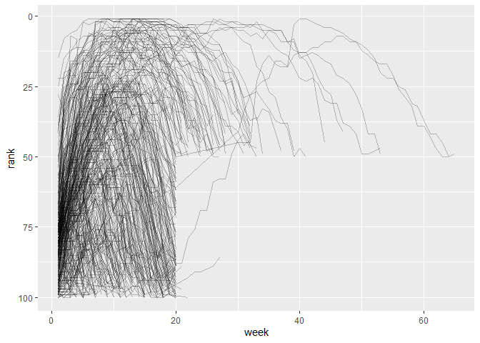
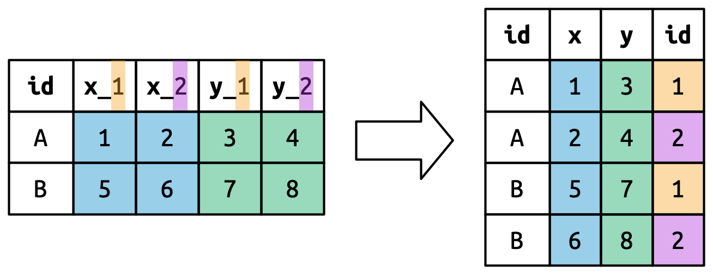

# Data tidying {#sec-data-tidy}

## Introduction

> "Happy families are all alike; every unhappy family is unhappy in its own way."\
> --- Leo Tolstoy

> "Tidy datasets are all alike, but every messy dataset is messy in its own way."\
> --- Hadley Wickham

In this chapter, you will learn a consistent way to organize your data in R using a system called **tidy data**.
Getting your data into this format requires some work up front, but that work pays off in the long term.
Once you have tidy data and the tidy tools provided by packages in the tidyverse, you will spend much less time munging data from one representation to another, allowing you to spend more time on the data questions you care about.

In this chapter, you'll first learn the definition of tidy data and see it applied to a simple toy dataset.
Then we'll dive into the primary tool you'll use for tidying data: pivoting.
Pivoting allows you to change the form of your data without changing any of the values.

### Prerequisites

In this chapter, we'll focus on tidyr, a package that provides a bunch of tools to help tidy up your messy datasets.
tidyr is a member of the core tidyverse.


```r
library(tidyverse)
```

From this chapter on, we'll suppress the loading message from `library(tidyverse)`.

## Tidy data {#sec-tidy-data}

You can represent the same underlying data in multiple ways.
The example below shows the same data organized in three different ways.
Each dataset shows the same values of four variables: *country*, *year*, *population*, and number of documented *cases* of TB (tuberculosis), but each dataset organizes the values in a different way.


```r
table1
```

```
## # A tibble: 6 × 4
##   country      year  cases population
##   <chr>       <dbl>  <dbl>      <dbl>
## 1 Afghanistan  1999    745   19987071
## 2 Afghanistan  2000   2666   20595360
## 3 Brazil       1999  37737  172006362
## 4 Brazil       2000  80488  174504898
## 5 China        1999 212258 1272915272
## 6 China        2000 213766 1280428583
```

```r
table2
```

```
## # A tibble: 12 × 4
##    country      year type            count
##    <chr>       <dbl> <chr>           <dbl>
##  1 Afghanistan  1999 cases             745
##  2 Afghanistan  1999 population   19987071
##  3 Afghanistan  2000 cases            2666
##  4 Afghanistan  2000 population   20595360
##  5 Brazil       1999 cases           37737
##  6 Brazil       1999 population  172006362
##  7 Brazil       2000 cases           80488
##  8 Brazil       2000 population  174504898
##  9 China        1999 cases          212258
## 10 China        1999 population 1272915272
## 11 China        2000 cases          213766
## 12 China        2000 population 1280428583
```

```r
table3
```

```
## # A tibble: 6 × 4
##   country     type           `1999`     `2000`
##   <chr>       <chr>           <dbl>      <dbl>
## 1 Afghanistan cases             745       2666
## 2 Afghanistan population   19987071   20595360
## 3 Brazil      cases           37737      80488
## 4 Brazil      population  172006362  174504898
## 5 China       cases          212258     213766
## 6 China       population 1272915272 1280428583
```

These are all representations of the same underlying data, but they are not equally easy to use.
One of them, `table1`, will be much easier to work with inside the tidyverse because it's **tidy**.

There are three interrelated rules that make a dataset tidy:

1.  Each variable is a column; each column is a variable.
2.  Each observation is a row; each row is an observation.
3.  Each value is a cell; each cell is a single value.

@fig-tidy-structure shows the rules visually.

<div class="figure">

<p class="caption">The following three rules make a dataset tidy: variables are columns, observations are rows, and values are cells.
</p>
</div>

Why ensure that your data is tidy?
There are two main advantages:

1.  There's a general advantage to picking one consistent way of storing data.
    If you have a consistent data structure, it's easier to learn the tools that work with it because they have an underlying uniformity.

2.  There's a specific advantage to placing variables in columns because it allows R's vectorized nature to shine.
    As you learned in @sec-mutate and @sec-summarize, most built-in R functions work with vectors of values.
    That makes transforming tidy data feel particularly natural.

dplyr, ggplot2, and all the other packages in the tidyverse are designed to work with tidy data.
Here are a few small examples showing how you might work with `table1`.


```r
# Compute rate per 10,000
table1 |>
  mutate(rate = cases / population * 10000)
```

```
## # A tibble: 6 × 5
##   country      year  cases population  rate
##   <chr>       <dbl>  <dbl>      <dbl> <dbl>
## 1 Afghanistan  1999    745   19987071 0.373
## 2 Afghanistan  2000   2666   20595360 1.29 
## 3 Brazil       1999  37737  172006362 2.19 
## 4 Brazil       2000  80488  174504898 4.61 
## 5 China        1999 212258 1272915272 1.67 
## 6 China        2000 213766 1280428583 1.67
```

```r
# Compute total cases per year
table1 |> 
  group_by(year) |> 
  summarize(total_cases = sum(cases))
```

```
## # A tibble: 2 × 2
##    year total_cases
##   <dbl>       <dbl>
## 1  1999      250740
## 2  2000      296920
```

```r
# Visualize changes over time
ggplot(table1, aes(x = year, y = cases)) +
  geom_line(aes(group = country), color = "grey50") +
  geom_point(aes(color = country, shape = country)) +
  scale_x_continuous(breaks = c(1999, 2000)) # x-axis breaks at 1999 and 2000
```


### Exercises

1.  For each of the sample tables, describe what each observation and each column represents.

2.  Sketch out the process you'd use to calculate the `rate` for `table2` and `table3`.
    You will need to perform four operations:

    a.  Extract the number of TB cases per country per year.
    b.  Extract the matching population per country per year.
    c.  Divide cases by population, and multiply by 10000.
    d.  Store back in the appropriate place.

    You haven't yet learned all the functions you'd need to actually perform these operations, but you should still be able to think through the transformations you'd need.

## Lengthening data {#sec-pivoting}

The principles of tidy data might seem so obvious that you wonder if you'll ever encounter a dataset that isn't tidy.
Unfortunately, however, most real data is untidy.
There are two main reasons:

1.  Data is often organized to facilitate some goal other than analysis.
    For example, it's common for data to be structured to make data entry, not analysis, easy.

2.  Most people aren't familiar with the principles of tidy data, and it's hard to derive them yourself unless you spend a lot of time working with data.

This means that most real analyses will require at least a little tidying.
You'll begin by figuring out what the underlying variables and observations are.
Sometimes this is easy; other times you'll need to consult with the people who originally generated the data.
Next, you'll **pivot** your data into a tidy form, with variables in the columns and observations in the rows.

tidyr provides two functions for pivoting data: `pivot_longer()` and `pivot_wider()`.
We'll first start with `pivot_longer()` because it's the most common case.
Let's dive into some examples.

### Data in column names {#sec-billboard}

The `billboard` dataset records the billboard rank of songs in the year 2000:


```r
billboard
```

```
## # A tibble: 317 × 79
##    artist track date.ent…¹   wk1   wk2   wk3   wk4   wk5   wk6   wk7   wk8   wk9
##    <chr>  <chr> <date>     <dbl> <dbl> <dbl> <dbl> <dbl> <dbl> <dbl> <dbl> <dbl>
##  1 2 Pac  Baby… 2000-02-26    87    82    72    77    87    94    99    NA    NA
##  2 2Ge+h… The … 2000-09-02    91    87    92    NA    NA    NA    NA    NA    NA
##  3 3 Doo… Kryp… 2000-04-08    81    70    68    67    66    57    54    53    51
##  4 3 Doo… Loser 2000-10-21    76    76    72    69    67    65    55    59    62
##  5 504 B… Wobb… 2000-04-15    57    34    25    17    17    31    36    49    53
##  6 98^0   Give… 2000-08-19    51    39    34    26    26    19     2     2     3
##  7 A*Tee… Danc… 2000-07-08    97    97    96    95   100    NA    NA    NA    NA
##  8 Aaliy… I Do… 2000-01-29    84    62    51    41    38    35    35    38    38
##  9 Aaliy… Try … 2000-03-18    59    53    38    28    21    18    16    14    12
## 10 Adams… Open… 2000-08-26    76    76    74    69    68    67    61    58    57
## # … with 307 more rows, 67 more variables: wk10 <dbl>, wk11 <dbl>, wk12 <dbl>,
## #   wk13 <dbl>, wk14 <dbl>, wk15 <dbl>, wk16 <dbl>, wk17 <dbl>, wk18 <dbl>,
## #   wk19 <dbl>, wk20 <dbl>, wk21 <dbl>, wk22 <dbl>, wk23 <dbl>, wk24 <dbl>,
## #   wk25 <dbl>, wk26 <dbl>, wk27 <dbl>, wk28 <dbl>, wk29 <dbl>, wk30 <dbl>,
## #   wk31 <dbl>, wk32 <dbl>, wk33 <dbl>, wk34 <dbl>, wk35 <dbl>, wk36 <dbl>,
## #   wk37 <dbl>, wk38 <dbl>, wk39 <dbl>, wk40 <dbl>, wk41 <dbl>, wk42 <dbl>,
## #   wk43 <dbl>, wk44 <dbl>, wk45 <dbl>, wk46 <dbl>, wk47 <dbl>, wk48 <dbl>, …
```

In this dataset, each observation is a song.
The first three columns (`artist`, `track` and `date.entered`) are variables that describe the song.
Then we have 76 columns (`wk1`-`wk76`) that describe the rank of the song in each week[^data-tidy-1].
Here, the column names are one variable (the `week`) and the cell values are another (the `rank`).

[^data-tidy-1]: The song will be included as long as it was in the top 100 at some point in 2000, and is tracked for up to 72 weeks after it appears.

To tidy this data, we'll use `pivot_longer()`:


```r
billboard |> 
  pivot_longer(
    cols = starts_with("wk"), 
    names_to = "week", 
    values_to = "rank"
  )
```

```
## # A tibble: 24,092 × 5
##    artist track                   date.entered week   rank
##    <chr>  <chr>                   <date>       <chr> <dbl>
##  1 2 Pac  Baby Don't Cry (Keep... 2000-02-26   wk1      87
##  2 2 Pac  Baby Don't Cry (Keep... 2000-02-26   wk2      82
##  3 2 Pac  Baby Don't Cry (Keep... 2000-02-26   wk3      72
##  4 2 Pac  Baby Don't Cry (Keep... 2000-02-26   wk4      77
##  5 2 Pac  Baby Don't Cry (Keep... 2000-02-26   wk5      87
##  6 2 Pac  Baby Don't Cry (Keep... 2000-02-26   wk6      94
##  7 2 Pac  Baby Don't Cry (Keep... 2000-02-26   wk7      99
##  8 2 Pac  Baby Don't Cry (Keep... 2000-02-26   wk8      NA
##  9 2 Pac  Baby Don't Cry (Keep... 2000-02-26   wk9      NA
## 10 2 Pac  Baby Don't Cry (Keep... 2000-02-26   wk10     NA
## # … with 24,082 more rows
```

After the data, there are three key arguments:

-   `cols` specifies which columns need to be pivoted, i.e. which columns aren't variables. This argument uses the same syntax as `select()` so here we could use `!c(artist, track, date.entered)` or `starts_with("wk")`.
-   `names_to` names of the variable stored in the column names, we named that variable `week`.
-   `values_to` names the variable stored in the cell values, we named that variable `rank`.

Note that in the code `"week"` and `"rank"` are quoted because those are new variables we're creating, they don't yet exist in the data when we run the `pivot_longer()` call.

Now let's turn our attention to the resulting, longer data frame.
What happens if a song is in the top 100 for less than 76 weeks?
Take 2 Pac's "Baby Don't Cry", for example.
The above output suggests that it was only in the top 100 for 7 weeks, and all the remaining weeks are filled in with missing values.
These `NA`s don't really represent unknown observations; they were forced to exist by the structure of the dataset[^data-tidy-2], so we can ask `pivot_longer()` to get rid of them by setting `values_drop_na = TRUE`:

[^data-tidy-2]: We'll come back to this idea in @sec-missing-values.


```r
billboard |> 
  pivot_longer(
    cols = starts_with("wk"), 
    names_to = "week", 
    values_to = "rank",
    values_drop_na = TRUE
  )
```

```
## # A tibble: 5,307 × 5
##    artist  track                   date.entered week   rank
##    <chr>   <chr>                   <date>       <chr> <dbl>
##  1 2 Pac   Baby Don't Cry (Keep... 2000-02-26   wk1      87
##  2 2 Pac   Baby Don't Cry (Keep... 2000-02-26   wk2      82
##  3 2 Pac   Baby Don't Cry (Keep... 2000-02-26   wk3      72
##  4 2 Pac   Baby Don't Cry (Keep... 2000-02-26   wk4      77
##  5 2 Pac   Baby Don't Cry (Keep... 2000-02-26   wk5      87
##  6 2 Pac   Baby Don't Cry (Keep... 2000-02-26   wk6      94
##  7 2 Pac   Baby Don't Cry (Keep... 2000-02-26   wk7      99
##  8 2Ge+her The Hardest Part Of ... 2000-09-02   wk1      91
##  9 2Ge+her The Hardest Part Of ... 2000-09-02   wk2      87
## 10 2Ge+her The Hardest Part Of ... 2000-09-02   wk3      92
## # … with 5,297 more rows
```

The number of rows is now much lower, indicating that many rows with `NA`s were dropped.

You might also wonder what happens if a song is in the top 100 for more than 76 weeks?
We can't tell from this data, but you might guess that additional columns `wk77`, `wk78`, ... would be added to the dataset.

This data is now tidy, but we could make future computation a bit easier by converting values of `week` from character strings to numbers using `mutate()` and `readr::parse_number()`.
`parse_number()` is a handy function that will extract the first number from a string, ignoring all other text.


```r
billboard_longer <- billboard |> 
  pivot_longer(
    cols = starts_with("wk"), 
    names_to = "week", 
    values_to = "rank",
    values_drop_na = TRUE
  ) |> 
  mutate(
    week = parse_number(week)
  )
billboard_longer
```

```
## # A tibble: 5,307 × 5
##    artist  track                   date.entered  week  rank
##    <chr>   <chr>                   <date>       <dbl> <dbl>
##  1 2 Pac   Baby Don't Cry (Keep... 2000-02-26       1    87
##  2 2 Pac   Baby Don't Cry (Keep... 2000-02-26       2    82
##  3 2 Pac   Baby Don't Cry (Keep... 2000-02-26       3    72
##  4 2 Pac   Baby Don't Cry (Keep... 2000-02-26       4    77
##  5 2 Pac   Baby Don't Cry (Keep... 2000-02-26       5    87
##  6 2 Pac   Baby Don't Cry (Keep... 2000-02-26       6    94
##  7 2 Pac   Baby Don't Cry (Keep... 2000-02-26       7    99
##  8 2Ge+her The Hardest Part Of ... 2000-09-02       1    91
##  9 2Ge+her The Hardest Part Of ... 2000-09-02       2    87
## 10 2Ge+her The Hardest Part Of ... 2000-09-02       3    92
## # … with 5,297 more rows
```

Now that we have all the week numbers in one variable and all the rank values in another, we're in a good position to visualize how song ranks vary over time.
The code is shown below and the result is in @fig-billboard-ranks.
We can see that very few songs stay in the top 100 for more than 20 weeks.


```r
billboard_longer |> 
  ggplot(aes(x = week, y = rank, group = track)) + 
  geom_line(alpha = 0.25) + 
  scale_y_reverse()
```

<div class="figure">

<p class="caption">A line plot showing how the rank of a song changes over time.
</p>
</div>

### How does pivoting work?

Now that you've seen how we can use pivoting to reshape our data, let's take a little time to gain some intuition about what pivoting does to the data.
Let's start with a very simple dataset to make it easier to see what's happening.
Suppose we have three patients with `id`s A, B, and C, and we take two blood pressure measurements on each patient.
We'll create the data with `tribble()`, a handy function for constructing small tibbles by hand:


```r
df <- tribble(
  ~id,  ~bp1, ~bp2,
   "A",  100,  120,
   "B",  140,  115,
   "C",  120,  125
)
```

We want our new dataset to have three variables: `id` (already exists), `measurement` (the column names), and `value` (the cell values).
To achieve this, we need to pivot `df` longer:


```r
df |> 
  pivot_longer(
    cols = bp1:bp2,
    names_to = "measurement",
    values_to = "value"
  )
```

```
## # A tibble: 6 × 3
##   id    measurement value
##   <chr> <chr>       <dbl>
## 1 A     bp1           100
## 2 A     bp2           120
## 3 B     bp1           140
## 4 B     bp2           115
## 5 C     bp1           120
## 6 C     bp2           125
```

How does the reshaping work?
It's easier to see if we think about it column by column.
As shown in @fig-pivot-variables, the values in column that was already a variable in the original dataset (`var`) need to be repeated, once for each column that is pivoted.

<div class="figure">

<p class="caption">Columns that are already variables need to be repeated, once for each column that is pivotted.
</p>
</div>

The column names become values in a new variable, whose name is defined by `names_to`, as shown in @fig-pivot-names.
They need to be repeated once for each row in the original dataset.

<div class="figure">

<p class="caption">The column names of pivoted columns become values in a new column. The values need to be repeated once for each row of the original dataset.
</p>
</div>

The cell values also become values in a new variable, with a name defined by `values_to`.
They are unwound row by row.
@fig-pivot-values illustrates the process.

<div class="figure">

<p class="caption">The number of values is preserved (not repeated), but unwound row-by-row.
</p>
</div>

### Many variables in column names

A more challenging situation occurs when you have multiple pieces of information crammed into the column names, and you would like to store these in separate new variables.
For example, take the `who2` dataset, the source of `table1` and friends that you saw above:


```r
who2
```

```
## # A tibble: 7,240 × 58
##    country  year sp_m_…¹ sp_m_…² sp_m_…³ sp_m_…⁴ sp_m_…⁵ sp_m_…⁶ sp_m_65 sp_f_…⁷
##    <chr>   <dbl>   <dbl>   <dbl>   <dbl>   <dbl>   <dbl>   <dbl>   <dbl>   <dbl>
##  1 Afghan…  1980      NA      NA      NA      NA      NA      NA      NA      NA
##  2 Afghan…  1981      NA      NA      NA      NA      NA      NA      NA      NA
##  3 Afghan…  1982      NA      NA      NA      NA      NA      NA      NA      NA
##  4 Afghan…  1983      NA      NA      NA      NA      NA      NA      NA      NA
##  5 Afghan…  1984      NA      NA      NA      NA      NA      NA      NA      NA
##  6 Afghan…  1985      NA      NA      NA      NA      NA      NA      NA      NA
##  7 Afghan…  1986      NA      NA      NA      NA      NA      NA      NA      NA
##  8 Afghan…  1987      NA      NA      NA      NA      NA      NA      NA      NA
##  9 Afghan…  1988      NA      NA      NA      NA      NA      NA      NA      NA
## 10 Afghan…  1989      NA      NA      NA      NA      NA      NA      NA      NA
## # … with 7,230 more rows, 48 more variables: sp_f_1524 <dbl>, sp_f_2534 <dbl>,
## #   sp_f_3544 <dbl>, sp_f_4554 <dbl>, sp_f_5564 <dbl>, sp_f_65 <dbl>,
## #   sn_m_014 <dbl>, sn_m_1524 <dbl>, sn_m_2534 <dbl>, sn_m_3544 <dbl>,
## #   sn_m_4554 <dbl>, sn_m_5564 <dbl>, sn_m_65 <dbl>, sn_f_014 <dbl>,
## #   sn_f_1524 <dbl>, sn_f_2534 <dbl>, sn_f_3544 <dbl>, sn_f_4554 <dbl>,
## #   sn_f_5564 <dbl>, sn_f_65 <dbl>, ep_m_014 <dbl>, ep_m_1524 <dbl>,
## #   ep_m_2534 <dbl>, ep_m_3544 <dbl>, ep_m_4554 <dbl>, ep_m_5564 <dbl>, …
```

This dataset, collected by the World Health Organisation, records information about tuberculosis diagnoses.
There are two columns that are already variables and are easy to interpret: `country` and `year`.
They are followed by 56 columns like `sp_m_014`, `ep_m_4554`, and `rel_m_3544`.
If you stare at these columns for long enough, you'll notice there's a pattern.
Each column name is made up of three pieces separated by `_`.
The first piece, `sp`/`rel`/`ep`, describes the method used for the diagnosis, the second piece, `m`/`f` is the `gender` (coded as a binary variable in this dataset), and the third piece, `014`/`1524`/`2535`/`3544`/`4554`/`65` is the `age` range (`014` represents 0-14, for example).

So in this case we have six pieces of information recorded in `who2`: the country and the year (already columns); the method of diagnosis, the gender category, and the age range category (contained in the other column names); and the count of patients in that category (cell values).
To organize these six pieces of information in six separate columns, we use `pivot_longer()` with a vector of column names for `names_to` and instructors for splitting the original variable names into pieces for `names_sep` as well as a column name for `values_to`:


```r
who2 |> 
  pivot_longer(
    cols = !(country:year),
    names_to = c("diagnosis", "gender", "age"), 
    names_sep = "_",
    values_to = "count"
  )
```

```
## # A tibble: 405,440 × 6
##    country      year diagnosis gender age   count
##    <chr>       <dbl> <chr>     <chr>  <chr> <dbl>
##  1 Afghanistan  1980 sp        m      014      NA
##  2 Afghanistan  1980 sp        m      1524     NA
##  3 Afghanistan  1980 sp        m      2534     NA
##  4 Afghanistan  1980 sp        m      3544     NA
##  5 Afghanistan  1980 sp        m      4554     NA
##  6 Afghanistan  1980 sp        m      5564     NA
##  7 Afghanistan  1980 sp        m      65       NA
##  8 Afghanistan  1980 sp        f      014      NA
##  9 Afghanistan  1980 sp        f      1524     NA
## 10 Afghanistan  1980 sp        f      2534     NA
## # … with 405,430 more rows
```

An alternative to `names_sep` is `names_pattern`, which you can use to extract variables from more complicated naming scenarios, once you've learned about regular expressions in @sec-regular-expressions.

Conceptually, this is only a minor variation on the simpler case you've already seen.
@fig-pivot-multiple-names shows the basic idea: now, instead of the column names pivoting into a single column, they pivot into multiple columns.
You can imagine this happening in two steps (first pivoting and then separating) but under the hood it happens in a single step because that's faster.

<div class="figure">

<p class="caption">Pivoting columns with multiple pieces of information in the names means that each column name now fills in values in multiple output columns.
</p>
</div>

### Data and variable names in the column headers

The next step up in complexity is when the column names include a mix of variable values and variable names.
For example, take the `household` dataset:


```r
household
```

```
## # A tibble: 5 × 5
##   family dob_child1 dob_child2 name_child1 name_child2
##    <int> <date>     <date>     <chr>       <chr>      
## 1      1 1998-11-26 2000-01-29 Susan       Jose       
## 2      2 1996-06-22 NA         Mark        <NA>       
## 3      3 2002-07-11 2004-04-05 Sam         Seth       
## 4      4 2004-10-10 2009-08-27 Craig       Khai       
## 5      5 2000-12-05 2005-02-28 Parker      Gracie
```

This dataset contains data about five families, with the names and dates of birth of up to two children.
The new challenge in this dataset is that the column names contain the names of two variables (`dob`, `name)` and the values of another (`child,` with values 1 or 2).
To solve this problem we again need to supply a vector to `names_to` but this time we use the special `".value"` sentinel; this isn't the name of a variable but a unique value that tells `pivot_longer()` to do something different.
This overrides the usual `values_to` argument to use the first component of the pivoted column name as a variable name in the output.


```r
household |> 
  pivot_longer(
    cols = !family, 
    names_to = c(".value", "child"), 
    names_sep = "_", 
    values_drop_na = TRUE
  )
```

```
## # A tibble: 9 × 4
##   family child  dob        name  
##    <int> <chr>  <date>     <chr> 
## 1      1 child1 1998-11-26 Susan 
## 2      1 child2 2000-01-29 Jose  
## 3      2 child1 1996-06-22 Mark  
## 4      3 child1 2002-07-11 Sam   
## 5      3 child2 2004-04-05 Seth  
## 6      4 child1 2004-10-10 Craig 
## 7      4 child2 2009-08-27 Khai  
## 8      5 child1 2000-12-05 Parker
## 9      5 child2 2005-02-28 Gracie
```

We again use `values_drop_na = TRUE`, since the shape of the input forces the creation of explicit missing variables (e.g. for families with only one child).

@fig-pivot-names-and-values illustrates the basic idea with a simpler example.
When you use `".value"` in `names_to`, the column names in the input contribute to both values and variable names in the output.

<div class="figure">

<p class="caption">Pivoting with `names_to = c(".value", "id")` splits the column names into two components: the first part determines the output column name (`x` or `y`), and the second part determines the value of the `id` column.
</p>
</div>

## Widening data

So far we've used `pivot_longer()` to solve the common class of problems where values have ended up in column names.
Next we'll pivot (HA HA) to `pivot_wider()`, which which makes datasets **wider** by increasing columns and reducing rows and helps when one observation is spread across multiple rows.
This seems to arise less commonly in the wild, but it does seem to crop up a lot when dealing with governmental data.

We'll start by looking at `cms_patient_experience`, a dataset from the Centers of Medicare and Medicaid services that collects data about patient experiences:


```r
cms_patient_experience
```

```
## # A tibble: 500 × 5
##    org_pac_id org_nm                               measure_cd   measur…¹ prf_r…²
##    <chr>      <chr>                                <chr>        <chr>      <dbl>
##  1 0446157747 USC CARE MEDICAL GROUP INC           CAHPS_GRP_1  CAHPS f…      63
##  2 0446157747 USC CARE MEDICAL GROUP INC           CAHPS_GRP_2  CAHPS f…      87
##  3 0446157747 USC CARE MEDICAL GROUP INC           CAHPS_GRP_3  CAHPS f…      86
##  4 0446157747 USC CARE MEDICAL GROUP INC           CAHPS_GRP_5  CAHPS f…      57
##  5 0446157747 USC CARE MEDICAL GROUP INC           CAHPS_GRP_8  CAHPS f…      85
##  6 0446157747 USC CARE MEDICAL GROUP INC           CAHPS_GRP_12 CAHPS f…      24
##  7 0446162697 ASSOCIATION OF UNIVERSITY PHYSICIANS CAHPS_GRP_1  CAHPS f…      59
##  8 0446162697 ASSOCIATION OF UNIVERSITY PHYSICIANS CAHPS_GRP_2  CAHPS f…      85
##  9 0446162697 ASSOCIATION OF UNIVERSITY PHYSICIANS CAHPS_GRP_3  CAHPS f…      83
## 10 0446162697 ASSOCIATION OF UNIVERSITY PHYSICIANS CAHPS_GRP_5  CAHPS f…      63
## # … with 490 more rows, and abbreviated variable names ¹​measure_title,
## #   ²​prf_rate
```

The core unit being studied is an organization, but each organization is spread across six rows, with one row for each measurement taken in the survey organization.
We can see the complete set of values for `measure_cd` and `measure_title` by using `distinct()`:


```r
cms_patient_experience |> 
  distinct(measure_cd, measure_title)
```

```
## # A tibble: 6 × 2
##   measure_cd   measure_title                                                    
##   <chr>        <chr>                                                            
## 1 CAHPS_GRP_1  CAHPS for MIPS SSM: Getting Timely Care, Appointments, and Infor…
## 2 CAHPS_GRP_2  CAHPS for MIPS SSM: How Well Providers Communicate               
## 3 CAHPS_GRP_3  CAHPS for MIPS SSM: Patient's Rating of Provider                 
## 4 CAHPS_GRP_5  CAHPS for MIPS SSM: Health Promotion and Education               
## 5 CAHPS_GRP_8  CAHPS for MIPS SSM: Courteous and Helpful Office Staff           
## 6 CAHPS_GRP_12 CAHPS for MIPS SSM: Stewardship of Patient Resources
```

Neither of these columns will make particularly great variable names: `measure_cd` doesn't hint at the meaning of the variable and `measure_title` is a long sentence containing spaces.
We'll use `measure_cd` as the source for our new column names for now, but in a real analysis you might want to create your own variable names that are both short and meaningful.

`pivot_wider()` has the opposite interface to `pivot_longer()`: instead of choosing new column names, we need to provide the existing columns that define the values (`values_from`) and the column name (`names_from)`:


```r
cms_patient_experience |> 
  pivot_wider(
    names_from = measure_cd,
    values_from = prf_rate
  )
```

```
## # A tibble: 500 × 9
##    org_pac_id org_nm     measu…¹ CAHPS…² CAHPS…³ CAHPS…⁴ CAHPS…⁵ CAHPS…⁶ CAHPS…⁷
##    <chr>      <chr>      <chr>     <dbl>   <dbl>   <dbl>   <dbl>   <dbl>   <dbl>
##  1 0446157747 USC CARE … CAHPS …      63      NA      NA      NA      NA      NA
##  2 0446157747 USC CARE … CAHPS …      NA      87      NA      NA      NA      NA
##  3 0446157747 USC CARE … CAHPS …      NA      NA      86      NA      NA      NA
##  4 0446157747 USC CARE … CAHPS …      NA      NA      NA      57      NA      NA
##  5 0446157747 USC CARE … CAHPS …      NA      NA      NA      NA      85      NA
##  6 0446157747 USC CARE … CAHPS …      NA      NA      NA      NA      NA      24
##  7 0446162697 ASSOCIATI… CAHPS …      59      NA      NA      NA      NA      NA
##  8 0446162697 ASSOCIATI… CAHPS …      NA      85      NA      NA      NA      NA
##  9 0446162697 ASSOCIATI… CAHPS …      NA      NA      83      NA      NA      NA
## 10 0446162697 ASSOCIATI… CAHPS …      NA      NA      NA      63      NA      NA
## # … with 490 more rows, and abbreviated variable names ¹​measure_title,
## #   ²​CAHPS_GRP_1, ³​CAHPS_GRP_2, ⁴​CAHPS_GRP_3, ⁵​CAHPS_GRP_5, ⁶​CAHPS_GRP_8,
## #   ⁷​CAHPS_GRP_12
```

The output doesn't look quite right; we still seem to have multiple rows for each organization.
That's because, we also need to tell `pivot_wider()` which column or columns have values that uniquely identify each row; in this case those are the variables starting with `"org"`:


```r
cms_patient_experience |> 
  pivot_wider(
    id_cols = starts_with("org"),
    names_from = measure_cd,
    values_from = prf_rate
  )
```

```
## # A tibble: 95 × 8
##    org_pac_id org_nm             CAHPS…¹ CAHPS…² CAHPS…³ CAHPS…⁴ CAHPS…⁵ CAHPS…⁶
##    <chr>      <chr>                <dbl>   <dbl>   <dbl>   <dbl>   <dbl>   <dbl>
##  1 0446157747 USC CARE MEDICAL …      63      87      86      57      85      24
##  2 0446162697 ASSOCIATION OF UN…      59      85      83      63      88      22
##  3 0547164295 BEAVER MEDICAL GR…      49      NA      75      44      73      12
##  4 0749333730 CAPE PHYSICIANS A…      67      84      85      65      82      24
##  5 0840104360 ALLIANCE PHYSICIA…      66      87      87      64      87      28
##  6 0840109864 REX HOSPITAL INC        73      87      84      67      91      30
##  7 0840513552 SCL HEALTH MEDICA…      58      83      76      58      78      26
##  8 0941545784 GRITMAN MEDICAL C…      46      86      81      54      NA      25
##  9 1052612785 COMMUNITY MEDICAL…      65      84      80      58      87      29
## 10 1254237779 OUR LADY OF LOURD…      61      NA      NA      65      NA      17
## # … with 85 more rows, and abbreviated variable names ¹​CAHPS_GRP_1,
## #   ²​CAHPS_GRP_2, ³​CAHPS_GRP_3, ⁴​CAHPS_GRP_5, ⁵​CAHPS_GRP_8, ⁶​CAHPS_GRP_12
```

This gives us the output that we're looking for.

### How does `pivot_wider()` work?

To understand how `pivot_wider()` works, let's again start with a very simple dataset.
This time we have two patients with `id`s A and B, we have three blood pressure measurements on patient A and two on patient B:


```r
df <- tribble(
  ~id, ~measurement, ~value,
  "A",        "bp1",    100,
  "B",        "bp1",    140,
  "B",        "bp2",    115, 
  "A",        "bp2",    120,
  "A",        "bp3",    105
)
```

We'll take the values from the `value` column and the names from the `measurement` column:


```r
df |> 
  pivot_wider(
    names_from = measurement,
    values_from = value
  )
```

```
## # A tibble: 2 × 4
##   id      bp1   bp2   bp3
##   <chr> <dbl> <dbl> <dbl>
## 1 A       100   120   105
## 2 B       140   115    NA
```

To begin the process `pivot_wider()` needs to first figure out what will go in the rows and columns.
The new column names will be the unique values of `measurement`.


```r
df |> 
  distinct(measurement) |> 
  pull()
```

```
## [1] "bp1" "bp2" "bp3"
```

By default, the rows in the output are determined by all the variables that aren't going into the new names or values.
These are called the `id_cols`.
Here there is only one column, but in general there can be any number.


```r
df |> 
  select(-measurement, -value) |> 
  distinct()
```

```
## # A tibble: 2 × 1
##   id   
##   <chr>
## 1 A    
## 2 B
```

`pivot_wider()` then combines these results to generate an empty data frame:


```r
df |> 
  select(-measurement, -value) |> 
  distinct() |> 
  mutate(x = NA, y = NA, z = NA)
```

```
## # A tibble: 2 × 4
##   id    x     y     z    
##   <chr> <lgl> <lgl> <lgl>
## 1 A     NA    NA    NA   
## 2 B     NA    NA    NA
```

It then fills in all the missing values using the data in the input.
In this case, not every cell in the output has a corresponding value in the input as there's no third blood pressure measurement for patient B, so that cell remains missing.
We'll come back to this idea that `pivot_wider()` can "make" missing values in @sec-missing-values.

You might also wonder what happens if there are multiple rows in the input that correspond to one cell in the output.
The example below has two rows that correspond to id "A" and name "bp1":


```r
df <- tribble(
  ~id, ~measurement, ~value,
  "A",        "bp1",    100,
  "A",        "bp1",    102,
  "A",        "bp2",    120,
  "B",        "bp1",    140, 
  "B",        "bp2",    115
)
```

If we attempt to pivot this we get an output that contains list-columns, which you'll learn more about in @sec-rectangling:


```r
df |>
  pivot_wider(
    names_from = measurement,
    values_from = value
  )
```

```
## Warning: Values from `value` are not uniquely identified; output will contain list-cols.
## • Use `values_fn = list` to suppress this warning.
## • Use `values_fn = {summary_fun}` to summarise duplicates.
## • Use the following dplyr code to identify duplicates.
##   {data} %>%
##   dplyr::group_by(id, measurement) %>%
##   dplyr::summarise(n = dplyr::n(), .groups = "drop") %>%
##   dplyr::filter(n > 1L)
```

```
## # A tibble: 2 × 3
##   id    bp1       bp2      
##   <chr> <list>    <list>   
## 1 A     <dbl [2]> <dbl [1]>
## 2 B     <dbl [1]> <dbl [1]>
```

Since you don't know how to work with this sort of data yet, you'll want to follow the hint in the warning to figure out where the problem is:


```r
df |> 
  group_by(id, measurement) |> 
  summarize(n = n(), .groups = "drop") |> 
  filter(n > 1)
```

```
## # A tibble: 1 × 3
##   id    measurement     n
##   <chr> <chr>       <int>
## 1 A     bp1             2
```

It's then up to you to figure out what's gone wrong with your data and either repair the underlying damage or use your grouping and summarizing skills to ensure that each combination of row and column values only has a single row.

## Summary

In this chapter you learned about tidy data: data that has variables in columns and observations in rows.
Tidy data makes working in the tidyverse easier, because it's a consistent structure understood by most functions, the main challenge is transforming the data from whatever structure you receive it in to a tidy format.
To that end, you learned about `pivot_longer()` and `pivot_wider()` which allow you to tidy up many untidy datasets.
The examples we presented here are a selection of those from `vignette("pivot", package = "tidyr")`, so if you encounter a problem that this chapter doesn't help you with, that vignette is a good place to try next.

Another challenge is that, for a given dataset, it can be impossible to label the longer or the wider version as the "tidy" one.
This is partly a reflection of our definition of tidy data, where we said tidy data has one variable in each column, but we didn't actually define what a variable is (and it's surprisingly hard to do so).
It's totally fine to be pragmatic and to say a variable is whatever makes your analysis easiest.
So if you're stuck figuring out how to do some computation, consider switching up the organisation of your data; don't be afraid to untidy, transform, and re-tidy as needed!

If you enjoyed this chapter and want to learn more about the underlying theory, you can learn more about the history and theoretical underpinnings in the [Tidy Data](https://www.jstatsoft.org/article/view/v059i10) paper published in the Journal of Statistical Software.

Now that you're writing a substantial amount of R code, it's time to learn more about organizing your code into files and directories.
In the next chapter, you'll learn all about the advantages of scripts and projects, and some of the many tools that they provide to make your life easier.
